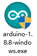
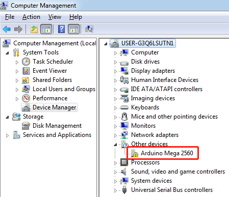
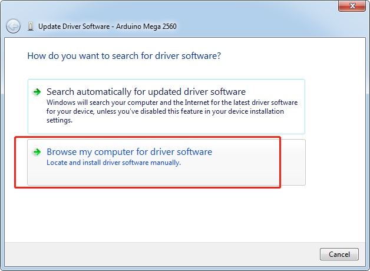
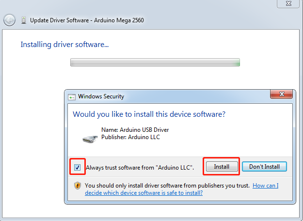

1.1 Arduino IDE
===============

Description
-----------

Arduino is an open source platform with simple software and hardware.
You can pick it up in short time even if you are a beginner. It provides
an integrated development environment (IDE) for code compiling,
compatible with multiple control boards. So you can just download the
Arduino IDE, upload the sketches (i.e. the code files) to the board, and
then you can see relative experimental phenomena. For more information,
refer to http://www.arduino.cc.

Install Arduino IDE
-------------------

Here are the installation steps on the windows system.

For other systems, please refer to: **Install Arduinio IDE in different
and FAQ.pdf**

`Install Arduinio IDE in different and FAQ.pdf <https://github.com/sunfounder/sunfounder_vincent_kit_for_arduino/blob/master/docs/(EN)%20Install%20Arduino%20IDE%20in%20different%20and%20FAQ.pdf>`_

The code in this kit is written based on Arduino, so you need to install
the IDE first. Skip it if you have done this. Now go to
`arduino.cc <http://www.arduino.cc>`__ and click SOFTWARE -> DOWNLOADs.
On the page, check the software list on the right side.

.. image:: media/image12.png

Find the one that suits your operation system and click to download.
There are two versions of Arduino for Windows: Installer or ZIP file.
You're recommended to download the former.

For Installer File
------------------

**Step 1**: Find the .exe file just downloaded.

**Step 2:** Double click the file and a window will pop up as below.
Click **I Agree**.

.. image:: media/image14.png

**Step 3:** Click **Next.**

.. image:: media/image15.png

**Step 4**: Select the path to install. By default, it's set
in the C disk. You can click **Browse** and choose other paths. Click
**OK**. Then click Install.

.. image:: media/image400.png

**Step 5:** Meanwhile, it will prompts install the needed drivers,
please select the ‘Always trust software from “Arduino LLC” ’. After the
installation is done, click **Close**.

.. note::
    The new IDE may prompt errors when you're compiling code under Windows
    XP. So if your computer is running on XP, you're suggested to install
    Arduino 1.0.5 or 1.0.6. Also you can upgrade your computer.

For ZIP File
------------

If you download the zip file before, when you connect the MCU to the
computer, it may not be recognized. Then you need to install the driver
manually. Take the following steps.

**Step 1**: Plug in the board to the computer with a 5V USB cable. After
a while, a prompt message of failed installation will appear.

**Step 2**: Go to the Device Manager. You will find under other devices,
Arduino Mega 2560 with an exclamation mark appear, which means the
computer did not recognize the board.

**Step 3**: Right click on **Arduino Mega 2560** and select **Update
Driver Software**.

.. image:: media/image18.png

**Step 4:** Choose the second option, **Browse my computer for Driver
software**.

**Step 5:** A window pops up then. Click **Browse**. Then go to the
folder where you just extracted the file. Go to the *drivers* folder and
click **OK** -> **Next**.

.. image:: media/image20.png

**Step 6:** Select ‘Always trust software from “Arduino LLC” ‘ then
click Install.

It may need a sec. Then the system prompts you the driver has been
installed successfully. So the computer can recognize the board now.
Click **Close**.

.. image:: media/image22.png

Open the Arduino Software (IDE)
-------------------------------

Double-click the Arduino icon (arduino.exe) created by the installation
process.

.. image:: media/image24.png

Then the Arduino IDE will appear. Let's check details of the software.

.. image:: media/image23.jpeg

1. **Verify**: Compile your code. Any syntax problem will be prompted
with errors.

2. **Upload**: Upload the code to your board. When you click the button,
the RX and TX LEDs on the board will flicker fast and won't stop until
the upload is done.

3. **New**: Create a new code editing window.

4. **Open**: Open an .ino sketch.

5. **Save**: Save the sketch.

6. **Serial Monitor**: Click the button and a window will appear. It
receives the data sent from your control board. It is very useful for
debugging.

7. **File**: Click the menu and a drop-down list will appear, including
file creating, opening, saving, closing, some parameter configuring,
etc.

8. **Edit**: Click the menu. On the drop-down list, there are some
editing operations like Cut, Copy, Paste, Find, and so on, with their
corresponding shortcuts.

9. **Sketch**: Includes operations like Verify, Upload, Add files, etc.
More important function is Include Library – where you can add
libraries.

10. **Tool**: Includes some tools – the most frequently used Board (the
board you use) and Port (the port your board is at). Every time you want
to upload the code, you need to select or check them.

11. **Help**: If you're a beginner, you may check the options under the
menu and get the help you need, including operations in IDE,
introduction information, troubleshooting, code explanation, etc.

12. In this message area, no matter when you compile or upload, the
summary message will always appear.

13. Detailed messages during compile and upload. For example, the file
used lies in which path, the details of error prompts.

14. **Board and Port**: Here you can preview the board and port selected
for code upload. You can select them again by **Tools** -> **Board** /
**Port** if any is incorrect.

15. The editing area of the IDE. You can write code here.
