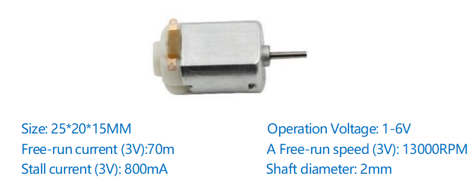

2.13 Motor
==========

Overview
--------

In this lesson, you will learn how to use Motor, the working principle
of which is that the energized coil is forced to rotate in the magnetic
field then the rotor of the motor rotates accordingly on which the
pinion gear drives the engine flywheel to rotate.

Components Required
-------------------

.. image:: media/list_2.13.png

Component Introduction
----------------------

This is a 5V DC motor. It will rotate when you give the two terminals of the copper sheet one high and one low level. For convenience, you can weld the pins to it.

**L293D**

.. image:: media/image457.png

L293D is a 4-channel motor driver integrated by chip with
high voltage and high current. It's designed to connect to standard DTL,
TTL logic level, and drive inductive loads (such as relay coils, DC,
Stepper Motors) and power switching transistors etc. DC Motors are
devices that turn DC electrical energy into mechanical energy. They are
widely used in electrical drive for their superior speed regulation
performance.

L293D has two pins (Vcc1 and Vcc2) for power supply. Vcc2 is used to
supply power for the motor, while Vcc1 to supply for the chip.

The following is the internal structure of L293D. Pin EN is an enable
pin and only works with high level; A stands for input and Y for output.
You can see the relationship among them at the right bottom. When pin EN
is High level, if A is High, Y outputs high level; if A is Low, Y
outputs Low level. When pin EN is Low level, the L293D does not work.

.. image:: media/image458.png

Power Supply Module
-------------------

In this experiment, it needs large currents to drive the motor
especially when it starts and stops, which will severely interfere with
the normal work of Raspberry Pi. Therefore, we separately supply power
for the motor by this module to make it run safely and steadily.

You can just plug it in the breadboard to supply power. It provides a
voltage of 3.3V and 5V, and you can connect either via a jumper cap
included.

.. image:: media/image140.png

Fritzing Circuit
----------------

In this example, we use Power Supply Module to power the anode and
cathode of breadboard. GND of Mega 2560 Board is connected to the
cathode.

.. image:: media/image141.png

Schematic Diagram
-----------------

.. image:: media/image459.png

Code
----

.. raw:: html

    <iframe src=https://create.arduino.cc/editor/sunfounder01/97ab73d2-6658-43e3-b741-c95f5040c15f/preview?embed style="height:510px;width:100%;margin:10px 0" frameborder=0></iframe>

After uploading the codes to the Mega2560 board, you can select the rotating direction of motor by typing 「A」 or 「B」 in the serial monitor.

Code Analysis
-------------

The motor can be driven by providing a voltage difference between the copper sheets at both sides of the motor. 
Therefore, you only need to write 0 for the voltage of one side of the copper sheet and 5V for the other side. Modify the written analog signal value to adjust the direction and speed.

.. code-block:: arduino

    void clockwise(int Speed)
    {
    analogWrite(motor1A,0);
    analogWrite(motor2A,Speed);
    }

    void anticlockwise(int Speed)
    {
    analogWrite(motor1A,Speed);
    analogWrite(motor2A,0);
    }

In this example, Serial.Read() is used to control the direction of motor. 

When you type ’A’ in serial monitor, there calls the clockwise (255) function to make the motor rotate with the speed of 255.
Input 'B', and the motor will rotate in reverse direction.

.. code-block:: arduino

    void loop() {
    if (Serial.available() > 0) {
        int incomingByte = Serial.read();
        switch(incomingByte){
        case 'A':
            clockwise(255);
            Serial.println("The motor rotate clockwise.");  
            break;
        case 'B':
            anticlockwise(255);
            Serial.println("The motor rotate anticlockwise."); 
            break;
        }
    }
    delay(3000);
    stopMotor();
    }

Phenomenon Picture
------------------

.. image:: media/image143.jpeg