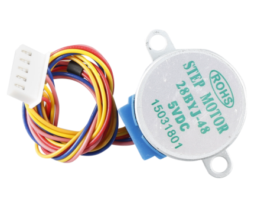
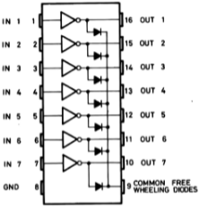
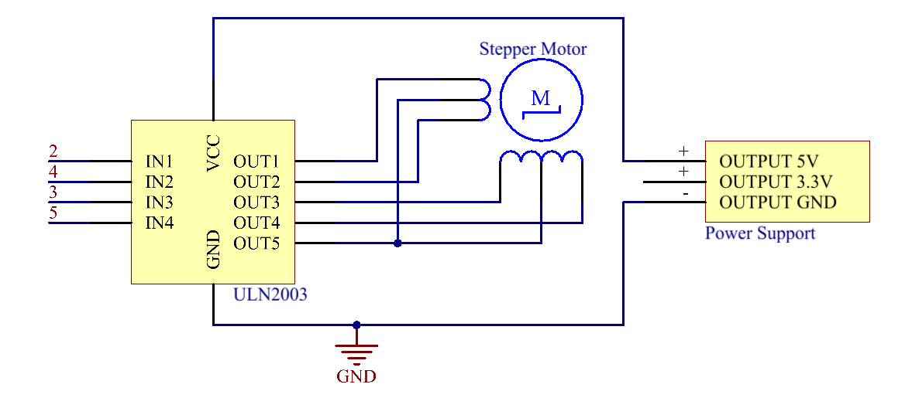

2.14 Stepper Motor
==================

Overview
--------

In this lesson, you will learn about Stepper Motor.

Components Required
-------------------

.. image:: media/list_2.14.png

Component Introduction
----------------------

Stepper motor is an open-loop control motor by converting the electric
pulse signal into angular displacement or line displacement. It is the
main executing component in the modern digital program control system.
When the stepper driver receives a pulse signal, it drives the stepper
motor to rotate a fixed angle in a set direction. The rotation of
stepper driver runs step by step at a fixed angle. The angular
displacement can be controlled by changing the number of pulses, thereby
achieving the purpose of accurate positioning. At the same time, the
speed and acceleration of the rotation of the motor can be controlled by
adjusting the pulse frequency so as to achieve the purpose of speed
regulation.

There are two types of steppers, unipolars and bipolars, and it is very
important to know which type you are working with. In this experiment,
we will use a unipolar stepper.

The stepper motor is a four-phase one, which uses a unipolarity DC power
supply. As long as you electrify all phase windings of the motor by an
appropriate timing sequence, you can make it rotate step by step. The
schematic diagram of a four-phase reactive stepper motor:

.. image:: media/image460.png

In the figure, in the middle of the motor is a rotor – a
gear-shaped permanent magnet. Around the rotor, 0 to 5 are teeth. Then
more outside, there are 8 magnetic poles, with each two opposite ones
connected by coil winding. So they form four pairs from A to D, which is
called a phase. It has four lead wires to be connected with switches SA,
SB, SC, and SD. Therefore, the four phases are in parallel in the
circuit, and the two magnetic poles in one phase are in series.

**Here's how a 4-phase stepper motor works:**

When switch SB is power on, switch SA, SC, and SD is power off, and
B-phase magnetic poles align with tooth 0 and 3 of the rotor. At the
same time, tooth 1 and 4 generate staggered teeth with C- and D-phase
poles. Tooth 2 and 5 generate staggered teeth with D- and A-phase poles.
When switch SC is power on, switch SB, SA, and SD is power off, the
rotor rotates under magnetic field of C-phase winding and that between
tooth 1 and 4. Then tooth 1 and 4 align with the magnetic poles of
C-phase winding. While tooth 0 and 3 generate staggered teeth with A-
and B-phase poles, and tooth 2 and 5 generate staggered teeth with the
magnetic poles of A- and D-phase poles. The similar situation goes on
and on. Energize the A, B, C and D phases in turn, and the rotor will
rotate in the order of A, B, C and D.

The stator of Stepper Motor we use has 32 magnetic poles, so a circle
needs 32 steps. The output shaft of the Stepper Motor is connected with
a reduction gear set, and the reduction ratio is 1/64. **So the final
output shaft rotates a circle requiring a 32*64=2048 step**.

**ULN2003**

Fritzing Circuit
----------------

Power Supply Module is used to power the stepper motor. Get the GND of
Mega 2560 Board and GND of ULN2003 connected to the cathode of the
breadboard, and connect the VCC of ULN2003 to 5V OUTPUT of Power Supply.

The wiring of ULN2003 and Mega2560 is shown as follows:

.. image:: media/image149.png

Schematic Diagram
-----------------

Code
----

.. raw:: html

    <iframe src=https://create.arduino.cc/editor/sunfounder01/1ea1cc56-83ef-45c3-8140-2c7378ad8efa/preview?embed style="height:510px;width:100%;margin:10px 0" frameborder=0></iframe>

After uploading the codes to the Mega2560 board, you will be able to see that the stepper motor rotates one circle with an interval of a second and each circle takes 3.75s.

Code Analysis
-------------

By calling the library Stepper.h, you can easily drive the stepper motor. 

.. code-block:: arduino

    #include <Stepper.h> 

**Library Functions：**

.. code-block:: arduino

    Stepper(steps, pin1, pin2, pin3, pin4)

Creates a new instance of the Stepper class that represents a particular stepper motor attached to your Arduino board.

**steps**: the number of steps in one revolution of your motor. If your motor gives the number of degrees per step, divide that number into 360 to get the number of steps (e.g. 360 / 3.6 gives 100 steps). (int)

.. note::
    Every circle of the stepper motor takes 2048 steps.

.. code-block:: arduino

    setSpeed(rpm)

Sets the motor speed in rotations per minute. This function doesn't make the motor turn, just sets the speed at which it will when you call step().

**rpm**: the speed at which the motor should turn in rotations per minute - a positive number. (long)

.. note::
    The stepper motor we use here rotates 17 circles a minute at most.

.. code_block:: arduino

    step(steps)

Turns the motor a specific number of steps, at a speed determined by the most recent call to setSpeed(). 

**This function is blocking;** that is, it will wait until the motor has finished moving to pass control to the next line in your sketch. For example, if you set the speed to, say, 1 RPM and called step(2048) on a 2048-step motor, this function would take a full minute to run. For better control, keep the speed high and only go a few steps with each call to step().

**steps:** the number of steps to turn the motor - positive to turn one direction, negative to turn the other. (int)

Phenomenon Picture
------------------

.. image:: media/image151.jpeg