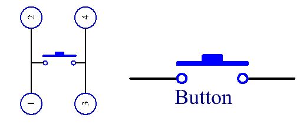

2.15 Button
===========

Overview
--------

In this lesson, you will learn about Button. Button is a common
component used to control electronic devices. It is usually used as a
switch to connect or break circuits.

Components Required
-------------------

.. image:: media/list_2.15.png

Component Introduction
----------------------

Two pins on the left are connected, and the one on the right is similar
to the left, which is shown below:

.. image:: media/image152.png

The symbol shown as below is usually used to represent a button in
circuits.

When the button is pressed, the 4 pins are connected, thus closing the
circuit.

Fritzing Circuit
----------------

In this example, we read the signal of the button with the digital pin
2. When the button is not pressed, the digital pin 2 (through the
drop-down resistor) is connected to ground to read the low level (0);
when the button is pressed, the two pins are connected and when the pin
is connected to the 5V power supply, the high level (1) is read.

.. image:: media/image464.png

.. note::
    If you disconnect the digital I/O pin from anything,
    the LED may blink erratically. The input is "floating" or it doesn't
    have a solid connection to voltage or ground, so it will randomly return
    either HIGH or LOW. That's why there needs a pull-down resistor in the
    circuit.

Schematic Diagram
-----------------

.. image:: media/image465.png

Code
----

**Example 1：**

.. raw:: html

    <iframe src=https://create.arduino.cc/editor/sunfounder01/435a252c-3d2e-45be-a3e2-294a5dcdb9fd/preview?embed style="height:510px;width:100%;margin:10px 0" frameborder=0></iframe>

Uploaded the codes to the Mega2560 board, you can see the readings of
the pins on the serial monitor. When you press down the Button, there
will display 「1」on the serial monitor, and once you release it, there
will display「0」. As for the detail code explanation, please refer to
**Part 1-1.4 Digital Read.**

:ref:`1.4 Digital Read`

**Example 2：**

.. raw:: html

    <iframe src=https://create.arduino.cc/editor/sunfounder01/020e4812-4345-4bf2-849b-df0c2b857213/preview?embed style="height:510px;width:100%;margin:10px 0" frameborder=0></iframe>

Uploaded the codes to the Mega2560 board, every time you press the
button, the output value will switch between 0 and 1. If you want to
know more about the code explanation, you can turn to **Part 1-1.10 State
Change Detection.**

:ref:`1.10 State Change Detection`

Phenomenon Picture
------------------

.. image:: media/image43.jpeg