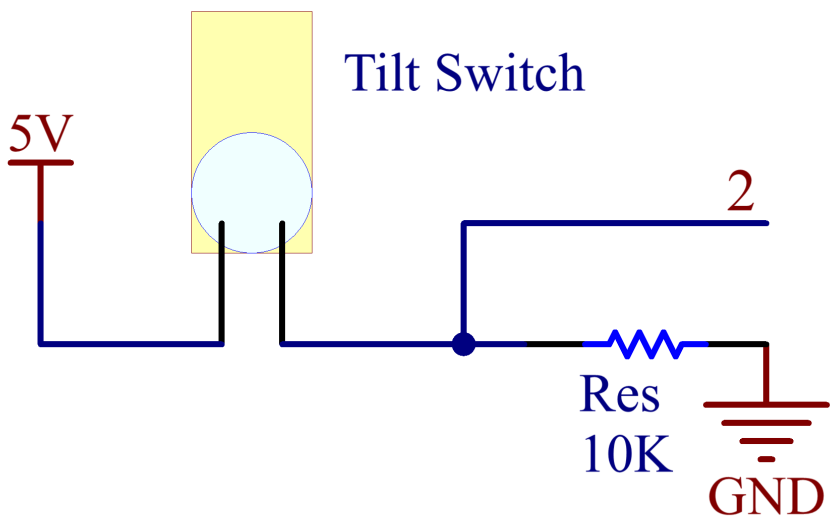

2.17 Tilt Switch
==================

**Overview**
---------------

In this lesson, you will learn about tilt switch. Tilt switch can be
used to detect whether objects tilt, which is of great value in
practical applications. It can be used to judge the tilt of bridges,
buildings, transmission line tower and so on, so it has an important
guiding function in carrying out maintenance work.

**Components Required**
-------------------------

.. image:: media/Part_two_17.png

**Component Introduction**
----------------------------

The principle is very simple. When the switch is tilted in a certain
angle, the ball inside rolls down and touches the two contacts connected
to the pins outside, thus triggering circuits. Otherwise the ball will
stay away from the contacts, thus breaking the circuits.

.. image:: media/image164.jpeg
   :width: 5.39792in
   :height: 4.01458in
   :align: center

**Fritzing Circuit**
---------------------

In this example, digital pin 2 is used to read the signal of Tilt
Switch.

.. image:: media/image165.png
   :alt: 2.17 Tilt Switch_bb
   :width: 500
   :align: center

**Schematic Diagram**
-----------------------

**Code**
----------

.. raw:: html

    <iframe src=https://create.arduino.cc/editor/sunfounder01/b0649977-fa45-423a-9612-9180d600f3ec/preview?embed style="height:510px;width:100%;margin:10px 0" frameborder=0></iframe>

After the codes are uploaded to the Mega2560 board, you can open the
serial monitor to see the readings of pins, which displays 「1」 or
「0」 when Tilt Switch is vertical (bringing the internal metal ball
into contacting with the Wire Pins) or tilted. For detailed explanation
of codes, you can turn to :ref:`1.4 Digital Read`.

**Phenomenon Picture**
-----------------------

.. image:: media/image167.jpeg
   :alt: 2.17
   :width: 6.09792in
   :height: 3.86875in
   :align: center