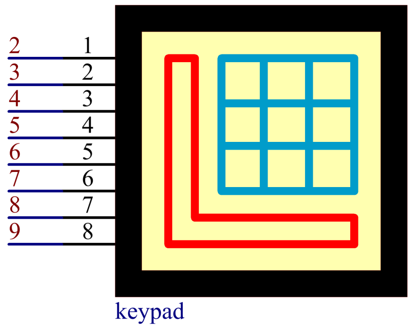

2.19 Keypad
============

**Overview**
-------------

In this lesson, you will learn to use Keypad. Keypad can be applied into
various kinds of devices, including mobile phone, fax machine, microwave
oven and so on. It is commonly used in user input.

**Components Required**
-------------------------

.. image:: media/Part_two_19.png

**Component Introduction**
----------------------------

A keypad is a rectangular array of 12 or 16 OFF-(ON) buttons. Their
contacts are accessed via a header suitable for connection with a ribbon
cable or insertion into a printed circuit board. In some keypads, each
button connects with a separate contact in the header, while all the
buttons share a common ground.

.. image:: media/Part_two_19_Introduction.png
    :align: center

More often, the buttons are matrix encoded, meaning that each of them
bridges a unique pair of conductors in a matrix. This configuration is
suitable for polling by a microcontroller, which can be programmed to
send an output pulse to each of the four horizontal wires in turn.
During each pulse, it checks the remaining four vertical wires in
sequence, to determine which one, if any, is carrying a signal. Pullup
or pulldown resistors should be added to the input wires to prevent the
inputs of the microcontroller from behaving unpredictably when no signal
is present.

**Fritzing Circuit**
---------------------

In this example, we extend the pins 1~8 of Keypad to connect to the
digital pins 2~9.

.. image:: media/image176.png
   :width: 7.65486in
   :height: 5.14514in

**Schematic Diagram**
----------------------

**Code**
-----------

The codes use the `library Keypad.h <https://github.com/sunfounder/sunfounder_vincent_kit_for_arduino/tree/master/library>`_ 
Please refer to :ref:`4.1 Add Libraries` to import the library.   

.. raw:: html

    <iframe src=https://create.arduino.cc/editor/sunfounder01/89e21aab-1a9c-4bf7-a0b3-a9b80f4d2d96/preview?embed style="height:510px;width:100%;margin:10px 0" frameborder=0></iframe>

After uploading the codes to the Mega2560 board, on the serial monitor,
you can see the value of the key currently pressed on the Keypad.

**Code Analysis**
-------------------

By calling the Keypad.h library, you can easily use Keypad.

.. code-block:: arduino

    #include <Keypad.h> 

**Library Functions：**

.. code-block:: arduino

    Keypad(char *userKeymap, byte *row, byte *col, byte numRows, byte numCols)

Initializes the internal keymap to be equal to userKeymap.

userKeymap: The symbols on the buttons of the keypads.

row, col: Pin configuration.

numRows, numCols: Keypad sizes.

.. code-block:: arduino

    char getKey()

Returns the key that is pressed, if any. This function is non-blocking.

**Phenomenon Picture**
------------------------

.. image:: media/image178.jpeg
   :alt: 2.19
   :width: 5.18264in
   :height: 4.52014in
   :align: center