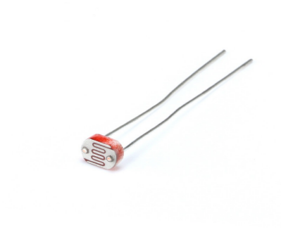

2.26 Photoresistor
===================

**Overview**
---------------

In this lesson, you will learn about Photoresistor. Photoresistor is applied in 
many electronic goods, such as the camera meter, clock radio, alarm device (as beam detector), 
small night lights, outdoor clock, solar street lamps and etc. Photoresistor is placed in a 
street lamp to control when the light is turned on. Ambient light falling on the photoresistor 
causes street lamps to turn on or off.

**Components Required**
-------------------------

.. image:: media/Part_two_26.png

**Component Introduction**
------------------------------

A photoresistor or photocell is a light-controlled variable resistor.
The resistance of a photoresistor decreases with increasing incident
light intensity; in other words, it exhibits photo conductivity. A
photoresistor can be applied in light-sensitive detector circuits, and
light- and darkness-activated switching circuits.

**Fritzing Circuit**
----------------------

In this example, we use analog pin ( A0 ) to read the value of photoresistor. One
pin of photoresistor is connected to 5V, the other is wired up to A0.
Besides, a 10kΩ resistor is needed before the other pin is connected to
GND.

.. image:: media/image213.png
    :width: 500
    :align: center

**Schematic Diagram**
-----------------------

.. image:: media/image214.png
    :width: 400
    :align: center

**Code**
---------------

.. raw:: html

    <iframe src=https://create.arduino.cc/editor/sunfounder01/c04e97d3-635a-4be6-9d35-9dae005331ae/preview?embed style="height:510px;width:100%;margin:10px 0" frameborder=0></iframe>

After uploading the codes to the Mega2560 board, you can open the serial
monitor to see the read value of the pin. When the ambient light becomes
stronger, the reading will increase correspondingly, and the pin reading
range is 「0」~「1023」. However, according to the environmental
conditions and the characteristics of the photoresistor, the actual
reading range may be smaller than the theoretical range. For a detailed
explanation of the code, refer to :ref:`1.5 Analog Read`.

**Phenomenon Picture**
------------------------

.. image:: media/image215.jpeg
   :alt: 2.27
   :width: 8.62361in
   :height: 5.43958in
   :align: center