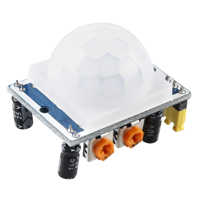
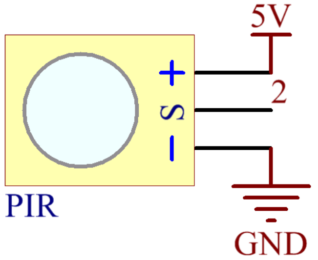

2.31 PIR Module
================

**Overview**
--------------

In this lesson, you will learn how to use PIR Module. The PIR sensor
detects infrared heat radiation or the presence of organisms that emit
infrared heat radiation. This module is widely used in daily life for
our intruder alarm and visiting prompt.

**Components Required**
-------------------------

.. image:: media/Part_two_31.png

**Component Introduction**
------------------------------

The PIR sensor is split into two slots that are connected to a
differential amplifier. Whenever a stationary object is in front of the
sensor, the two slots receive the same amount of radiation and the
output is zero. Whenever a moving object is in front of the sensor, one
of the slots receives more radiation than the other, which makes the
output fluctuate high or low. This change in output voltage is a result
of detection of motion.

After the sensing module is wired, there is a one-minute
initialization. During the initialization, module will output for 0~3
times at intervals. Then the module will be in the standby mode.
Please keep the interference of light source and other sources away
from the surface of the module so as to avoid the misoperation caused
by the interfering signal. Even you'd better use the module without
too much wind, because the wind can also interfere with the sensor.
Two trigger modes: (choosing different modes by using the jumper cap).

**Distance Adjustment**

.. image:: media/image235.png
    :width: 300
    :align: center

Turning the knob of the distance adjustment potentiometer clockwise, the
range of sensing distance increases, and the maximum sensing distance
range is about 0-7 meters. If turn it anticlockwise, the range of
sensing distance is reduced, and the minimum sensing distance range is
about 0-3 meters.

| **Delay Adjustment**
| Rotate the knob of the delay adjustment potentiometer clockwise, you
  can also see the sensing delay increasing. The maximum of the sensing
  delay can reach up to 300s. On the contrary, if rotate it
  anticlockwise, you can shorten the delay with a minimum of 5s. 

Two trigger modes: (choosing different modes by using the jumper cap).

-  **H:** **Repeatable trigger mode**, after sensing the human body, the
   module outputs high level. During the subsequent delay period, if
   somebody enters the sensing range,the output will keep being the high
   level.

-  **L**\ ：\ **Non-repeatable trigger mode**, outputs high level when
   it senses the human body. After the delay, the output will change
   from high level into low level automatically. 

| PIR can only be installed indoors, and its false alarm rate has a
  great relationship with the location and mode of installation. The
  correct use should meet the following conditions:
| 1. It should be 2.0-2.2 meters above the ground.
| 2. Stay away from air conditioners, refrigerators, stoves and other
  places where air temperature changes
  `apparently <https://cn.bing.com/dict/search?q=apparently&FORM=BDVSP6&mkt=zh-cn>`__.
| 3. No screen, furniture, large-scale bonsai or other isolation objects
  shall be detected within the detection range.
| 4. Don't face straightly toward the window, otherwise the disturbance
  of the hot air flow outside the window and the movement of people will
  cause false alarm.
| 5. Do not use in areas with strong airflow.
| 6. The sensitivity of PIR to human body is also closely related to the
  direction of movement. It is least sensitive to radial movement and
  most sensitive to the movement in the crosscutting direction.

**Fritzing Circuit**
----------------------

In this example, we can connect the pins of Sound Sensor
Module to the pins of Mega 2560 Board directly, and we use digital pin 2
to read the signal of PIR Module. Connect the VCC of PIR Module to 5V,
GND to GND, and OUT to digital pin NOTE: you can remove the PIR cover to
see the pin mark.

.. image:: media/image236.png
   :width: 500
   :align: center

**Schematic Diagram**

**Code**
-------------

.. raw:: html

    <iframe src=https://create.arduino.cc/editor/sunfounder01/7d331c91-94eb-4284-b288-5260521505fc/preview?embed style="height:510px;width:100%;margin:10px 0" frameborder=0></iframe>

After the codes are uploaded to the Mega2560 board, you can open the
serial monitor to see the reading value of the pin. When PIR Module
detects activity nearby, the serial monitor will display 「1」;
otherwise, it will display 「0」. Check :ref:`1.4 Digital Read` 
detail code explanation.

There are two potentiometers on the PIR module: one is to adjust
**sensitivity** and the other is to adjust the **detection distance**.
In order to make the PIR module work better, you need to try to adjust
these two potentiometers.

**Phenomenon Picture**
------------------------

.. image:: media/image238.jpeg
   :alt: 2.31
   :width: 6.97361in
   :height: 5.13264in
