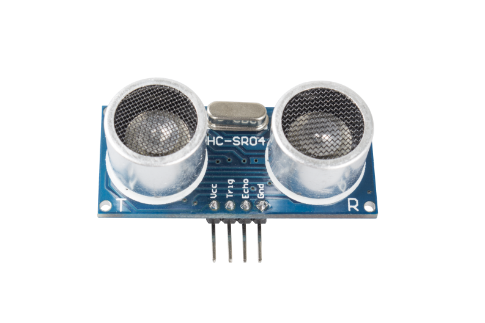

2.33 Ultrasonic Module
======================

**Overview**
------------

In this lesson, you will learn how to use Ultrasonic module.

**Components Required**
-------------------------

.. image:: media/Part_two_33.png

**Component Introduction**
----------------------------

Ultrasonic ranging module provides 2cm - 400cm non-contact measurement function. 
The working principle is that when the MPU sends out orders, the ceramic chip 
begins to vibrate and then aluminum enclosure vibrates together with it to form 
ultrasonic wave and emit the wave towards the back of the car. After the emitted 
ultrasonic wave hits an obstacle, there will be echo wave. This echo wave is 
received by the same aluminum enclosure and the ceramic chip in the form of 
vibration. The MPU judges the position of the obstacle by calculating the time 
difference and azimuth difference of the echo wave. Ultrasonic distance sensor 
can be widely used in the field of material level (liquid level) monitoring, 
robot anti-collision, various ultrasonic proximity switches, and intruder alarm.

The module includes ultrasonic transmitters, receiver and control
circuit. The basic principles are as follows:

1.Use an IO flip-flop to process a high level signal of at least 10us;

2.The module automatically sends eight 40khz and detects if there is a
pulse signal return.

3.If the signal returns, passing the high level, the high output IO
duration is the time from the transmission of the ultrasonic wave to the
return of it. Here, test distance = (high time x sound speed (340 m / s)
/ 2.

======== =================== ======= ======
**TRIG** Trigger Pulse Input **GND** Ground
**ECHO** Echo Pulse Output   **VCC** Supply
======== =================== ======= ======

The timing diagram is shown below. You only need to supply a short 10us
pulse for the trigger input to start the ranging, and then the module
will send out an 8 cycle burst of ultrasound at 40 kHz and raise its
echo. You can calculate the range through the time interval between
sending trigger signal and receiving echo signal.

Formula: us / 58 = centimeters or us / 148 =inch; or: the
range = high level time \* velocity (340M/S) / 2; you are suggested to
use measurement cycle over 60ms in order to prevent signal collisions of
trigger signal and the echo signal.

.. image:: media/image245.png
    :align: center

**Fritzing Circuit**
---------------------

In this example, we directly connect the pins of Ultrasonic Module with
the pins of Mega 2560 Board. And then we get VCC of the Ultrasonic
Module connected to 5V, GND to GND, Trig to the digital pin 5, Echo to
the digital pin 4.

.. image:: media/image246.png
   :width: 500
   :align: center

**Schematic Diagram**
----------------------

.. image:: media/image247.png
   :width: 2.91667in
   :height: 2.27083in
   :align: center

**Code**
----------

.. raw:: html

    <iframe src=https://create.arduino.cc/editor/sunfounder01/8254174a-93c8-4a72-a440-26f1ab63ca07/preview?embed style="height:510px;width:100%;margin:10px 0" frameborder=0></iframe>

After uploading the codes to the Mega2560 board, the serial monitor will
display the distance of obstacles ahead that the ultrasonic sensor has
detected.

**Code Analysis**
--------------------

About the application of ultrasonic sensor, we can directly check the
subfunction.

.. code-block:: arduino

    float readSensorData(){// ...}

PING is triggered by a HIGH pulse of 2 or more microseconds. (Give a
short LOW pulse beforehand to ensure a clean HIGH pulse.)

.. code-block:: arduino

    digitalWrite(trigPin, LOW); 
    delayMicroseconds(2);
    digitalWrite(trigPin, HIGH); 
    delayMicroseconds(10);
    digitalWrite(trigPin, LOW); 

The echo pin is used to read signal from PING, a HIGH pulse whose
duration is the time (in microseconds) from the sending of the ping to
the reception of echo of the object.

.. code-block:: arduino

    microsecond=pulseIn(echoPin, HIGH);

The speed of sound is 340 m/s or 29 microseconds per centimeter.

This gives the distance travelled by the ping, outbound and return, so
we divide by 2 to get the distance of the obstacle.

.. code-block:: arduino

    float distance = microsecond / 29.00 / 2;  

**Phenomenon Picture**
------------------------

.. image:: media/image248.jpeg
   :alt: 2.33
   :width: 5.40833in
   :height: 3.93681in
   :align: center
