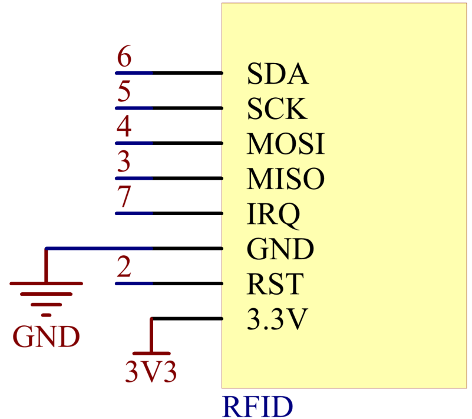

2.35 RFID-RC522 Module
=======================

**Overview**
-------------

In this lesson, you will learn how to use RFID Module. RFID is the
abbreviation of Radio Frequency Identification. Its working principle is
to carry on the contactless data communication between the reader and
the label to achieve the goal of identifying the target. The application
of RFID is very extensive, currently the typical applications are animal
chips, immobilizer, access control, parking control, production chain
automation, material management and so on.

**Components Required**
-------------------------

.. image:: media/Part_two_35.png

**Component Introduction**
---------------------------

Radio Frequency Identification (RFID) refers to technologies that
involve using wireless communication between an object (or tag) and an
interrogating device (or reader) to automatically track and identify
such objects. The tag transmission range is limited to several meters
from the reader. A clear line of sight between the reader and tag is not
necessarily required.

Most tags contain at least one integrated circuit (IC) and an antenna.
The microchip stores information and is responsible for managing the
radio frequency (RF) communication with the reader. Passive tags do not
have an independent energy source and depend on an external
electromagnetic signal, provided by the reader, to power their
operations. Active tags contain an independent energy source, such as a
battery. Thus, they may have increased processing, transmission
capabilities and range.

**MFRC522**

MF RC522 is a highly integrated read and write card chip applied to the
13.56MHz contactless communication. Launched by the NXP Company, it is a
low-voltage, low-cost, and small-sized non-contact card chip, a best
choice of intelligent instrument and portable hand held device.

The MF RC522 uses advanced modulation and demodulation concept which
fully presented in all types of 13.56MHz passive contactless
communication methods and protocols. In addition, it supports rapid
CRYPTO1 encryption algorithm to verify MIFARE products.

MFRC522 also supports MIFARE series of high-speed non-contact
communication, with a two-way data transmission rate up to 424kbit/s. As
a new member of the 13.56MHz highly integrated reader card series, MF
RC522 is much similar to the existing MF RC500 and MF RC530 but there
also exists great differences.

It communicates with the host machine via the serial manner which needs
less wiring. You can choose between SPI, I2C and serial UART mode
(similar to RS232), which helps reduce the connection, save PCB board
space (smaller size), and reduce cost.

**Fritzing Circuit**
---------------------

In this example, we insert the RFID into the breadboard. Get the 3.3V of
RFID connected to 3.3V, GND to GND, RST to pin 2, SDA to pin 6, SCK to
pin 5, MOSI to pin 4, MISO to pin 3 and IRQ to pin 7.

.. image:: media/image259.png
   :width: 500
   :align: center

**Schematic Diagram**
-------------------------

**Code**
-----------

The codes use the `rfid1.h library <https://github.com/sunfounder/sunfounder_vincent_kit_for_arduino/tree/master/library>`_. About how to import the library,
please refer to :ref:`4.1 Add Libraries`.

.. raw:: html

    <iframe src=https://create.arduino.cc/editor/sunfounder01/81d293e2-aba5-4bc2-9c16-ddb45b6357a8/preview?embed style="height:510px;width:100%;margin:10px 0" frameborder=0></iframe>

Uploaded the codes to the Mega2560 board, you can get your RFID card (secret key) 
close to the RFID Reader. The module will read the card information and then print it on the serial monitor.  

**Code Analysis**
-------------------

The functions of the module are included in the library rfid1.h.

.. code-block:: arduino

    #include <rfid1.h>

**Library Functions：**

.. code-block:: arduino

    RFID1

Create a new instance of the rfid1 class that represents a particular
RFID module attached to your Arduino .

.. code-block:: arduino

    void begin(IRQ_PIN,SCK_PIN,MOSI_PIN,MISO_PIN,SDA_PIN,RST_PIN)

Pin configuration.

IRQ_PIN,SCK_PIN,MOSI_PIN,MISO_PIN: the pins used for the SPI
communication.

SDA_PIN: Synchronous data adapter.

RST_PIN: The pins used for reset.

.. code-block:: arduino

    void init()

Initialize the RFID.

.. code-block:: arduino

    uchar request(uchar reqMode, uchar *TagType);

Search card and read card type, and the function will return the current
read status of RFID and return MI_OK if successed.

reqMode: Search methods. PICC_REQIDL is defined that 0x26 command bits
(Search the cards that does not in the sleep mode in the antenna area).

\*TagType: It is used to store card type, and its value can be 4byte
(e.g. 0x0400).

.. code-block:: arduino

    char * readCardType(uchar *TagType)

This function decodes the four-digit hexadecimal number of \*tagType
into the specific card type and returns a string. If passed 0x0400,
"MFOne-S50" will be returned.

.. code-block:: arduino

    uchar anticoll(uchar *serNum);

Prevent conflict, and read the card serial number. The function will
return the current reading status of RFID. It returns MI_OK if
successed.

\*serNum: It is used to store the card serial number, and return the 4
bytes card serial number. The 5th byte is recheck byte(e.g. e.g. my
magnetic card ID is 5AE4C955).

**Phenomenon Picture**
---------------------------

.. image:: media/Part_two_35_Code_Analysis.png
   :alt: 2.35
   :align: center
