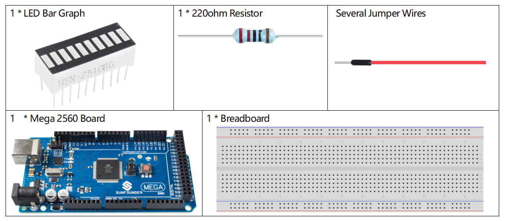

2.4 LED Bar Graph
==================

Overview
--------

In this lesson, you will learn something about LED Bar Graph. Generally,
LED Bar Graph works as a battery level indicator, Audio equipment,
industrial control panel. If we want, we can also find its other
application.

Components Required
-------------------

Component Introduction
----------------------

LED Bar Graph is an LED array, which is used to connect with electronic
circuit or microcontroller. It’s easy to connect LED bar graph with the
circuit like as connecting 10 individual LEDs with 10 output pins.

.. note::
    The anode is the side with a label (1-10).

.. image:: media/image81.jpeg

Fritzing Circuit
----------------

In this example, we use digital pins 2~11 to drive the LED Bar Graph.
LED Bar Graph has ten separate LEDs inside and each LED has two pins.
The left pins 1~10 of LED Bar Graph are connected with the digital pins
2~11 respectively; the right side pins 11~20 are separately extended to
same side of these 220ohm resistors whose other sides are identically
connected to GND.

.. image:: media/image82.png

Schematic Diagram
-----------------

.. image:: media/image427.png

Code
----

.. raw:: html

    <iframe src=https://create.arduino.cc/editor/sunfounder01/0614541f-58d0-4f5c-b7c9-c3b893178fda/preview?embed style="height:510px;width:100%;margin:10px 0" frameborder=0></iframe>

Uploaded the codes to the Mega2560 board, you can see that the LEDs on the LED Bar Graph flash in sequence.

Code Analysis
-------------
The codes in setup() use the for loop to initialize pins 2~11 to output mode in turn.  

.. code-block:: arduino

    for(int i=2;i<=11;i++)
    {
        pinMode(i,OUTPUT);
    }

The for loop is used in loop() to make the LED flash(turn on 0.5s, then turn off 0.5s) in sequence.

.. code-block:: arduino

    for(int i=2;i<=11;i++)
    {
        digitalWrite(i,HIGH);
        delay(500);
    digitalWrite(i,LOW);
        delay(500);
    }

Refer to **Part 1-1.2 Digital Write** for more details about controlling the LED by using digital pins. 

:ref:`1.2 Digital Write`

Phenomenon Picture
------------------

.. image:: media/image84.jpeg