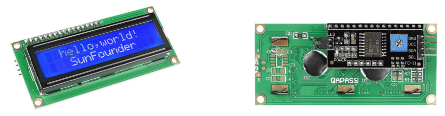

2.9 I2C LCD1602 Module
======================

Overview
--------

In this lesson, you will learn about LCD1602. LCD1602, or 1602
character-type liquid crystal display, a kind of dot matrix module to
show letters, numbers, characters and so on.

Components Required
-------------------

.. image:: media/list_2.9.png

Component Introduction
----------------------

It's composed of 5x7 or 5x11 dot matrix positions; each position can
display one character. There's a dot pitch between two characters and a
space between lines, thus separating characters and lines. The number
1602 means on the display, 2 rows can be showed and 16 characters in
each.

As we all know, though LCD and some other displays greatly enrich the
man-machine interaction, they share a common weakness. When they are
connected to a controller, multiple IOs will be occupied of the
controller which has no so many outer ports. Also it restricts other
functions of the controller. Therefore, LCD1602 with an I2C bus is
developed to solve the problem.

I2C communication
-----------------

I2C(Inter-Integrated Circuit) bus is a very popular and powerful bus for
communication between a master device (or master devices) and a single
or multiple slave devices. I2C main controller can be used to control IO
expander, various sensors, EEPROM, ADC/DAC and so on. All of these are
controlled only by the two pins of host, the serial data (SDA) line and
the serial clock line(SCL).

Fritzing Circuit
----------------

In this example, we will get the first pin GND of LCD1602 connected to
GND, the second pin VCC to 5V, the third pin SDA to the pin SDA 20 and
the forth pin SCL to the pin SCL 21.

.. image:: media/image113.png

Schematic Diagram
-----------------

.. image:: media/image446.png

.. note::
    The SDA and SCL of the Mega2560 board are the pins 20 and 21.

Code
----

The libraries Wire.h and LiquidCrystal_I2C.h are used in these codes, Wire.h is built in Arduino, but LiquidCrystal_I2C.h needs adding manually. Add Method: Refer to **Part 4 - 4.1 Add Libraries**

`LiquidCrystal_I2C.h <https://github.com/sunfounder/sunfounder_vincent_kit_for_arduino/tree/master/library>`_

:ref:`4.1 Add Libraries`

.. raw:: html

    <iframe src=https://create.arduino.cc/editor/sunfounder01/ca004845-7cd3-4fec-a85c-732a1a23c8b6/preview?embed style="height:510px;width:100%;margin:10px 0" frameborder=0></iframe>

Upload the codes to the Mega2560 board, the content that you input in the serial monitor will be printed on the LCD. 

.. note::
    About the ASCII code and the character input in the serial monitor, please refer to Part 1-1.8 Serial Read. 

:ref:`1.8 Serial Read`

Code Analysis
-------------

By calling the library LiquidCrystal_I2C.h, you can easily drive the LCD. 

.. code-block:: arduino

    #include "LiquidCrystal_I2C.h"

**Library Functions：**

.. code-block:: arduino

    LiquidCrystal_I2C(uint8_t lcd_Addr,uint8_t lcd_cols,uint8_t lcd_rows)

Creates a new instance of the LiquidCrystal_I2C class that represents a
particular LCD attached to your Arduino board.

**lcd_AddR**: The address of the LCD defaults to 0x27.

**lcd_cols**: The LCD1602 has 16 columns.

**lcd_rows**: The LCD1602 has 2 rows.

.. code-block:: arduino

    void init()

Initialize the lcd.

.. code-block:: arduino

    void backlight()

Turn the (optional) backlight on.

.. code-block:: arduino

    void nobacklight()

Turn the (optional) backlight off.

.. code-block:: arduino

    void display()

Turn the LCD display on.

.. code-block:: arduino

    void nodisplay()

Turn the LCD display off quickly.

.. code-block:: arduino

    void clear()

Clear display, set cursor position to zero.

.. code-block:: arduino

    void setCursor(uint8_t col,uint8_t row)

Set the cursor position to col,row.

.. code-block:: arduino

    void print(data,BASE)

Prints text to the LCD.

**data**: The data to print (char, byte, int, long, or string).

**BASE (optional)**: The base in which to print numbers: BIN for binary (base 2), DEC for decimal (base 10), OCT for octal (base 8), HEX for hexadecimal (base 16).

Phenomenon Picture
------------------

.. image:: media/image115.jpeg