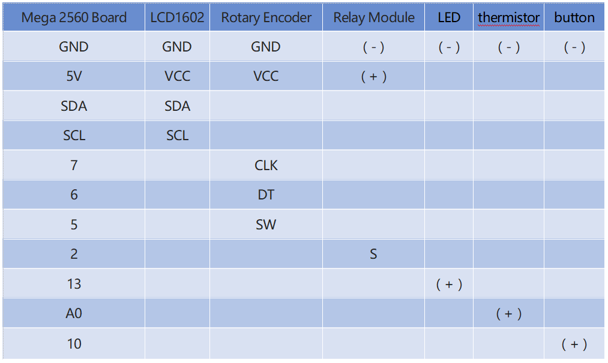

3.3 Overheat Monitor
=====================

**Overview**
-----------------

You may want to make an overheat monitoring device that applies to various 
situations. When the temperature of room is above 30°C in summer, the electric 
fan or the air conditioner will be turned on automatically. If the refrigerator 
stops to refrigerate, there will emit alarm. When the CPU gets overheated, the 
water-cooling system turns on. Next, we will use thermistor, relay, button, 
rotary encoder and LCD to make an intelligent temperature monitoring device 
whose threshold is adjustable. You can make it suitable for the scene you want 
by inserting different peripherals into the relay and using a rotary encoder to 
adjust the high temperature threshold.

**Components Required**
------------------------

.. image:: media/Part_three_3.1.png
    :align: center

.. image:: media/Part_three_3.2.png
    :align: center

**Fritzing Circuit**
-----------------------

In this example, the component modules are connected as shown in the
table.

.. image:: media/image276.png
   :alt: 3.3 Overheat Monitor_bb
   :align: center

**Schematic Diagram**
-------------------------

.. image:: media/image277.png
   :align: center

**Example Explanation**
-------------------------

The flow diagram of the project is as follows:

.. image:: media/Part_three_3_Example_Explanation.png
   :align: center

By using EEPROM.h library, the high temperature threshold is saved in
EEPROM to avoid the value reset after the restart of MCU.

**Library Functions：**

.. code-block:: arduino

    void write(address,value)

Write a byte to the EEPROM.

.. code-block:: arduino

    void Read(address)

Reads a byte from the EEPROM. Locations that have never been written to
have the value of 255.

.. code-block:: arduino

    void update(address,value)

Write a byte to the EEPROM. The value is written only if differs from
the one already saved at the same address.

.. code-block:: arduino

    void put(address,value)

Write any data type or object to the EEPROM.

.. code-block:: arduino

    void get(address)

Read any data type or object from the EEPROM.

**Phenomenon Picture**
------------------------

.. image:: media/image279.jpeg
   :alt: 3.03
   :width: 7.69861in
   :height: 5.35417in
   :align: center

.. raw:: html

   <iframe src=https://create.arduino.cc/editor/sunfounder01/ed5a53dd-9d6d-43f7-b5f1-c240a1c320fb/preview?embed style="height:510px;width:100%;margin:10px 0" frameborder=0>

</iframe>