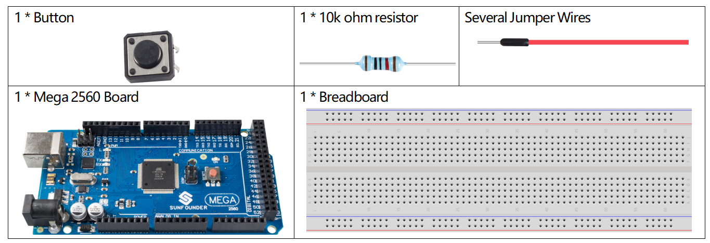
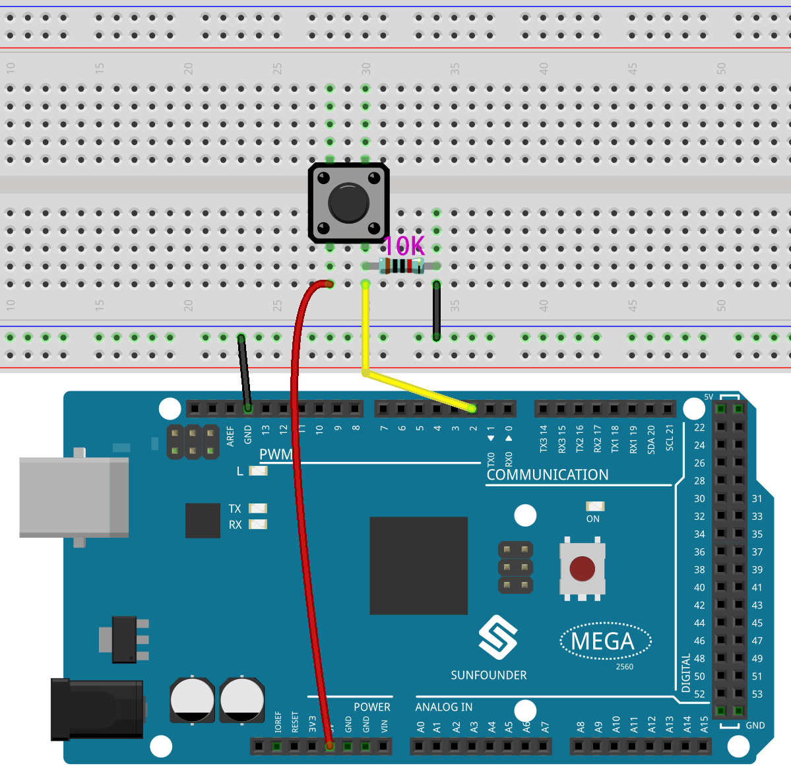
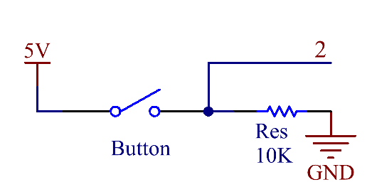

.. _ar_state_change:

1.10 Zustandsänderungserkennung
===============================

Überblick
------------------

Wenn Sie die Taste verwenden, können Sie nicht nur die Taste drücken, die LED aufleuchten lassen, die Taste loslassen, die LED ausschalten, sondern auch den Betriebszustand der LED bei jedem Drücken der Taste ändern. Um diesen Effekt zu erzielen, müssen Sie wissen, wann sich der Zustand der Schaltfläche von Aus zu Ein ändert , d . h. „Zustandsänderungserkennung“. In dieser Lektion werden wir die Ergebnisse der Zustandsänderungserkennung der Schaltfläche im seriellen Monitor drucken.

Erforderliche Komponenten
----------------------------------

* :ref:`cpn_mega2560`
* :ref:`cpn_breadboard`
* :ref:`cpn_wires`
* :ref:`cpn_button`
* :ref:`cpn_resistor`

Fritzing-Schaltung
-------------------------

In diesem Beispiel verwenden wir Pin 2, um das Signal des Tasters zu lesen.

Schematische Darstellung
--------------------------------

Code
-------

.. note::

    * Sie können die Datei ``1.10_stateChangeDetection.ino`` unter dem Pfad ``sunfounder_vincent_kit_for_arduino\code\1.10_stateChangeDetection`` direkt öffnen.
    * Oder kopieren Sie diesen Code in Arduino IDE. 

.. raw:: html

    <iframe src=https://create.arduino.cc/editor/sunfounder01/f15c5e05-b038-413e-9009-4d08fb9722fd/preview?embed style="height:510px;width:100%;margin:10px 0" frameborder=0></iframe>

Nachdem die Codes in das Mega2560-Board hochgeladen wurden, wechselt die Ausgangsnummer jedes Mal zwischen 0 und 1, wenn Sie die Taste drücken.

Code-Analyse
-----------------

Deklarieren Sie einen Pin, der mit Button verbunden ist.

.. code-block:: arduino

    const int  buttonPin = 2;  

Deklarieren Sie eine Variable namens 「detectionState」, um jeden Zustand der Zustandsänderungserkennung aufzuzeichnen.

.. code-block:: arduino

    int detectionState = 0;   

Deklarieren Sie zwei Variablen, um den Zustand der Schaltfläche zur Zustandsänderungserkennung zu lesen.

.. code-block:: arduino

    int buttonState = 0;         
    int lastButtonState = 0;   

Initialisieren Sie in ``setup()`` die Pins und starten Sie dann den seriellen Monitor.

.. code-block:: arduino

    pinMode(buttonPin, INPUT);
    Serial.begin(9600);

Lesen Sie in ``loop()`` den Wert von buttonPin und weisen Sie ihn dann der Variablen buttonState zu.

.. code-block:: arduino

    buttonState = digitalRead(buttonPin);

Vergleichen Sie buttonState mit lastButtonState, wenn sie nicht gleich sind, zeigt dies an, dass der Zustand geändert wurde. Eine Verzögerung (50) wird benötigt, um eine Entprellung während der Änderungserkennung zu realisieren. Weisen Sie nach dem Vergleich den buttonState lastButtonState zu, um die nächste Beurteilungsrunde durchzuführen.

.. code-block:: arduino

    if (buttonState != lastButtonState) {
    ...
        delay(50);
    }
    lastButtonState = buttonState;

Die Zustandsänderungsbeurteilung ist installiert (buttonState != lastButtonState), die weitere Beurteilung wird durchgeführt, um die Bedingung zu erhalten「Press the button」.

.. code-block:: arduino

    if (buttonState == HIGH) {
    ...
        } 

Unter dem Zustand「Taste drücken」 wird der DetectionState ausgeführt und wechselt zwischen 1 und 0. Währenddessen wird der Wert des DetectionState gedruckt.

.. code-block:: arduino

        detectionState=(detectionState+1)%2;
        Serial.print("The detection state is:");
        Serial.println(detectionState);

Phänomen Bild
------------------

.. image:: img/image413.png