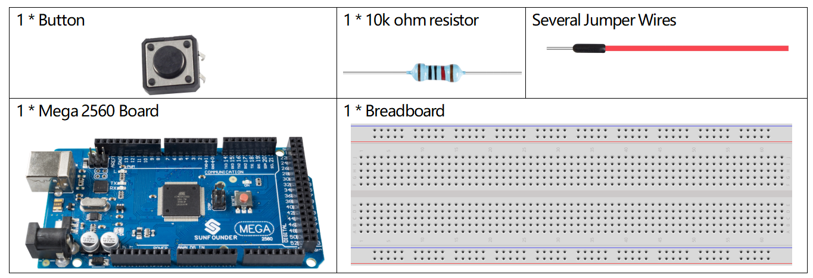
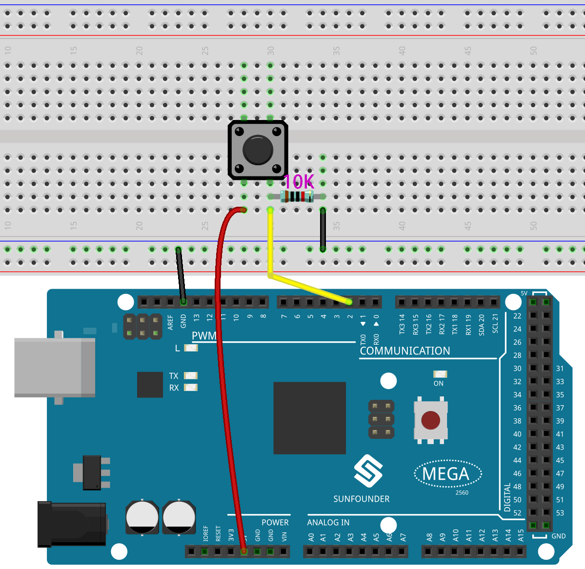
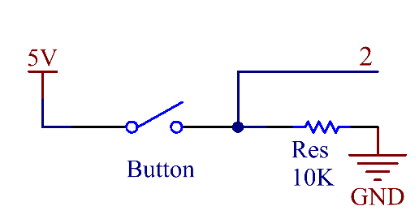

.. note:: 

    ¡Hola, bienvenido a la Comunidad de Entusiastas de Raspberry Pi, Arduino y ESP32 en Facebook! Profundiza en Raspberry Pi, Arduino y ESP32 junto a otros entusiastas.

    **¿Por qué unirse?**

    - **Soporte experto**: Resuelve problemas postventa y desafíos técnicos con la ayuda de nuestra comunidad y equipo.
    - **Aprender y compartir**: Intercambia consejos y tutoriales para mejorar tus habilidades.
    - **Vistas previas exclusivas**: Obtén acceso anticipado a nuevos anuncios de productos y avances.
    - **Descuentos especiales**: Disfruta de descuentos exclusivos en nuestros productos más nuevos.
    - **Promociones festivas y sorteos**: Participa en sorteos y promociones especiales de temporada.

    👉 ¿Listo para explorar y crear con nosotros? Haz clic en [|link_sf_facebook|] y únete hoy mismo.

.. _ar_state_change:

1.10 Detección de Cambio de Estado
=====================================

Resumen
-----------

Cuando utilizas un botón, no solo puedes presionar el botón para encender el 
LED, soltarlo para apagarlo, sino también alternar el estado de funcionamiento 
del LED cada vez que se presiona el botón. Para lograr este efecto, necesitas 
saber cuándo el estado del botón cambia de **apagado** a **encendido**, es 
decir, la "detección de cambio de estado". En esta lección, imprimiremos los 
resultados de la detección de cambio de estado del botón en el monitor serie.

Componentes necesarios
-------------------------

* :ref:`cpn_mega2560`
* :ref:`cpn_breadboard`
* :ref:`cpn_wires`
* :ref:`cpn_button`
* :ref:`cpn_resistor`

Circuito Fritzing
--------------------

En este ejemplo, utilizamos el pin 2 para leer la señal del botón.

Diagrama esquemático
-----------------------

Código
---------

.. note::

    * Puedes abrir el archivo ``1.10_stateChangeDetection.ino`` en la ruta ``sunfounder_vincent_kit_for_arduino\code\1.10_stateChangeDetection`` directamente.
    * O copiar este código en el IDE de Arduino.

.. raw:: html

    <iframe src=https://create.arduino.cc/editor/sunfounder01/f15c5e05-b038-413e-9009-4d08fb9722fd/preview?embed style="height:510px;width:100%;margin:10px 0" frameborder=0></iframe>

Después de cargar el código en la placa Mega2560, el número de salida cambiará entre 0 y 1 cada vez que presiones el botón.

Análisis del código
-----------------------

Declara un pin conectado al botón.

.. code-block:: arduino

    const int  buttonPin = 2;  

Declara una variable llamada 「detectionState」para registrar cada estado de la detección de cambio de estado.

.. code-block:: arduino

    int detectionState = 0;   

Declara dos variables para leer el estado del botón para la detección de cambio de estado.

.. code-block:: arduino

    int buttonState = 0;         
    int lastButtonState = 0;   

En setup(), inicializa los pines y luego inicia el monitor serie.

.. code-block:: arduino

    pinMode(buttonPin, INPUT);
    Serial.begin(9600);

En loop(), lee el valor de buttonPin y asígnalo a la variable buttonState.

.. code-block:: arduino

    buttonState = digitalRead(buttonPin);

Compara buttonState con lastButtonState. Si no son iguales, indica que el estado ha cambiado. Se necesita un delay(50) para realizar la eliminación de rebotes durante la detección del cambio. Después de la comparación, asigna buttonState a lastButtonState para hacer el siguiente juicio.

.. code-block:: arduino

    if (buttonState != lastButtonState) {
    ...
        delay(50);
    }
    lastButtonState = buttonState;

Una vez hecho el juicio de cambio de estado (buttonState != lastButtonState), 
se realiza un juicio adicional para obtener la condición「Presionar el botón」.

.. code-block:: arduino

    if (buttonState == HIGH) {
    ...
        } 

Bajo la condición「Presionar el botón」, detectionState se alterna entre 1 y 0. Al mismo tiempo, se imprime el valor de detectionState.

.. code-block:: arduino

        detectionState=(detectionState+1)%2;
        Serial.print("El estado de detección es:");
        Serial.println(detectionState);

Imagen del fenómeno
-----------------------

.. image:: img/image413.png