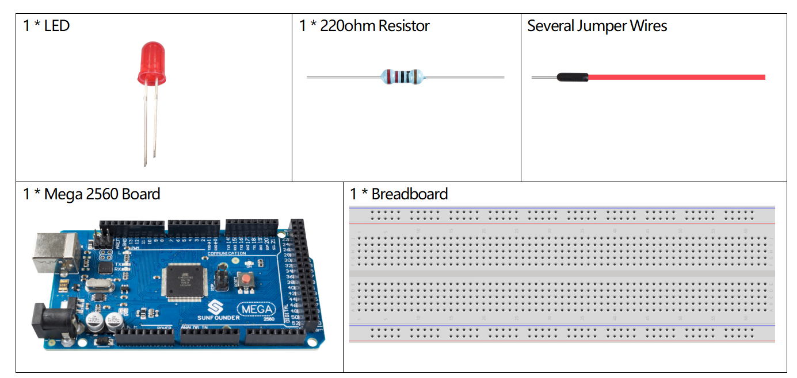

.. _ar_interval:

1.11 Intervall
================

Überblick
------------------

Manchmal müssen Sie zwei Dinge auf einmal tun. Zum Beispiel könnten Sie
eine LED blinken lassen und gleichzeitig einen Tastendruck lesen. In diesem Fall können Sie nicht
``delay()`` verwenden, da Arduino das Programm während ``delay()`` anhält. Wenn
Taste gedrückt wird, während Arduino pausiert und auf den Ablauf von ``delay()``
durchläuft, verpasst Ihr Programm den Tastendruck.

Dieser Sketch demonstriert, wie man eine LED ohne ``delay()`` zum Blinken bringt. Er
schaltet die LED ein und notiert dann die Zeit. Dann, jedes Mal
durch ``loop()``, um zu sehen, ob die gewünschte Blinkzeit verstrichen ist.
Ist dies der Fall, wird die LED ein- oder ausgeschaltet und die neue Zeit notiert.
Auf diese Weise blinkt die LED kontinuierlich, während die Ausführung des Sketches nie
einer einzigen Anweisung verzögert.

Eine Analogie wäre das Aufwärmen einer Pizza in der Mikrowelle und das
eine wichtige E-Mail warten. Sie legen die Pizza in die Mikrowelle und stellen
sie für 10 Minuten. Die Analogie zur Verwendung von ``delay()`` wäre, sich vor die Mikrowelle zu setzen
vor der Mikrowelle zu sitzen und zuzusehen, wie der Timer von 10 Minuten herunterzählt, bis er
Timer Null erreicht. Wenn die wichtige E-Mail in dieser Zeit eintrifft, werden Sie
wird man sie verpassen.

Im wirklichen Leben würde man erst die Pizza anmachen und dann
und dann Ihre E-Mails abrufen, dann vielleicht etwas anderes tun (das nicht zu lange dauert!)
(das dauert zu lange!), und ab und zu kommen Sie zur Mikrowelle zurück, um zu sehen
um zu sehen, ob der Timer Null erreicht hat, was bedeutet, dass die Pizza fertig ist.

Erforderliche Komponenten
---------------------------------

* :ref:`cpn_mega2560`
* :ref:`cpn_breadboard`
* :ref:`cpn_humiture`
* :ref:`cpn_led`
* :ref:`cpn_resistor`

Fritzing-Schaltung
-------------------------

In diesem Beispiel verwenden wir den digitalen Pin 9, um die LED anzusteuern, und wir verbinden
eine Seite des Widerstands an die entsprechenden digitalen Pins. Der längere
Pin der LED (eine positive Elektrode, Anode genannt) ist mit der anderen
der anderen Seite des Widerstands verbunden. Der kürzere Stift (eine negative Elektrode,
bezeichnet als Kathode) der LED ist mit GND verbunden.

.. image:: img/image30.png

Schematische Darstellung
------------------------------

.. image:: img/image466.png

Code
-------

.. note::

    * Sie können die Datei ``1.11_interval.ino`` unter dem Pfad ``sunfounder_vincent_kit_for_arduino\code\1.11_interval`` direkt öffnen.
    * Oder kopieren Sie diesen Code in Arduino IDE 1/2.
    * Oder klicken Sie auf Code öffnen, um ihn im `Web Editor <https://docs.arduino.cc/cloud/web-editor/tutorials/getting-started/getting-started-web-editor>`_ zu öffnen .
    * Laden Sie dann :ref:`ar_upload_code` auf das Board hoch.

.. raw:: html

    <iframe src=https://create.arduino.cc/editor/sunfounder01/9aa795a1-fcb1-4773-98bc-a353d3d21750/preview?embed style="height:510px;width:100%;margin:10px 0" frameborder=0></iframe>

Wenn Sie das Hochladen der Codes auf das Mega2560-Board abgeschlossen haben, sehen Sie, wie die LED hochgeladen wird. 

Code-Analyse
----------------

Deklarieren Sie den digitalen Pin 9 als ledPin.

.. code-block:: arduino

    const int ledPin = 9;

Setze den Zustand von ledState auf LOW, um die LED auszuschalten.

.. code-block:: arduino

    int ledState = LOW;

Initialisiere eine Variable namens previousMillis, um die vorherige Betriebszeit des Mikrocontrollers zu speichern.

.. code-block:: arduino

    unsigned long previousMillis = 0;     

Setzt die Intervallzeit auf 1000ms (Millisekunden).

.. code-block:: arduino

    const long intervall = 1000; 

Setze ledPin in den OUTPUT-Modus.

.. code-block:: arduino

    pinMode(ledPin, OUTPUT);

In loop() deklarieren wir currentMillis, um die aktuelle Zeit zu speichern.

.. code-block:: arduino

    unsigned long currentMillis = millis();

Wenn das Intervall zwischen der aktuellen Betriebszeit und der letzten Aktualisierungszeit größer als 1000ms ist, werden bestimmte Funktionen ausgelöst. In der Zwischenzeit wird previousMillis auf die aktuelle Zeit für die nächste Auslösung aktualisiert, die 1 Sekunde später erfolgen soll.  

.. code-block:: arduino

    if (currentMillis - previousMillis >= Intervall) {
        previousMillis = currentMillis;// speichere das letzte Mal, als die LED blinkte
    //..
    }

Hier werden bestimmte Funktionen in Intervallen ausgeführt, um den Zustand der LED zu ändern. 

.. code-block:: arduino

    if (ledState == LOW) 
    {ledState = HIGH;} 
    else 
    {ledState = LOW;}
    digitalWrite(ledPin, ledState);

Phänomen Bild
------------------

.. image:: img/image36.jpeg