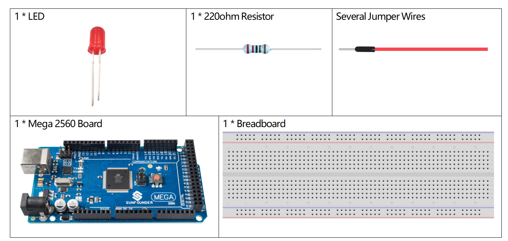
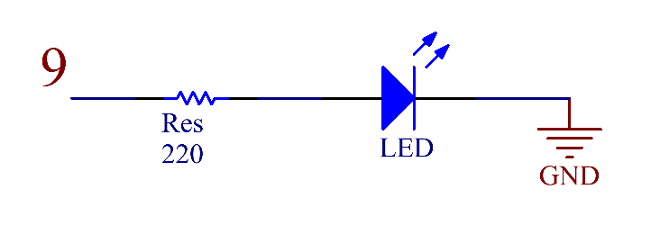

.. note::  

    Ciao, benvenuto nella comunità di appassionati di SunFounder Raspberry Pi & Arduino & ESP32 su Facebook! Immergiti nel mondo affascinante di Raspberry Pi, Arduino ed ESP32 insieme ad altri appassionati.

    **Perché unirti a noi?**

    - **Supporto esperto**: Risolvi problemi post-vendita e sfide tecniche con l'aiuto della nostra comunità e del nostro team.
    - **Impara e condividi**: Scambia consigli e tutorial per migliorare le tue competenze.
    - **Anteprime esclusive**: Ottieni accesso anticipato a nuovi annunci di prodotti e contenuti esclusivi.
    - **Sconti speciali**: Approfitta di sconti esclusivi sui nostri prodotti più recenti.
    - **Promozioni festive e concorsi**: Partecipa a concorsi e promozioni speciali durante le festività.

    👉 Sei pronto a esplorare e creare con noi? Clicca su [|link_sf_facebook|] e unisciti oggi!

.. _ar_interval:

1.11 Intervallo
=================

Panoramica
-------------

A volte è necessario eseguire due operazioni contemporaneamente. Ad esempio, 
potresti voler far lampeggiare un LED mentre leggi la pressione di un pulsante. 
In questo caso, non puoi utilizzare delay(), poiché Arduino mette in pausa il 
tuo programma durante l'esecuzione di delay(). Se il pulsante viene premuto 
mentre Arduino è in pausa, il tuo programma non rileverà la pressione.

Questo esempio dimostra come far lampeggiare un LED senza utilizzare delay(). 
Il LED si accende e viene registrato il tempo. Poi, a ogni iterazione di loop(), 
verifica se il tempo impostato per il lampeggio è trascorso. Se sì, cambia lo 
stato del LED (acceso o spento) e aggiorna il tempo. In questo modo, il LED 
lampeggia continuamente senza che l'esecuzione del programma si fermi su una 
singola istruzione.

Un'analogia potrebbe essere riscaldare una pizza nel microonde mentre attendi 
un'e-mail importante. Configuri il microonde per 10 minuti. Utilizzare delay() 
sarebbe come sederti davanti al microonde osservando il timer fino a quando 
raggiunge lo zero, perdendo l'opportunità di leggere l'e-mail. Nella vita reale, 
accenderesti il microonde e controlleresti la posta mentre aspetti, tornando al 
microonde di tanto in tanto per verificare se la pizza è pronta.

Componenti Necessari
-----------------------

* :ref:`cpn_mega2560`
* :ref:`cpn_breadboard`
* :ref:`cpn_wires`
* :ref:`cpn_led`
* :ref:`cpn_resistor`

Circuito con Fritzing
------------------------

In questo esempio, utilizziamo il pin digitale 9 per controllare il LED. 
Collega un lato della resistenza al pin digitale corrispondente. Il pin 
lungo del LED (anodo) va collegato all'altro lato della resistenza, mentre 
il pin corto (catodo) si collega a GND.

.. image:: img/image30.png

Schema del Circuito
----------------------

Codice
---------

.. note::

    * Puoi aprire direttamente il file ``1.11_interval.ino`` che si trova nel percorso ``sunfounder_vincent_kit_for_arduino\code\1.11_interval``.
    * Oppure copia questo codice nell'Arduino IDE 1/2.

.. raw:: html

    <iframe src=https://create.arduino.cc/editor/sunfounder01/9aa795a1-fcb1-4773-98bc-a353d3d21750/preview?embed style="height:510px;width:100%;margin:10px 0" frameborder=0></iframe>

Dopo aver caricato il codice sulla scheda Mega2560, vedrai il LED lampeggiare.

Analisi del Codice
--------------------

Dichiara il pin digitale 9 come ledPin.

.. code-block:: arduino

    const int ledPin = 9;

Imposta lo stato iniziale di ledState su LOW per spegnere il LED.

.. code-block:: arduino

    int ledState = LOW;

Inizializza una variabile chiamata previousMillis per memorizzare il tempo precedente.

.. code-block:: arduino

    unsigned long previousMillis = 0;     

Imposta l'intervallo di tempo su 1000 ms (millisecondi).

.. code-block:: arduino

    const long interval = 1000; 

Configura ledPin in modalità OUTPUT.

.. code-block:: arduino

    pinMode(ledPin, OUTPUT);

In loop(), dichiara currentMillis per memorizzare il tempo attuale.

.. code-block:: arduino

    unsigned long currentMillis = millis();

Quando l'intervallo tra il tempo attuale e l'ultimo tempo registrato supera i 1000 ms, vengono attivate alcune funzioni. Contemporaneamente, aggiorna previousMillis al tempo attuale per la prossima attivazione che avverrà 1 secondo dopo.

.. code-block:: arduino

    if (currentMillis - previousMillis >= interval) {
        previousMillis = currentMillis; // salva l'ultimo tempo in cui il LED è stato lampeggiato
    //...
    }

Qui, le funzioni eseguite a intervalli servono per cambiare lo stato del LED.

.. code-block:: arduino

    if (ledState == LOW) 
    {ledState = HIGH;} 
    else 
    {ledState = LOW;}
    digitalWrite(ledPin, ledState);

Immagine del Fenomeno
-----------------------

.. image:: img/image36.jpeg