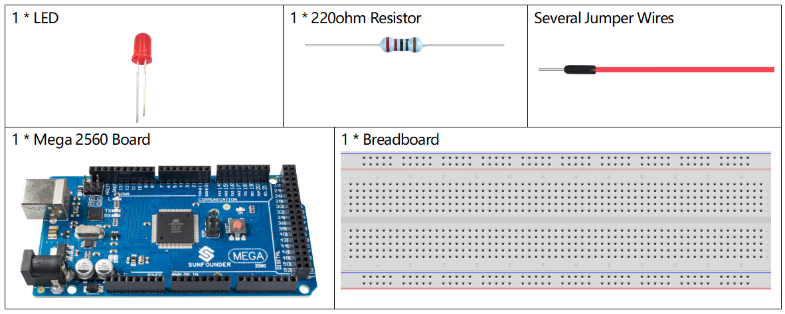

.. _digital_write:

1.2 Digital Write
=================

Overview
-----------

The digitalWrite() statement here is used to write high level or low
level to pins and to let LED and active buzzer 「work 」or 「stop」. In
this lesson, we will take LED as an example to introduce the experiment
phenomenon.

Components Required
----------------------

* :ref:`cpn_mega2560`
* :ref:`cpn_breadboard`
* :ref:`cpn_wires`
* :ref:`cpn_led`
* :ref:`cpn_resistor`

Fritzing Circuit
-------------------

In this example, we use digital pin 9 to drive the LED. Attach one side
of the resistor to the digital pin 9 and the longer pin (anode) of the
LED to the other side of the resistor. Connect the shorter pin (cathode)
of the LED to GND.

.. image:: img/image30.png

Schematic Diagram
-------------------

.. image:: img/image401.png

Code
------

After finishing the circuit connection, connect the Mega2560 board to
the computer. Run the Arduino software IDE and type in the following
codes.

.. note::

    * You can open the file ``1.2_digitalWrite.ino`` under the path of ``sunfounder_vincent_kit_for_arduino\code\1.2_digitalWrite`` directly.
    * Or copy this code into Arduino IDE 1/2.
    * Or click **Open Code** to open it in `Web Editor <https://docs.arduino.cc/cloud/web-editor/tutorials/getting-started/getting-started-web-editor>`_.
    * Then :ref:`ar_upload_code` to the board.

.. raw:: html

    <iframe src=https://create.arduino.cc/editor/sunfounder01/014d0aec-693e-4246-b944-17105b28e818/preview?embed style="height:510px;width:100%;margin:10px 0" frameborder=0></iframe>

Upload the codes to the Mega2560 board, and you can see the blinking of LED.

Code Analysis
-------------

Here, we connect the LED to the digital pin 9, so we need to declare an
int variable called ledpin at the beginning of the program and assign a
value of 9.

.. code-block:: arduino

    const int ledPin = 9;

Now, initialize the pin in the setup() function, where you need to 
initialize the pin to OUTPUT mode.

.. code-block:: arduino

    pinMode(ledPin, OUTPUT);

In loop(), digitalWrite() is used to provide 5V high level signal for 
ledpin, which will cause voltage difference between LED pins and light LED up.

.. code-block:: arduino

    digitalWrite(ledPin, HIGH);

If the level signal is changed to LOW, the ledPin's signal will be returned to 0 V to turn LED off.

.. code-block:: arduino

    digitalWrite(ledPin, LOW);

An interval between on and off is required to allow people to see the change, so 
we use a delay(1000) code to let the controller do nothing for 1000 ms.

.. code-block:: arduino

    delay(1000);

Phenomenon Picture
------------------

.. image:: img/image36.jpeg