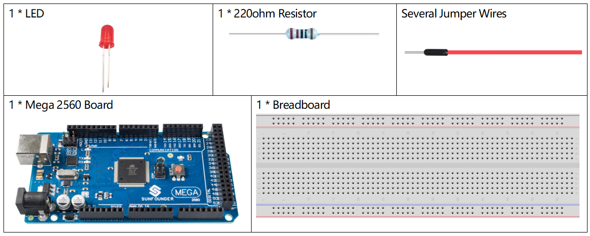

.. note::  

    Ciao, benvenuto nella comunità di appassionati di SunFounder Raspberry Pi & Arduino & ESP32 su Facebook! Immergiti nel mondo affascinante di Raspberry Pi, Arduino e ESP32 insieme ad altri appassionati.

    **Perché unirti a noi?**

    - **Supporto esperto**: Risolvi problemi post-vendita e sfide tecniche con l'aiuto della nostra comunità e del nostro team.
    - **Impara e condividi**: Scambia consigli e tutorial per migliorare le tue competenze.
    - **Anteprime esclusive**: Ottieni accesso anticipato a nuovi annunci di prodotti e contenuti esclusivi.
    - **Sconti speciali**: Approfitta di sconti esclusivi sui nostri prodotti più recenti.
    - **Promozioni festive e concorsi**: Partecipa a concorsi e promozioni speciali durante le festività.

    👉 Sei pronto a esplorare e creare con noi? Clicca su [|link_sf_facebook|] e unisciti oggi!

.. _ar_digital_write:

1.2 Scrittura Digitale (Digital Write)
=======================================

Panoramica
-----------

L'istruzione digitalWrite() viene utilizzata per impostare un livello alto o basso 
sui pin digitali e controllare se un LED o un buzzer attivo 「funzionano」 o 「si spengono」. 
In questa lezione, utilizzeremo un LED come esempio per spiegare il fenomeno sperimentale.

Componenti Necessari
----------------------

* :ref:`cpn_mega2560`
* :ref:`cpn_breadboard`
* :ref:`cpn_wires`
* :ref:`cpn_led`
* :ref:`cpn_resistor`

Circuito con Fritzing
------------------------

In questo esempio, utilizziamo il pin digitale 9 per controllare il LED. Collega un'estremità 
della resistenza al pin digitale 9 e il pin più lungo (anodo) del LED all'altra estremità della resistenza. 
Collega il pin più corto (catodo) del LED al GND.

.. image:: img/image30.png

Schema del Circuito
---------------------

.. image:: img/image401.png

Codice
--------

Dopo aver completato il collegamento del circuito, collega la scheda Mega2560 al computer. 
Apri il software Arduino IDE e inserisci il seguente codice.

.. note::

    * Puoi aprire direttamente il file ``1.2_digitalWrite.ino`` presente nel percorso ``sunfounder_vincent_kit_for_arduino\code\1.2_digitalWrite``.
    * Oppure copia questo codice nell'Arduino IDE.

.. raw:: html

    <iframe src=https://create.arduino.cc/editor/sunfounder01/014d0aec-693e-4246-b944-17105b28e818/preview?embed style="height:510px;width:100%;margin:10px 0" frameborder=0></iframe>

Carica il codice sulla scheda Mega2560 e potrai vedere il LED lampeggiare.

Analisi del Codice
------------------

Colleghiamo il LED al pin digitale 9, quindi dobbiamo dichiarare 
una variabile int chiamata ledPin all'inizio del programma e assegnarle 
il valore 9.

.. code-block:: arduino

    const int ledPin = 9;

Ora, inizializza il pin nella funzione setup(), configurandolo in modalità OUTPUT.

.. code-block:: arduino

    pinMode(ledPin, OUTPUT);

In loop(), digitalWrite() viene utilizzato per fornire un segnale di livello alto a 5V 
al ledPin, creando una differenza di tensione tra i pin del LED e accendendolo.

.. code-block:: arduino

    digitalWrite(ledPin, HIGH);

Se il segnale viene impostato su LOW, il segnale del ledPin torna a 0V, spegnendo il LED.

.. code-block:: arduino

    digitalWrite(ledPin, LOW);

È necessario un intervallo tra accensione e spegnimento per rendere visibile il cambiamento. 
Usiamo il codice delay(1000) per mantenere il controller inattivo per 1000 ms.

.. code-block:: arduino

    delay(1000);

Immagine del Fenomeno
------------------------

.. image:: img/image36.jpeg