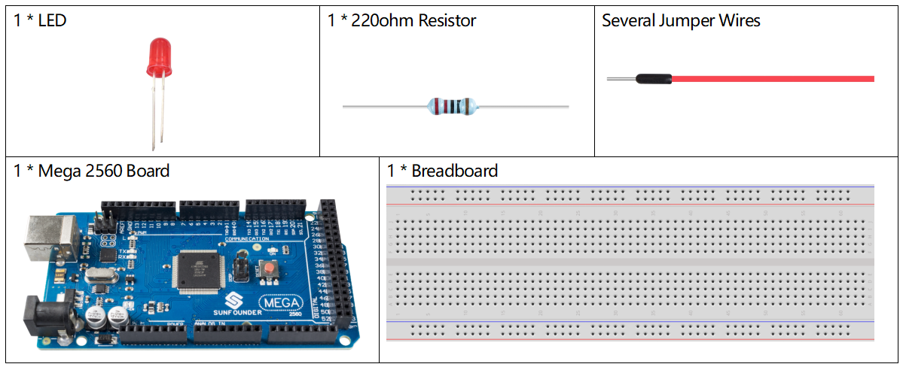
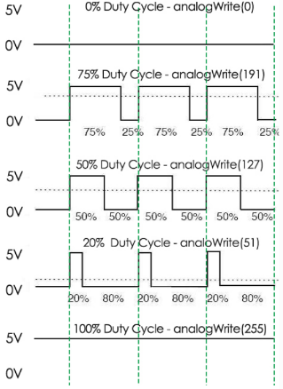

.. _ar_analog_write:

1.3 Analog Write
================

Overview
--------

You can write the PWM wave to the pin by using analogWrite(). This
method can be used to adjust the brightness of LED, change the color of
RGB, or adjust the motor speed, etc. Here we will take LED as an example
to get gradient brightness of LED.

Components Required
-------------------

* :ref:`cpn_mega2560`
* :ref:`cpn_breadboard`
* :ref:`cpn_wires`
* :ref:`cpn_led`
* :ref:`cpn_resistor`

※ Pulse Width Modulation
-------------------------

Pulse Width Modulation, or PWM, is a technique for getting analog results 
with digital means. Digital control is used to create a square wave, a 
signal switched between on and off. This on-off pattern can simulate voltages 
in between full on (5 Volts) and off (0 Volts) by changing the portion of 
the time the signal spends on versus the time that the signal spends off. 
The duration of "on time" is called the pulse width. To get varying analog 
values, you change, or modulate, that pulse width. If you repeat this on-off 
pattem fast enough with an LED for example, the result is as if the signal 
is a steady voltage between 0 and 5v controlling the brightness of the LED.

A call to analogWrite() is on a scale of 0 - 255, such that analogWrite(255) 
requests a 100% duty cycle (always on), and analogWrite(127) is a 50% duty 
cycle (on half the time) for example.

Fritzing Circuit
----------------

In this example, we use the PWM pin 9 to drive the LED. Connect one end
of the resistor to pin 9. Connect the long pin (anode) of the LED to the
other end of the resistor. Connect the short pin (negative, referred to
as the cathode) of LED to GND. 

.. note::
    PWM pins of Mega2560 board are 2 -13, 44 - 46.

.. image:: img/image30.png

Schematic Diagram
-----------------

.. image:: img/image401.png

Code
----

.. note::

    * You can open the file ``1.3_analogWrite.ino`` under the path of ``sunfounder_vincent_kit_for_arduino\code\1.3_analogWrite`` directly.
    * Or copy this code into Arduino IDE.

.. raw:: html

    <iframe src=https://create.arduino.cc/editor/sunfounder01/0870c13c-2064-4d3b-9b5b-cf14d3466425/preview?embed style="height:510px;width:100%;margin:10px 0" frameborder=0></iframe>

After uploading the code to the Mega2560 board, you can see that the LED gradually brightens out and turns off gradually.

Code Analysis
-------------

Declare pin 9 as ledPin.

.. code-block:: arduino

    int ledPin = 9; 

analogWrite() in loop() assigns ledPin an analog value (PWM wave) between 0 and 255 to change the brightness of LED.

.. code-block:: arduino

    analogWrite(ledPin, value);

Using a for loop, the value of analogWrite() can be changed step by step between the minimum value (0) and the maximum value (255).

.. code-block:: arduino

    for (int value = 0 ; value <= 255; value += 5) {
        analogWrite(ledPin, value);
    }

In order to see the experimental phenomenon clearly, a delay(30) needs to be added to the for cycle to control the brightness change time.

.. code-block:: arduino

    void loop() {
    for (int value = 0 ; value <= 255; value += 5) {
        analogWrite(ledPin, value);
        delay(30);
    }
    }

Phenomenon Picture
-------------------

.. image:: img/image36.jpeg