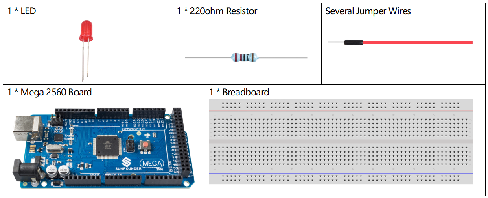
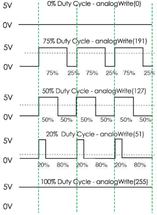

.. note:: 

    ¡Hola, bienvenido a la Comunidad de Entusiastas de Raspberry Pi, Arduino y ESP32 en Facebook! Profundiza en Raspberry Pi, Arduino y ESP32 junto a otros entusiastas.

    **¿Por qué unirse?**

    - **Soporte experto**: Resuelve problemas postventa y desafíos técnicos con la ayuda de nuestra comunidad y equipo.
    - **Aprender y compartir**: Intercambia consejos y tutoriales para mejorar tus habilidades.
    - **Vistas previas exclusivas**: Obtén acceso anticipado a nuevos anuncios de productos y avances.
    - **Descuentos especiales**: Disfruta de descuentos exclusivos en nuestros productos más nuevos.
    - **Promociones festivas y sorteos**: Participa en sorteos y promociones especiales de temporada.

    👉 ¿Listo para explorar y crear con nosotros? Haz clic en [|link_sf_facebook|] y únete hoy mismo.

.. _ar_analog_write:

1.3 Escribir en analógico
===========================

Resumen
------------

Puedes escribir una señal de onda PWM a un pin utilizando analogWrite(). 
Este método se puede usar para ajustar el brillo de un LED, cambiar el color 
de un RGB o ajustar la velocidad de un motor, entre otros. En este caso, 
tomaremos el LED como ejemplo para obtener un brillo gradual del LED.

Componentes necesarios
-------------------------

* :ref:`cpn_mega2560`
* :ref:`cpn_breadboard`
* :ref:`cpn_wires`
* :ref:`cpn_led`
* :ref:`cpn_resistor`

※ Modulación por Ancho de Pulso (PWM)
---------------------------------------

La Modulación por Ancho de Pulso, o PWM, es una técnica para obtener resultados 
analógicos mediante medios digitales. El control digital se usa para crear una 
onda cuadrada, una señal que alterna entre encendido y apagado. Este patrón de 
encendido-apagado puede simular voltajes entre totalmente encendido (5 voltios) 
y apagado (0 voltios) al cambiar la proporción de tiempo en que la señal está 
encendida en comparación con el tiempo en que está apagada. La duración del 
"tiempo encendido" se llama ancho de pulso. Para obtener valores analógicos 
variables, se cambia o modula ese ancho de pulso. Si repites este patrón de 
encendido-apagado lo suficientemente rápido con un LED, el resultado es como si 
la señal fuera un voltaje constante entre 0 y 5V que controla el brillo del LED.

Una llamada a analogWrite() se hace sobre una escala de 0 a 255, de modo que 
analogWrite(255) solicita un ciclo de trabajo del 100% (siempre encendido), y 
analogWrite(127) es un ciclo de trabajo del 50% (encendido la mitad del tiempo), 
por ejemplo.

Circuito Fritzing
----------------------

En este ejemplo, utilizamos el pin PWM 9 para controlar el LED. Conecta un 
extremo de la resistencia al pin 9. Conecta el pin largo (ánodo) del LED al 
otro extremo de la resistencia. Conecta el pin corto (negativo, llamado cátodo) del LED a GND.

.. note:: 
    Los pines PWM de la placa Mega2560 son del 2 al 13 y del 44 al 46.

.. image:: img/image30.png

Diagrama esquemático
---------------------

.. image:: img/image401.png

Código
--------

.. note::

    * Puedes abrir el archivo ``1.3_analogWrite.ino`` en la ruta ``sunfounder_vincent_kit_for_arduino\code\1.3_analogWrite`` directamente.
    * O copiar este código en el IDE de Arduino.

.. raw:: html

    <iframe src=https://create.arduino.cc/editor/sunfounder01/0870c13c-2064-4d3b-9b5b-cf14d3466425/preview?embed style="height:510px;width:100%;margin:10px 0" frameborder=0></iframe>

Después de cargar el código a la placa Mega2560, podrás ver cómo el LED gradualmente se va iluminando y apagando.

Análisis del código
----------------------

Declaramos el pin 9 como ledPin.

.. code-block:: arduino

    int ledPin = 9;

En la función loop(), analogWrite() asigna a ledPin un valor analógico (onda PWM) entre 0 y 255 para cambiar el brillo del LED.

.. code-block:: arduino

    analogWrite(ledPin, value);

Usando un bucle for, el valor de analogWrite() puede cambiarse paso a paso entre el valor mínimo (0) y el valor máximo (255).

.. code-block:: arduino

    for (int value = 0 ; value <= 255; value += 5) {
        analogWrite(ledPin, value);
    }

Para ver claramente el fenómeno experimental, es necesario agregar un delay(30) dentro del ciclo for para controlar el tiempo de cambio del brillo.

.. code-block:: arduino

    void loop() {
    for (int value = 0 ; value <= 255; value += 5) {
        analogWrite(ledPin, value);
        delay(30);
    }
    }

Imagen del fenómeno
----------------------

.. image:: img/image36.jpeg