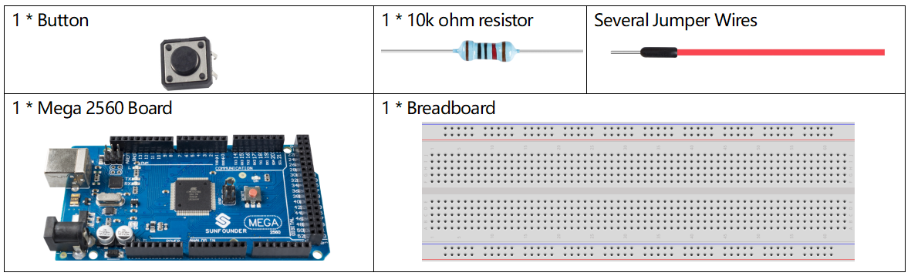
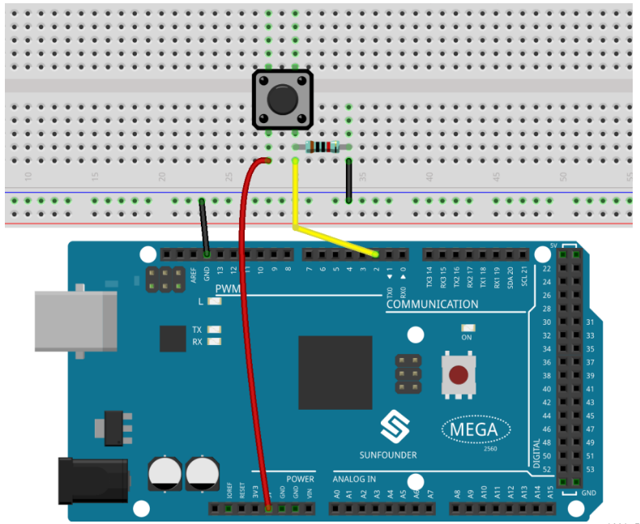
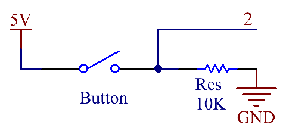
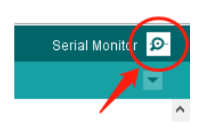

.. note::  

    Ciao, benvenuto nella comunità di appassionati di SunFounder Raspberry Pi & Arduino & ESP32 su Facebook! Immergiti nel mondo affascinante di Raspberry Pi, Arduino e ESP32 insieme ad altri appassionati.

    **Perché unirti a noi?**

    - **Supporto esperto**: Risolvi problemi post-vendita e sfide tecniche con l'aiuto della nostra comunità e del nostro team.
    - **Impara e condividi**: Scambia consigli e tutorial per migliorare le tue competenze.
    - **Anteprime esclusive**: Ottieni accesso anticipato a nuovi annunci di prodotti e contenuti esclusivi.
    - **Sconti speciali**: Approfitta di sconti esclusivi sui nostri prodotti più recenti.
    - **Promozioni festive e concorsi**: Partecipa a concorsi e promozioni speciali durante le festività.

    👉 Sei pronto a esplorare e creare con noi? Clicca su [|link_sf_facebook|] e unisciti oggi!

.. _ar_digital_read:

1.4 Lettura Digitale (Digital Read)
=====================================

Panoramica
------------

Puoi utilizzare il comando digitalRead() per leggere lo stato logico (alto o basso) di un pin digitale. 
Il comando è particolarmente adatto per elementi di input digitale come pulsanti, sensori tattili, 
sensori di movimento a infrarossi, ecc. In questo articolo utilizzeremo un pulsante come esempio 
per leggere lo stato logico.

Questo esempio mostra anche come monitorare lo stato di un interruttore utilizzando una porta USB 
per stabilire una comunicazione seriale tra una scheda di controllo e un computer.

Componenti Necessari
---------------------

* :ref:`cpn_mega2560`
* :ref:`cpn_breadboard`
* :ref:`cpn_wires`
* :ref:`cpn_button`
* :ref:`cpn_resistor`

Circuito con Fritzing
---------------------

In questo esempio, leggiamo il segnale del pulsante con il pin digitale 2. Quando il pulsante non viene 
premuto, il pin digitale 2 (attraverso la resistenza pull-down) è collegato a terra e legge un livello basso (0); 
quando il pulsante viene premuto, i due pin sono collegati, e quando il pin è collegato all'alimentazione 
a 5V, viene letto un livello alto (1).

.. note::
    Se scolleghi il pin digitale da tutto, il LED potrebbe lampeggiare in modo erratico. 
    Questo accade perché l'ingresso è "fluttuante", cioè non è collegato saldamente né alla tensione né alla terra, 
    e restituirà casualmente HIGH o LOW. Per questo motivo è necessaria una resistenza pull-down nel circuito.

Schema del Circuito
--------------------

Codice
-------

.. note::

    * Puoi aprire direttamente il file ``1.4_digitalRead.ino`` che si trova nel percorso ``sunfounder_vincent_kit_for_arduino\code\1.4_digitalRead``.
    * Oppure copia questo codice nell'Arduino IDE.

.. raw:: html

    <iframe src=https://create.arduino.cc/editor/sunfounder01/4ef3d429-1015-4f56-ac7d-6d841bdaee5f/preview?embed style="height:510px;width:100%;margin:10px 0" frameborder=0></iframe>

Dopo aver caricato il codice sulla scheda Mega2560, possiamo aprire il monitor seriale per visualizzare 
il valore letto dal pin. Quando premi il pulsante, il monitor seriale mostrerà 「1」 e, quando rilasci il pulsante, 
mostrerà 「0」.

Analisi del Codice
--------------------

Avvia la comunicazione seriale in setup() e imposta la velocità di trasmissione a 9600.

.. code-block:: arduino

    Serial.begin(9600);

Devi anche configurare il pin digitale 2 come INPUT per leggere lo stato di uscita del pulsante.

.. code-block:: arduino

    pinMode(2, INPUT);

Utilizza il comando digitalRead() in loop() per leggere lo stato logico del pin digitale 2 e dichiara una variabile per memorizzarlo.

.. code-block:: arduino

    int buttonState = digitalRead(2);

Stampa il valore memorizzato nella variabile sul monitor seriale.

.. code-block:: arduino

    Serial.println(buttonState);

Usa il comando delay() per rendere i risultati stampati più facili da osservare.

.. code-block:: arduino

    delay(1);

※ Come Aprire il Monitor Seriale
-----------------------------------

Fai clic sull'icona della lente di ingrandimento nell'angolo in alto a destra 
della finestra di programmazione di Arduino IDE per aprire il **Monitor Seriale**.

Immagine del Fenomeno
-----------------------

.. image:: img/image43.jpeg
