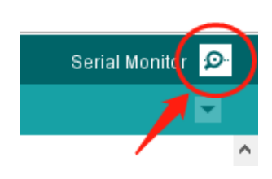

.. _ar_digital_read:

1.4 Digitales Lesen
=======================

Überblick
----------

Sie können den Befehl digitalRead() verwenden, um den Pegelstatus von einem digitalen Pin zu lesen. Der Befehl eignet sich für digitale Eingabeelemente wie Button, Berührungssensor, Infrarot-Bewegungssensor usw. Dieser Artikel nimmt Button als Beispiel, um den Füllstandsstatus zu lesen.

Dieses Beispiel zeigt Ihnen auch, wie Sie den Status eines Schalters überwachen, indem Sie USB verwenden, um eine serielle Kommunikation zwischen einer Steuerplatine und einem Computer herzustellen.

Erforderliche Komponenten
------------------------------

.. image:: img/list_1.4.png

* :ref:`cpn_mega2560`
* :ref:`cpn_breadboard`
* :ref:`cpn_wires`
* :ref:`cpn_button`
* :ref:`cpn_resistor`

Fritzing-Schaltung
---------------------

In diesem Beispiel lesen wir das Signal der Taste mit dem digitalen Pin 2. Wenn die Taste nicht gedrückt wird, wird der digitale Pin 2 (über den Vorwiderstand) mit Masse verbunden, um den niedrigen Pegel (0) zu lesen; Wenn der Taster gedrückt wird, werden die beiden Pins verbunden und wenn der Pin mit der 5-V-Stromversorgung verbunden ist, wird der hohe Pegel (1) gelesen.

.. image:: img/image403.png

.. note::
    Wenn Sie den digitalen I/O-Pin von allem trennen, kann die LED unregelmäßig blinken. Dies liegt daran, dass der Eingang „schwebend“ ist – das heißt, er hat keine feste Verbindung zu Spannung oder Masse und gibt zufällig entweder HIGH oder LOW zurück. Aus diesem Grund benötigen Sie einen Pulldown-Widerstand in der Schaltung.

Schematische Darstellung
---------------------------

Code
----

.. note::

    * Sie können die Datei ``1.4_digitalRead.ino`` unter dem Pfad ``sunfounder_vincent_kit_for_arduino\code\1.4_digitalRead`` direkt öffnen.
    * Oder kopieren Sie diesen Code in Arduino IDE. 

.. raw:: html

    <iframe src=https://create.arduino.cc/editor/sunfounder01/4ef3d429-1015-4f56-ac7d-6d841bdaee5f/preview?embed style="height:510px;width:100%;margin:10px 0" frameborder=0></iframe>

Nach dem Hochladen des Codes auf die Mega2560-Platine können wir den Serial Port Monitor öffnen, um den Lesewert des Pins zu sehen. Wenn Sie die Taste drücken, zeigt der Monitor des seriellen Anschlusses 「1」 an und wenn die Taste losgelassen wird, wird 「0」 angezeigt.

Code-Analyse
----------------

Starten Sie die serielle Kommunikation in ``setup()`` und stellen Sie die Datenrate auf 9600 ein.

.. code-block:: arduino

    Serial.begin(9600);

Sie müssen auch den Status des digitalen Pins 2 auf INPUT setzen, um den Ausgangsstatus von Button zu lesen.

.. code-block:: arduino

    pinMode(2, INPUT);

Verwenden Sie die Anweisung ``digitalRead()`` in ``loop()``, um den Pegelzustand des digitalen Pins 2 zu lesen und eine Variable zum Speichern des Zustands zu deklarieren.

.. code-block:: arduino

    int buttonState = digitalRead(2);

Drucken Sie den von der Variablen gespeicherten Wert auf dem Monitor der seriellen Schnittstelle.

.. code-block:: arduino

    Serial.println(buttonState);

Verwenden Sie ``delay()``-Anweisungen, um die Druckergebnisse einfach zu beobachten.

.. code-block:: arduino

    delay(1);

※ So aktivieren Sie den Serial Port Monitor
---------------------------------------------------

Klicken Sie auf das Lupensymbol oben rechts im Programmierfenster der Arduino IDE, um den **Serial Monitor** zu öffnen.

Phänomen Bild
-------------------

.. image:: img/image43.jpeg