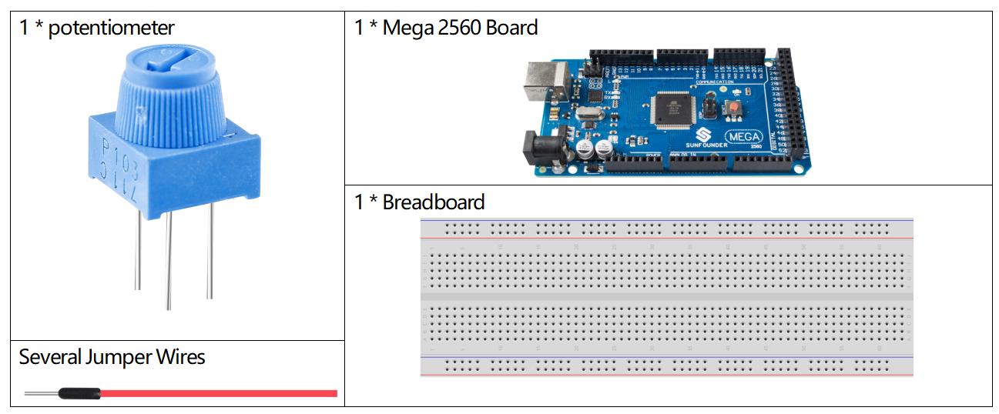
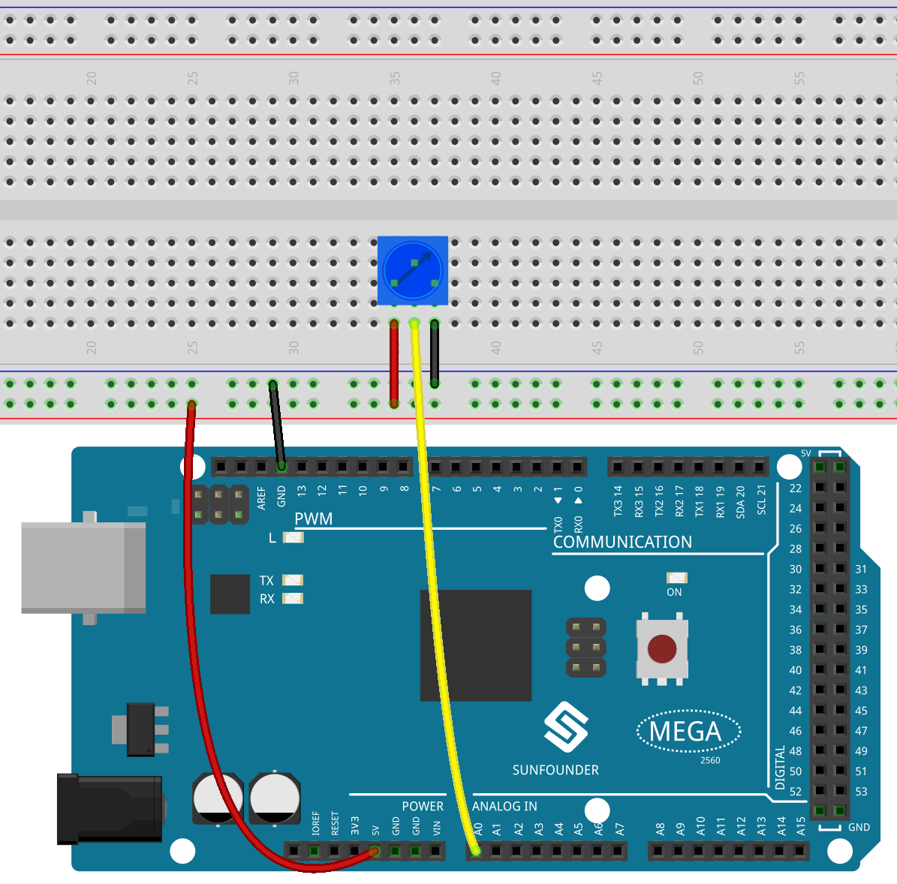
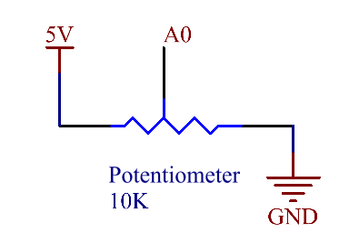
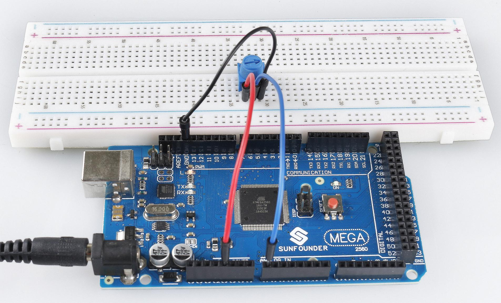

.. note:: 

    ¡Hola, bienvenido a la Comunidad de Entusiastas de Raspberry Pi, Arduino y ESP32 en Facebook! Profundiza en Raspberry Pi, Arduino y ESP32 junto a otros entusiastas.

    **¿Por qué unirse?**

    - **Soporte experto**: Resuelve problemas postventa y desafíos técnicos con la ayuda de nuestra comunidad y equipo.
    - **Aprender y compartir**: Intercambia consejos y tutoriales para mejorar tus habilidades.
    - **Vistas previas exclusivas**: Obtén acceso anticipado a nuevos anuncios de productos y avances.
    - **Descuentos especiales**: Disfruta de descuentos exclusivos en nuestros productos más nuevos.
    - **Promociones festivas y sorteos**: Participa en sorteos y promociones especiales de temporada.

    👉 ¿Listo para explorar y crear con nosotros? Haz clic en [|link_sf_facebook|] y únete hoy mismo.

.. _ar_analog_read:

1.5 Lectura Analógica
=========================

Resumen
----------

Puedes usar el comando analogRead() para leer entradas analógicas del mundo 
físico a través de un pin analógico, lo que es adecuado para elementos de 
entrada analógicos como potenciómetros, fotorresistencias, sensores de nivel 
de agua, entre otros. En este artículo, tomaremos como ejemplo el potenciómetro 
para leer el valor analógico de su salida.

Componentes necesarios
------------------------

* :ref:`cpn_mega2560`
* :ref:`cpn_breadboard`
* :ref:`cpn_wires`
* :ref:`cpn_potentiometer`

Circuito Fritzing
--------------------

En este ejemplo, utilizamos el pin analógico (A0) para leer el valor del 
potenciómetro. Conecta los pines en ambos extremos del potenciómetro a 5V 
y GND, respectivamente. Conecta el pin del medio al pin A0.

El voltaje del pin central se enviará a la placa Mega2560 como un valor 
analógico. Al girar el eje del potenciómetro, podrás cambiar el voltaje 
en el pin central, lo que cambiará el valor analógico obtenido en el pin A0.

Diagrama esquemático
-----------------------

Código
--------

.. note::

    * Puedes abrir el archivo ``1.5_analogRead.ino`` en la ruta ``sunfounder_vincent_kit_for_arduino\code\1.5_analogRead`` directamente.
    * O copiar este código en el IDE de Arduino.

.. raw:: html

    <iframe src=https://create.arduino.cc/editor/sunfounder01/5003d35b-2bb2-47ec-9a87-cf259311c8c5/preview?embed style="height:510px;width:100%;margin:10px 0" frameborder=0></iframe>

Después de cargar el código en la placa Mega2560, puedes abrir el monitor 
de puerto serie para ver el valor leído del pin. Cuando gires el eje del 
potenciómetro, el monitor de puerto serie imprimirá el valor que cambia 
entre "0" y "1023".

Análisis del código
---------------------

Para permitir que el IDE de Arduino imprima el valor transmitido desde el 
componente electrónico a la placa Mega2560, debes iniciar la comunicación 
serial en setup() y establecer la tasa de datos a 9600.

.. code-block:: arduino

    Serial.begin(9600);

Usa el comando analogRead() en loop() para leer el estado de nivel adquirido por el pin analógico A0 y declara una variable para almacenar el estado de nivel.

.. code-block:: arduino

    int sensorValue = analogRead(A0);

Imprime el valor almacenado en la variable en el monitor de puerto serie.

.. code-block:: arduino

    Serial.println(sensorValue);

Usa declaraciones delay() para que los resultados de impresión sean fáciles de observar.

.. code-block:: arduino

    delay(1);

※ Convertidor Analógico a Digital
-------------------------------------

El Arduino tiene un circuito interno llamado convertidor analógico a digital 
o ADC que lee este voltaje variable y lo convierte en un número entre 0 y 1023. 
Cuando el eje se gira completamente en una dirección, no llega voltaje al pin y 
el valor de entrada es 0. Cuando el eje se gira completamente en la dirección 
opuesta, llega 5V al pin y el valor de entrada es 1023. Entre estos dos extremos, 
el comando analogRead() devuelve un número entre 0 y 1023 que es proporcional a 
la cantidad de voltaje aplicada al pin.

Imagen del fenómeno
-----------------------

