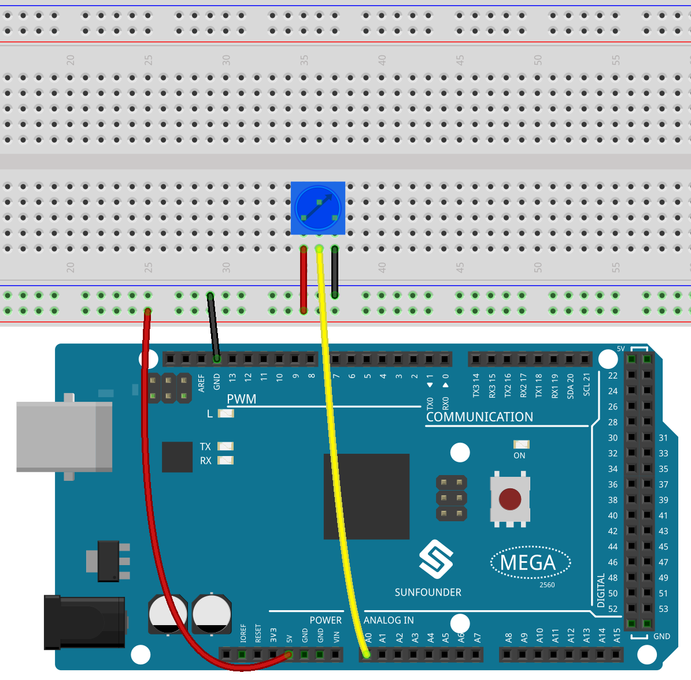

.. _ar_analog_read:

1.5 Analog lesen
========================

Überblick
------------

Sie können den Befehl ``analogRead()`` verwenden, um analoge Eingaben aus der physischen Welt über einen analogen Pin zu lesen, der für analoge Eingabeelemente wie Potentiometer, Fotowiderstand, Sensoren zur Wasserstandserkennung usw. geeignet ist. Dieser Artikel nimmt das Potentiometer als Beispiel, um den analogen Wert seines Ausgangs zu lesen.

Erforderliche Komponenten
---------------------------------

.. image:: img/list_1.5.png

* :ref:`cpn_mega2560`
* :ref:`cpn_breadboard`
* :ref:`cpn_wires`
* :ref:`cpn_potentiometer`

Fritzing-Schaltung
--------------------

In diesem Beispiel verwenden wir den analogen Pin (A0), um den Wert des Potentiometers zu lesen. Verbinden Sie die Pins an beiden Enden des Potentiometers mit 5 V bzw. GND. Verbinden Sie den mittleren Pin mit A0.

Die Spannung des mittleren Pins wird als analoger Wert an die Mega2560-Platine ausgegeben. Indem Sie die Achse des Potentiometers drehen, können Sie die Spannung am mittleren Stift ändern, wodurch sich der analoge Wert des von A0 erhaltenen Stifts ändert.

Schematische Darstellung
--------------------------------

.. image:: img/image406.png

Code
----

.. note::

    * Sie können die Datei ``1.5_analogRead.ino`` unter dem Pfad ``sunfounder_vincent_kit_for_arduino\code\1.5_analogRead`` direkt öffnen.
    * Oder kopieren Sie diesen Code in Arduino IDE. 

.. raw:: html

    <iframe src=https://create.arduino.cc/editor/sunfounder01/5003d35b-2bb2-47ec-9a87-cf259311c8c5/preview?embed style="height:510px;width:100%;margin:10px 0" frameborder=0></iframe>

Nachdem der Code auf die Mega2560-Platine hochgeladen wurde, können Sie den Monitor für die serielle Schnittstelle öffnen, um den Lesewert des Pins anzuzeigen. Wenn die Welle des Potentiometers gedreht wird, druckt der Monitor der seriellen Schnittstelle den Wert, der sich zwischen „0“ und „1023“ ändert.

Code-Analyse
----------------

Damit die Arduino IDE den von der elektronischen Komponente an das Mega2560-Board übertragenen Wert drucken kann, müssen Sie die serielle Kommunikation in setup() starten und die Datenrate auf 9600 einstellen.

.. code-block:: arduino

    Serial.begin(9600);

Verwenden Sie die ``analoglRead()``-Anweisung in ``loop()``, um den vom analogen Pin A0 erfassten Pegelzustand zu lesen und eine Variable zum Speichern des Pegelzustands zu deklarieren.

.. code-block:: arduino

    int sensorValue = analogRead(A0);

Drucken Sie den in der Variablen gespeicherten Wert auf dem seriellen Monitor.

.. code-block:: arduino

    Serial.println(sensorValue);

Verwenden Sie delay()-Anweisungen, um die Druckergebnisse einfach zu beobachten.

.. code-block:: arduino

    delay(1);

※ Analog-Digital-Wandler
---------------------------------

Der Arduino hat einen Schaltkreis namens Analog-Digital-Wandler oder ADC, der diese sich ändernde Spannung liest und in eine Zahl zwischen 0 und 1023 umwandelt. Wenn die Welle ganz in eine Richtung gedreht wird, gehen 0 Volt an Pin und der Eingangswert ist 0. Wenn die Welle ganz in die entgegengesetzte Richtung gedreht wird, gehen 5 Volt an den Pin und der Eingangswert ist 1023. Dazwischen gibt analogRead() eine Zahl zwischen 0 und zurück 1023, die proportional zur Höhe der an den Pin angelegten Spannung ist.

Phänomen Bild
------------------

.. image:: img/image47.jpeg