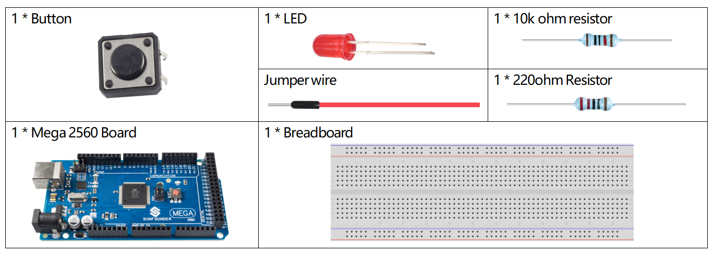
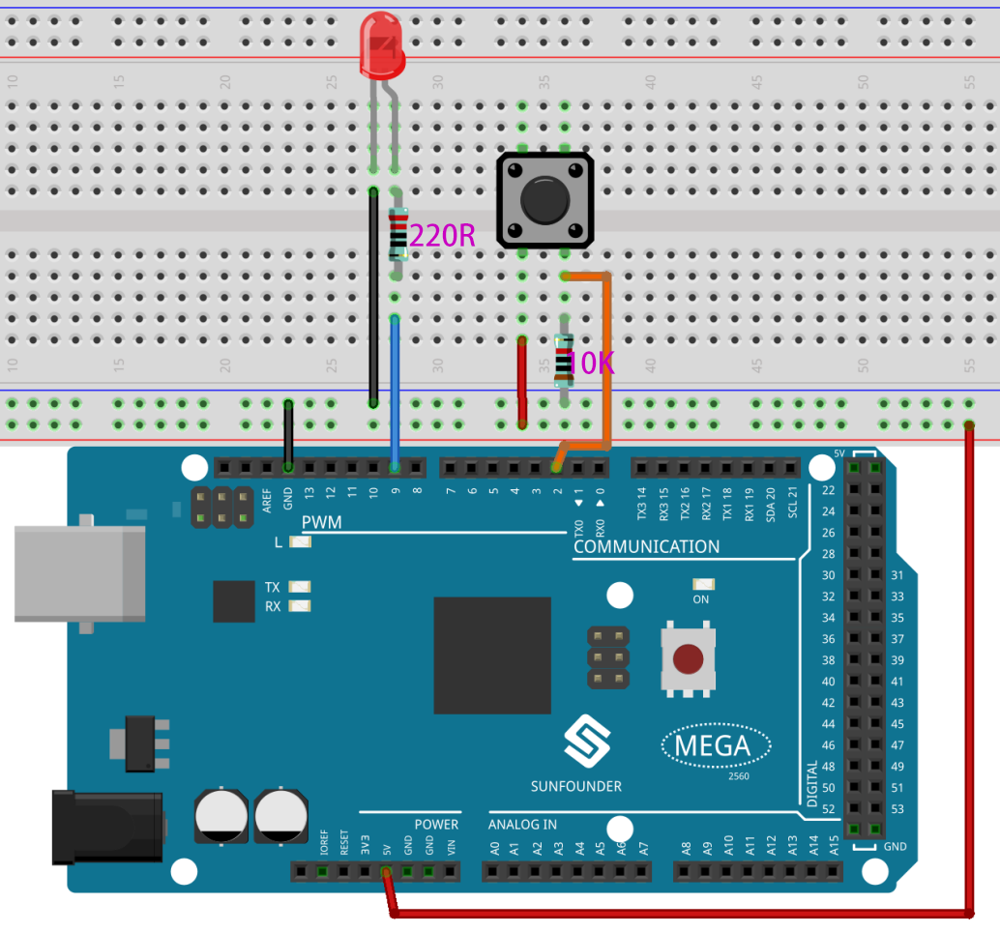
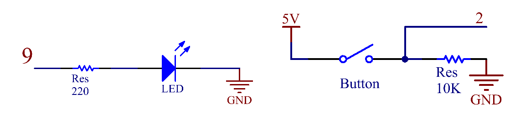
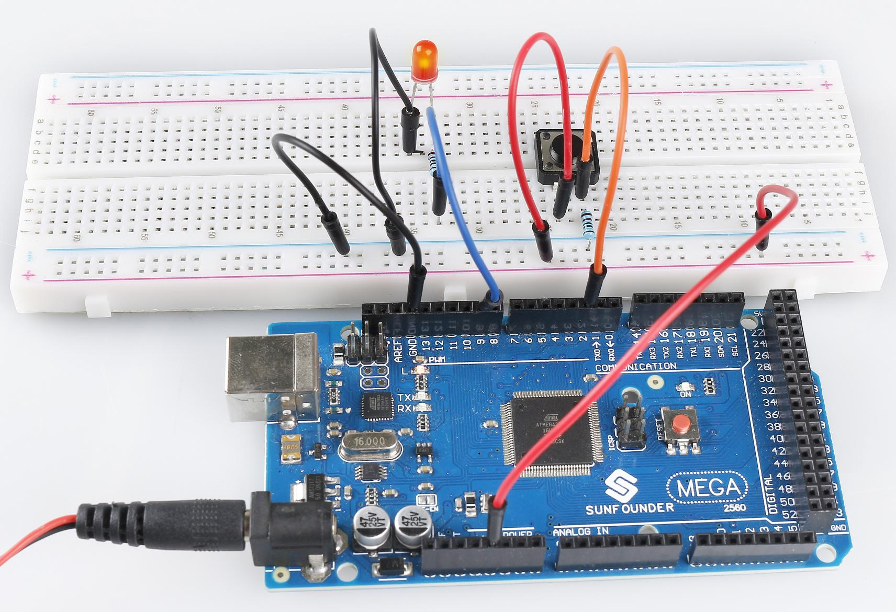

.. _ar_digital_input_output:

1.6 Digital Input Control Output
================================

Overview
---------

With the understanding of digitalWrite() and digitalRead(), we can build
a complete I / O system to control the output device by obtaining the
data from the input device. We can use this method to enable digital
input components such as Button, Touch sensor, Infrared motion sensor to
control digital output devices such as LED, active buzzer. This lesson
will take Button and LED as examples to realize button control LED with
the condition (if-else).

Components Required
-------------------

* :ref:`cpn_mega2560`
* :ref:`cpn_breadboard`
* :ref:`cpn_wires`
* :ref:`cpn_button`
* :ref:`cpn_resistor`

Fritzing Circuit
----------------

In this example, we use pin 9 to drive LED. Use digital pin 2 to read
the signal of Button. When the button is pressed, the LED lights up.

Schematic Diagram
-----------------

Code
----

.. note::

    * You can open the file ``1.6_digitalInputControlOutput.ino`` under the path of ``sunfounder_vincent_kit_for_arduino\code\1.6_digitalInputControlOutput`` directly.
    * Or copy this code into Arduino IDE 1/2.
    * Or click **Open Code** to open it in `Web Editor <https://docs.arduino.cc/cloud/web-editor/tutorials/getting-started/getting-started-web-editor>`_.
    * Then :ref:`ar_upload_code` to the board.

.. raw:: html

    <iframe src=https://create.arduino.cc/editor/sunfounder01/e018645f-5a3e-4c36-be7a-d786fe8f3601/preview?embed style="height:510px;width:100%;margin:10px 0" frameborder=0></iframe>

After uploading the code to the Mega2560 board, you can hold down Button
to lighten the LED.

Code Analysis
--------------

Declare the pins of LED and Button and declare a variable to store the
state of button.

.. code-block:: arduino

    const int buttonPin = 2; 
    const int ledPin =  9;  
    int buttonState = 0;

Initialize the pin mode in setup().

.. code-block:: arduino

    pinMode(ledPin, OUTPUT);
    pinMode(buttonPin, INPUT);

Read the status of the Button in loop() and assign it to the variable buttonState.

.. code-block:: arduino

    buttonState = digitalRead(buttonPin);

Use if condition to judge: if you get high level from a button, light up the LED.

.. code-block:: arduino

    if (buttonState == HIGH) {
        digitalWrite(ledPin, HIGH);
    } 

Otherwise, turn off the LED.

.. code-block:: arduino

    else {
    digitalWrite(ledPin, LOW);
    }

Phenomenon Picture
------------------

