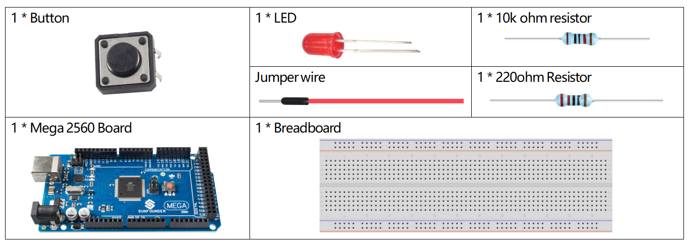
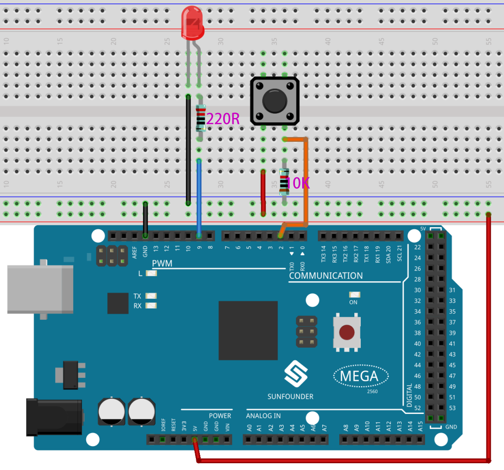
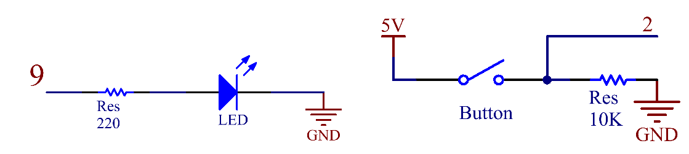
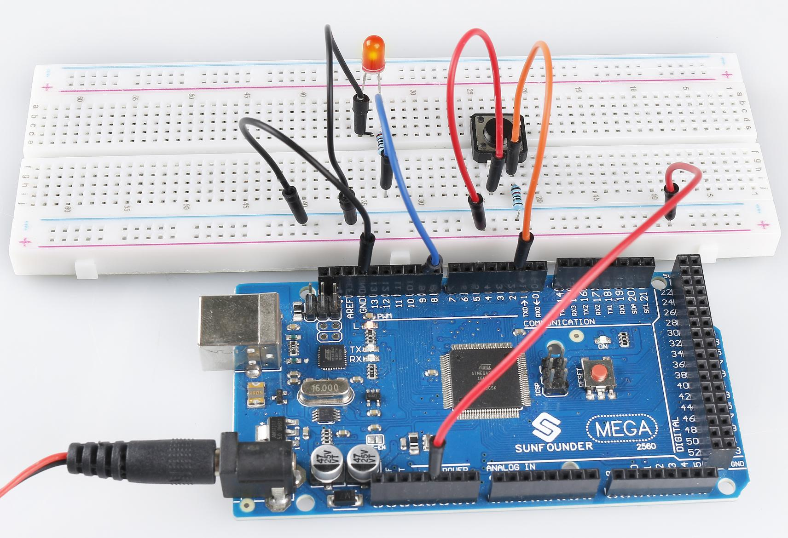

.. note:: 

    ¡Hola, bienvenido a la Comunidad de Entusiastas de Raspberry Pi, Arduino y ESP32 en Facebook! Profundiza en Raspberry Pi, Arduino y ESP32 junto a otros entusiastas.

    **¿Por qué unirse?**

    - **Soporte experto**: Resuelve problemas postventa y desafíos técnicos con la ayuda de nuestra comunidad y equipo.
    - **Aprender y compartir**: Intercambia consejos y tutoriales para mejorar tus habilidades.
    - **Vistas previas exclusivas**: Obtén acceso anticipado a nuevos anuncios de productos y avances.
    - **Descuentos especiales**: Disfruta de descuentos exclusivos en nuestros productos más nuevos.
    - **Promociones festivas y sorteos**: Participa en sorteos y promociones especiales de temporada.

    👉 ¿Listo para explorar y crear con nosotros? Haz clic en [|link_sf_facebook|] y únete hoy mismo.

.. _ar_digital_input_output:

1.6 Control de Entrada Digital y Salida
==========================================

Resumen
----------

Con el conocimiento de digitalWrite() y digitalRead(), podemos construir un 
sistema completo de E/S para controlar un dispositivo de salida obteniendo 
los datos de un dispositivo de entrada. Podemos usar este método para habilitar 
componentes de entrada digitales como botones, sensores táctiles, sensores de 
movimiento por infrarrojos, para controlar dispositivos de salida digitales como 
LEDs y zumbadores activos. Esta lección tomará como ejemplo el botón y el LED para 
realizar el control del LED con el botón utilizando la estructura condicional (if-else).

Componentes necesarios
-------------------------

* :ref:`cpn_mega2560`
* :ref:`cpn_breadboard`
* :ref:`cpn_wires`
* :ref:`cpn_button`
* :ref:`cpn_resistor`

Circuito Fritzing
--------------------

En este ejemplo, utilizamos el pin 9 para controlar el LED. Usamos el pin 
digital 2 para leer la señal del botón. Cuando se presiona el botón, el LED 
se enciende.

Diagrama esquemático
-----------------------

Código
---------

.. note::

    * Puedes abrir el archivo ``1.6_digitalInputControlOutput.ino`` en la ruta ``sunfounder_vincent_kit_for_arduino\code\1.6_digitalInputControlOutput`` directamente.
    * O copiar este código en el IDE de Arduino.

.. raw:: html

    <iframe src=https://create.arduino.cc/editor/sunfounder01/e018645f-5a3e-4c36-be7a-d786fe8f3601/preview?embed style="height:510px;width:100%;margin:10px 0" frameborder=0></iframe>

Después de cargar el código en la placa Mega2560, puedes mantener presionado 
el botón para encender el LED.

Análisis del código
----------------------

Declara los pines del LED y el botón, y declara una variable para almacenar el 
estado del botón.

.. code-block:: arduino

    const int buttonPin = 2; 
    const int ledPin =  9;  
    int buttonState = 0;

Inicializa el modo de los pines en setup().

.. code-block:: arduino

    pinMode(ledPin, OUTPUT);
    pinMode(buttonPin, INPUT);

Lee el estado del botón en loop() y asigna el valor a la variable buttonState.

.. code-block:: arduino

    buttonState = digitalRead(buttonPin);

Usa una condición if para verificar: si el botón está en nivel alto, enciende el LED.

.. code-block:: arduino

    if (buttonState == HIGH) {
        digitalWrite(ledPin, HIGH);
    } 

De lo contrario, apaga el LED.

.. code-block:: arduino

    else {
    digitalWrite(ledPin, LOW);
    }

Imagen del fenómeno
-----------------------

