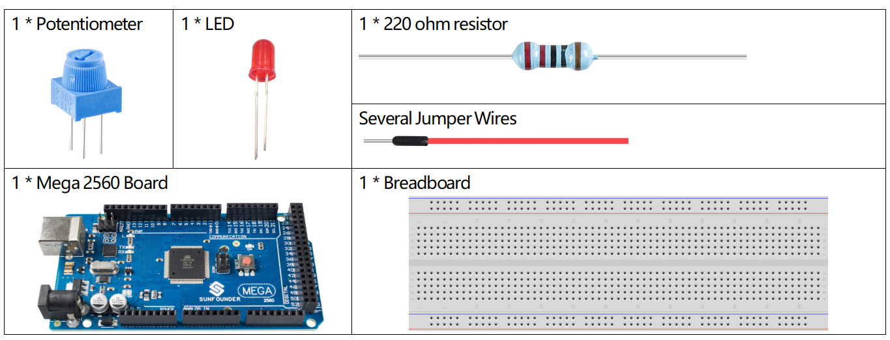
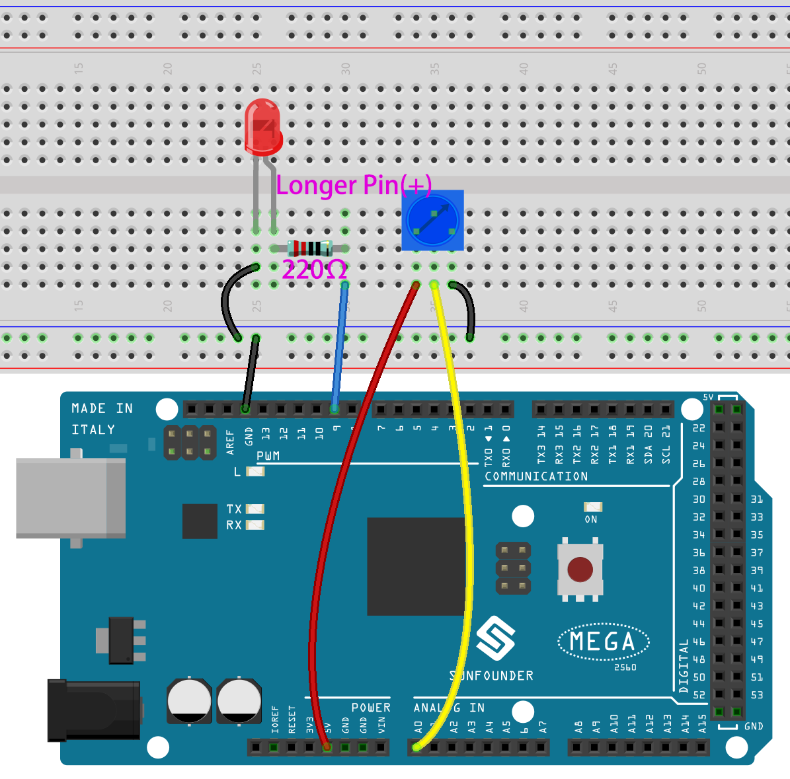
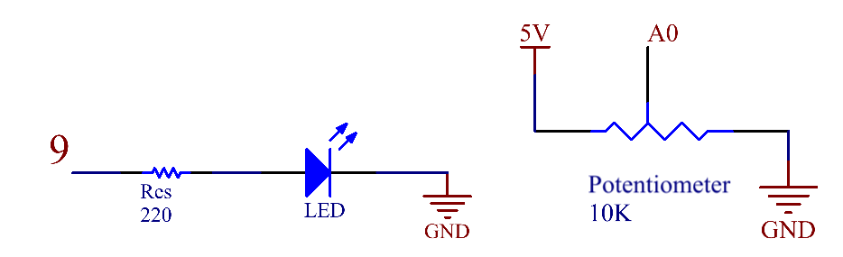
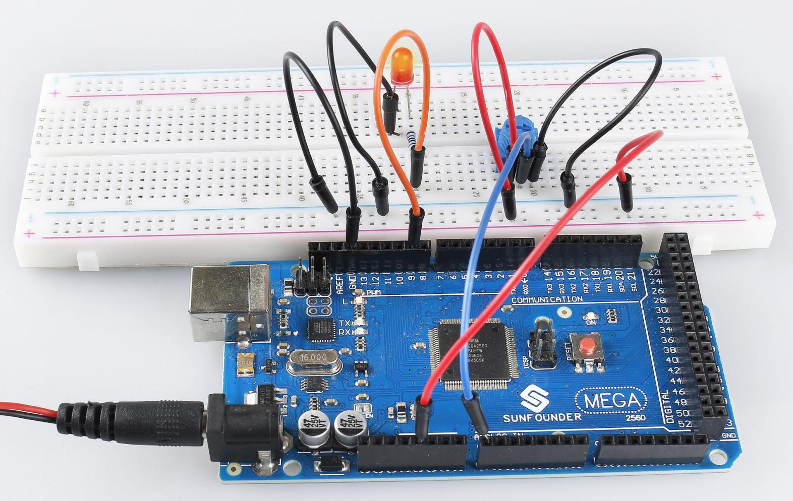

.. _ar_analog_input_output:

1.7 Analog Input Control Output
===============================

Overview
---------

You can install an I/O system by using an analog input/ output device.
For example, you can use potentiometer, photoresistor, water level
sensor, etc., to control the brightness of LED, the speed of motor, and
the like. In this lesson, potentiometer and LED are taken as examples to
change the brightness of the LED when the potentiometer is turning.

Components Required
-------------------

* :ref:`cpn_mega2560`
* :ref:`cpn_breadboard`
* :ref:`cpn_wires`
* :ref:`cpn_led`
* :ref:`cpn_resistor`
* :ref:`cpn_potentiometer`

Fritzing Circuit
-----------------

In this lesson, we use PWM pin 9 to drive LED. The analog pin (A0) is
used to read the value of potentiometer. After uploading the code,
you'll notice that the brightness of the LED changes as the
potentiometer rotates.

Schematic Diagram
-----------------

Code
----

.. note::

    * You can open the file ``1.7_analogInputControlOutput.ino`` under the path of ``sunfounder_vincent_kit_for_arduino\code\1.7_analogInputControlOutput`` directly.
    * Or copy this code into Arduino IDE 1/2.
    * Or click **Open Code** to open it in `Web Editor <https://docs.arduino.cc/cloud/web-editor/tutorials/getting-started/getting-started-web-editor>`_.
    * Then :ref:`ar_upload_code` to the board.

.. raw:: html

    <iframe src=https://create.arduino.cc/editor/sunfounder01/ab85c832-b034-40fa-a231-ef54f461f898/preview?embed style="height:510px;width:100%;margin:10px 0" frameborder=0></iframe>

When the codes are uploaded to the Mega2560 board, you can see that the brightness of LED is changing with the turning of the knob of potentiometer.  

Code Analysis
-------------

Declare the pins of LED and Button.

.. code-block:: arduino

    const int sensorPin = A0;    
    const int ledPin = 9;    

In setup(), set the mode of ledPin to OUTPUT.

.. code-block:: arduino

    pinMode(ledPin,OUTPUT);

Read the readings of potentiometer in loop().

.. code-block:: arduino

    int sensorValue=analogRead(sensorPin);

Map the potentiometer reading to the LED brightness value (0-1024 is mapped to 0-255).

.. code-block:: arduino

    int brightness = map(sensorValue,0,1024,0,255);

Write the brightness value to LED.

.. code-block:: arduino

    analogWrite(ledPin,brightness);

Phenomenon Picture
------------------

