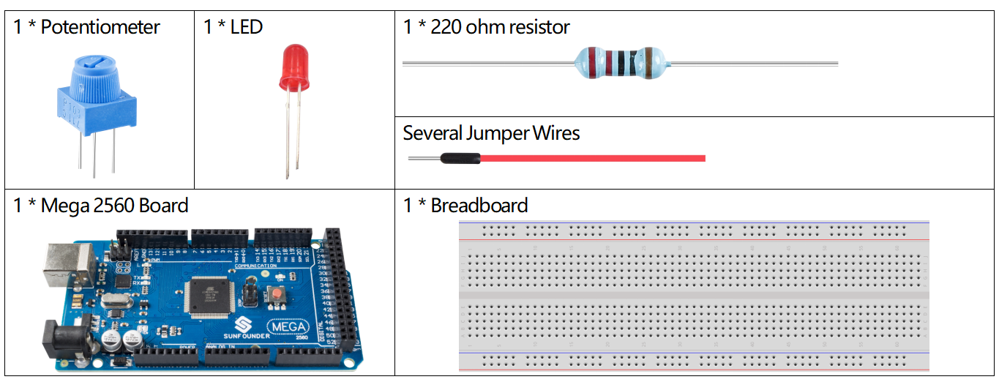
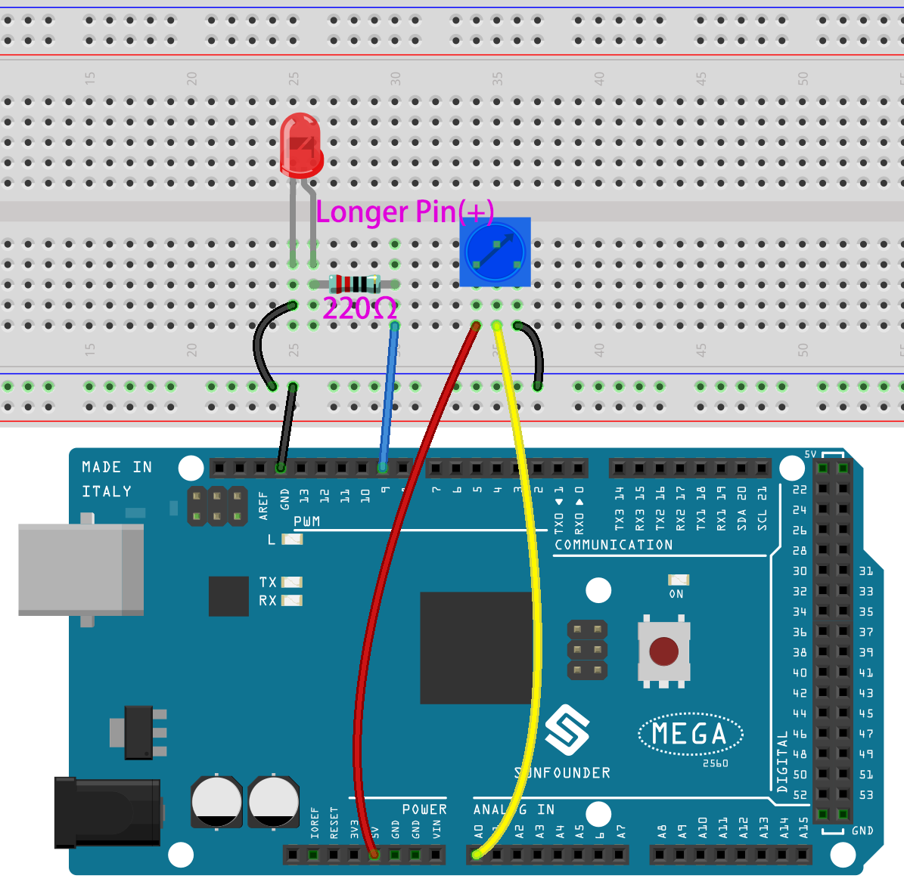
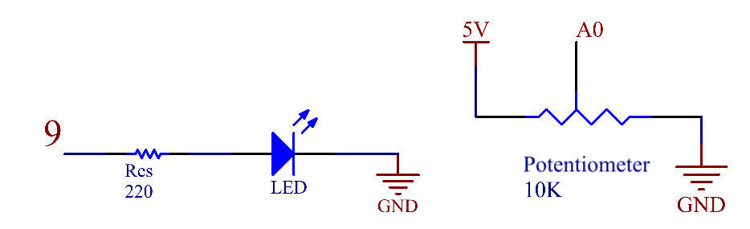
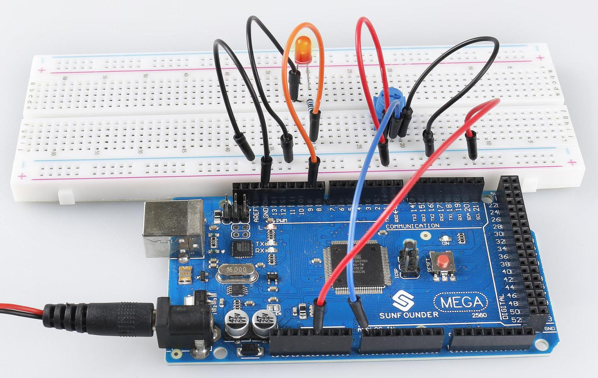

.. note::

    Hallo und willkommen in der SunFounder Raspberry Pi & Arduino & ESP32 Enthusiasten-Gemeinschaft auf Facebook! Tauchen Sie tiefer ein in die Welt von Raspberry Pi, Arduino und ESP32 mit anderen Enthusiasten.

    **Warum beitreten?**

    - **Expertenunterstützung**: Lösen Sie Nachverkaufsprobleme und technische Herausforderungen mit Hilfe unserer Gemeinschaft und unseres Teams.
    - **Lernen & Teilen**: Tauschen Sie Tipps und Anleitungen aus, um Ihre Fähigkeiten zu verbessern.
    - **Exklusive Vorschauen**: Erhalten Sie frühzeitigen Zugang zu neuen Produktankündigungen und exklusiven Einblicken.
    - **Spezialrabatte**: Genießen Sie exklusive Rabatte auf unsere neuesten Produkte.
    - **Festliche Aktionen und Gewinnspiele**: Nehmen Sie an Gewinnspielen und Feiertagsaktionen teil.

    👉 Sind Sie bereit, mit uns zu erkunden und zu erschaffen? Klicken Sie auf [|link_sf_facebook|] und treten Sie heute bei!

.. _ar_analog_input_output:

1.7 Steuerausgang Analogeingang
=================================

Überblick
------------

Sie können ein E/A-System installieren, indem Sie ein analoges Eingabe-/Ausgabegerät verwenden. Beispielsweise können Sie Potentiometer, Fotowiderstand, Wasserstandssensor usw. verwenden, um die Helligkeit der LED, die Motordrehzahl und dergleichen zu steuern. In dieser Lektion werden Potentiometer und LED als Beispiele genommen, um die Helligkeit der LED zu ändern, wenn sich das Potentiometer dreht.

Erforderliche Komponenten
---------------------------------

* :ref:`cpn_mega2560`
* :ref:`cpn_breadboard`
* :ref:`cpn_wires`
* :ref:`cpn_led`
* :ref:`cpn_resistor`
* :ref:`cpn_potentiometer`

Fritzing-Schaltung
------------------------------

In dieser Lektion verwenden wir PWM Pin 9, um die LED anzusteuern. Der analoge Pin (A0) wird verwendet, um den Wert des Potentiometers zu lesen. Nach dem Hochladen des Codes werden Sie feststellen, dass sich die Helligkeit der LED ändert, wenn sich das Potentiometer dreht.

Schematische Darstellung
-------------------------------

Code
---------

.. note::

    * Sie können die Datei ``1.7_analogInputControlOutput.ino`` unter dem Pfad ``sunfounder_vincent_kit_for_arduino\code\1.7_analogInputControlOutput`` direkt öffnen.
    * Oder kopieren Sie diesen Code in Arduino IDE. 

.. raw:: html

    <iframe src=https://create.arduino.cc/editor/sunfounder01/ab85c832-b034-40fa-a231-ef54f461f898/preview?embed style="height:510px;width:100%;margin:10px 0" frameborder=0></iframe>

Wenn die Codes auf die Mega2560-Platine hochgeladen werden, können Sie sehen, dass sich die Helligkeit der LED mit dem Drehen des Potentiometerknopfs ändert.

Code-Analyse
---------------

Deklarieren Sie die Pins von LED und Button.

.. code-block:: arduino

    const int sensorPin = A0;    
    const int ledPin = 9;    

Stellen Sie in ``setup()`` den Modus von ledPin auf OUTPUT.

.. code-block:: arduino

    pinMode(ledPin,OUTPUT);

Lesen Sie die Messwerte des Potentiometers in ``loop()``.

.. code-block:: arduino

    int sensorValue=analogRead(sensorPin);

Ordnen Sie den Potentiometerwert dem LED-Helligkeitswert zu (0-1024 wird 0-255 zugeordnet).

.. code-block:: arduino

    int brightness = map(sensorValue,0,1024,0,255);

Schreiben Sie den Helligkeitswert auf LED.

.. code-block:: arduino

    analogWrite(ledPin,brightness);

Phänomen Bild
------------------

