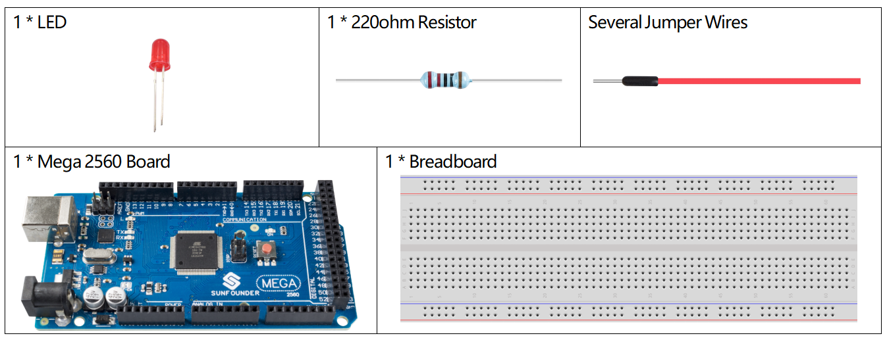
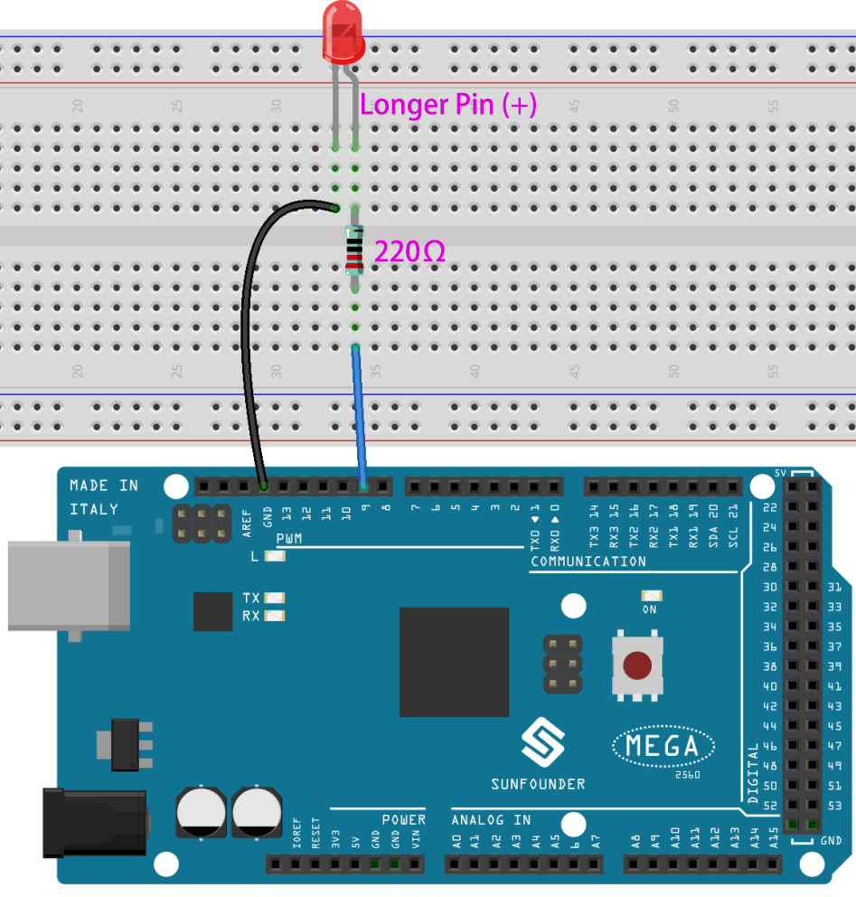
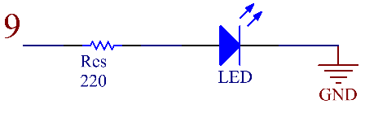
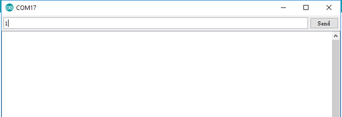
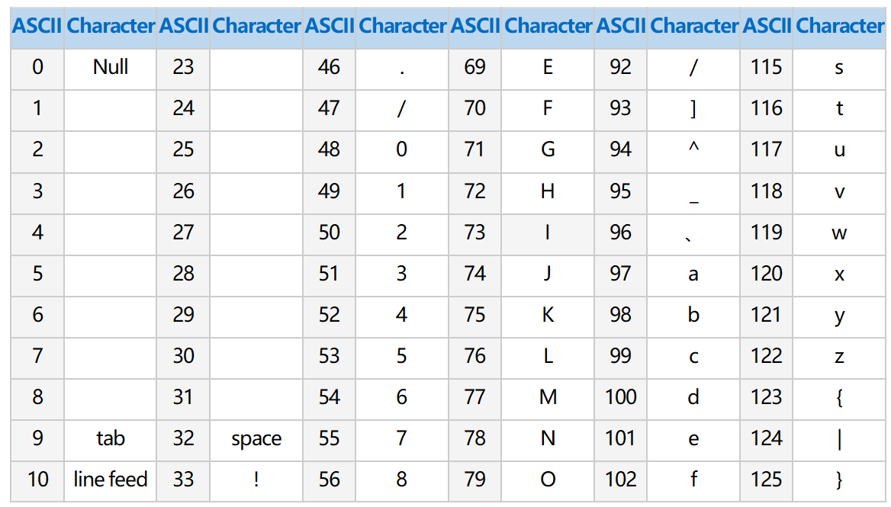
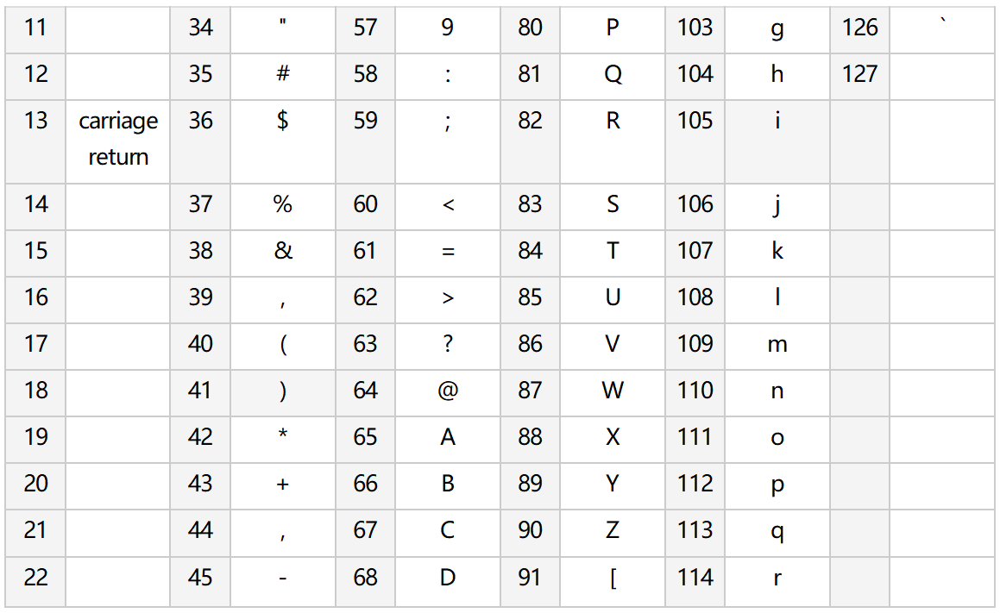

.. note::  

    Ciao, benvenuto nella comunità di appassionati di SunFounder Raspberry Pi & Arduino & ESP32 su Facebook! Immergiti nel mondo affascinante di Raspberry Pi, Arduino ed ESP32 insieme ad altri appassionati.

    **Perché unirti a noi?**

    - **Supporto esperto**: Risolvi problemi post-vendita e sfide tecniche con l'aiuto della nostra comunità e del nostro team.
    - **Impara e condividi**: Scambia consigli e tutorial per migliorare le tue competenze.
    - **Anteprime esclusive**: Ottieni accesso anticipato a nuovi annunci di prodotti e contenuti esclusivi.
    - **Sconti speciali**: Approfitta di sconti esclusivi sui nostri prodotti più recenti.
    - **Promozioni festive e concorsi**: Partecipa a concorsi e promozioni speciali durante le festività.

    👉 Sei pronto a esplorare e creare con noi? Clicca su [|link_sf_facebook|] e unisciti oggi!

.. _ar_serial_read:

1.8 Lettura Serial (Serial Read)
==================================

Panoramica
------------

Oltre a leggere dati dai componenti elettronici, la scheda Mega2560 può 
leggere i dati inseriti nel monitor seriale, e puoi utilizzare Serial.
read() come controller per esperimenti con i circuiti. In questo caso, 
utilizzeremo un LED per sperimentare con l'istruzione Serial.read() e 
controllare l'accensione e lo spegnimento del LED.

Componenti Necessari
----------------------

* :ref:`cpn_mega2560`
* :ref:`cpn_breadboard`
* :ref:`cpn_wires`
* :ref:`cpn_led`
* :ref:`cpn_resistor`

Circuito con Fritzing
------------------------

In questo esempio, utilizziamo il pin digitale 9 per controllare il LED. 
Quando viene inserito "1" nel monitor seriale, il LED si accende. Quando 
viene inserito "0", il LED si spegne.

Schema del Circuito
----------------------

Codice
-------

.. note::

    * Puoi aprire direttamente il file ``1.8_serialRead.ino`` che si trova nel percorso ``sunfounder_vincent_kit_for_arduino\code\1.8_serialRead``.
    * Oppure copia questo codice nell'Arduino IDE.

.. raw:: html

    <iframe src=https://create.arduino.cc/editor/sunfounder01/ca230e6c-c8c1-4101-87cf-25da1130f414/preview?embed style="height:510px;width:100%;margin:10px 0" frameborder=0></iframe>

Dopo aver caricato il codice sulla scheda Mega2560, apri il monitor seriale. Digitando "1" il LED si accenderà, e digitando "0" il LED si spegnerà.

Analisi del Codice
----------------------

Dichiara il pin digitale 9 come ledPin.

.. code-block:: arduino

    const int ledPin = 9;

Serial.read() legge un singolo byte in formato ASCII, quindi è necessario dichiarare una variabile di tipo int, incomingByte, per memorizzare i dati acquisiti.

.. code-block:: arduino

    int incomingByte = 0; 

Inizia la comunicazione seriale in setup() e imposta la velocità di trasmissione a 9600.

.. code-block:: arduino

    Serial.begin(9600);

Configura ledPin in modalità OUTPUT.

.. code-block:: arduino

    pinMode(ledPin,OUTPUT);

In loop(), valuta lo stato del monitor seriale e processa le informazioni solo quando vengono ricevuti dati.

.. code-block:: arduino

    if (Serial.available() > 0){}

Legge il valore inserito nel monitor seriale e lo memorizza nella variabile incomingByte.

.. code-block:: arduino

    incomingByte = Serial.read();

Quando viene ricevuto il carattere '1', il LED si accende; quando viene ricevuto '0', il LED si spegne.

.. code-block:: arduino

        if(incomingByte=='1'){digitalWrite(ledPin,HIGH);}
        else if(incomingByte=='0'){digitalWrite(ledPin,LOW);}

.. note::
    Serial.read() acquisisce il valore in formato ASCII come un singolo carattere, il che significa che quando digiti '1', il valore ottenuto non è il numero "1", ma il carattere '1' il cui valore ASCII corrispondente è 49.

※ Tabella ASCII
-------------------

Il codice ASCII (American Standard Code for Information Interchange) risale 
agli anni '60. È lo standard per la codifica numerica del testo.

Nota che i primi 32 caratteri (0-31) sono caratteri non stampabili, comunemente 
chiamati caratteri di controllo. I caratteri più utili sono stati etichettati.

Immagine del Fenomeno
-------------------------

.. image:: img/image36.jpeg