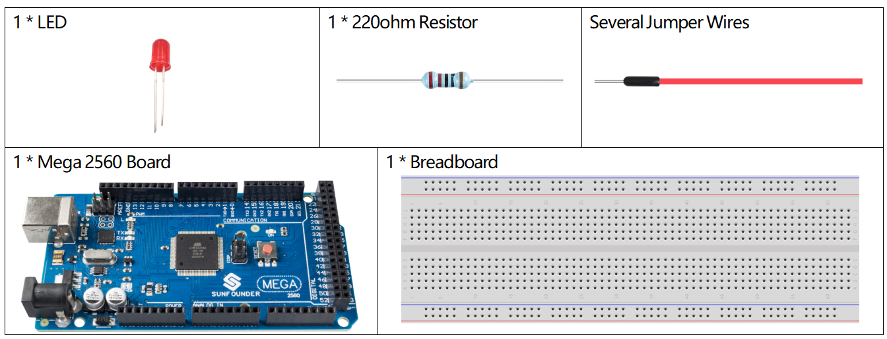
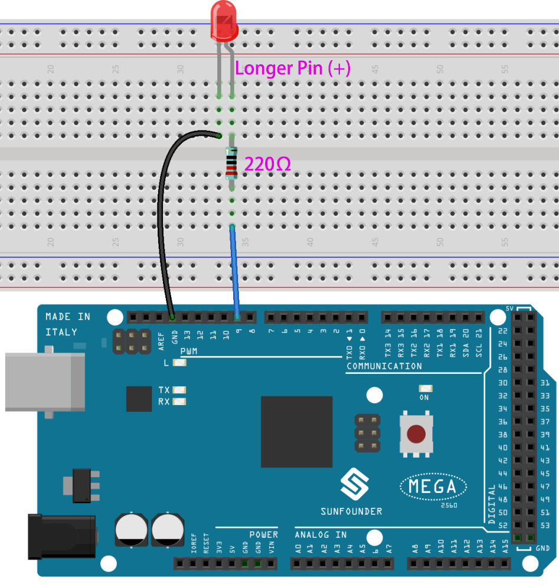

.. _serial_read:

1.8 Serial Read
===============

Overview
--------

In addition to reading data from the electronic components, the Mega2560
board can read the data input in the serial port monitor, and you can
use Serial.read() as the controller of the circuit experiment. Then we
use LED to experiment with the Serial. Read() statement to control LED
to turn on and off.

Components Required
-------------------

* :ref:`cpn_mega2560`
* :ref:`cpn_breadboard`
* :ref:`cpn_wires`
* :ref:`cpn_led`
* :ref:`cpn_resistor`

Fritzing Circuit
----------------

In this example, we use digital pin 9 to drive LED. When 1 is entered in
serial monitor, the LED lights up. When 0 is entered, the LED turns off.

Schematic Diagram
-----------------

.. image:: img/image401.png

Code
----

.. note::

    * You can open the file ``1.8_serialRead.ino`` under the path of ``sunfounder_vincent_kit_for_arduino\code\1.8_serialRead`` directly.
    * Or copy this code into Arduino IDE 1/2.
    * Or click **Open Code** to open it in `Web Editor <https://docs.arduino.cc/cloud/web-editor/tutorials/getting-started/getting-started-web-editor>`_.
    * Then :ref:`ar_upload_code` to the board.

.. raw:: html

    <iframe src=https://create.arduino.cc/editor/sunfounder01/ca230e6c-c8c1-4101-87cf-25da1130f414/preview?embed style="height:510px;width:100%;margin:10px 0" frameborder=0></iframe>

After the codes are uploaded to the Mega2560 board, please turn on the serial port monitor. Typing in ”1” can make LED turn on and typing in ”0” can make it turn off. 

.. image:: img/image52.png

Code Analysis
-----------------------

Declare digital pin 9 as ledPin.

.. code-block:: arduino

    const int ledPin = 9;

Serial.read() reads a single byte of ASCII value, and therefore you need to declare a int type variable, incomingByte to store the acquired data.

.. code-block:: arduino

    int incomingByte = 0; 

Run the serial communication in setup() and set the data rate to 9600.

.. code-block:: arduino

    Serial.begin(9600);

Set ledPin to OUTPUT mode.

.. code-block:: arduino

    pinMode(ledPin,OUTPUT);

The state of serial port monitor is judged in loop(), and the information processing will be carried out only when the data are received.

.. code-block:: arduino

    if (Serial.available() > 0){}

Reads the input value in the serial port monitor and stores it to the variable incomingByte.

.. code-block:: arduino

    incomingByte = Serial.read();

When the character '1' is obtained, the LED is lit; when ’0’ is obtained, the LED turns off.

.. code-block:: arduino

        if(incomingByte=='1'){digitalWrite(ledPin,HIGH);}
        else if(incomingByte=='0'){digitalWrite(ledPin,LOW);}

.. note::
    Serial.read() takes the ASCII value in single character, which means that when you input '1', the obtained value is not the number '1', but the character '1' whose corresponding ASCII value is 49.

※ ASCII chart
--------------

The ASCII (American Standard Code for Information Interchange) encoding
dates to the 1960's. It is the standard way that text is encoded
numerically.

Note that the first 32 characters (0-31) are non-printing characters,
often called control characters. The more useful characters have been
labeled.

.. image:: img/image410.png

Phenomenon Picture
------------------

.. image:: img/image36.jpeg