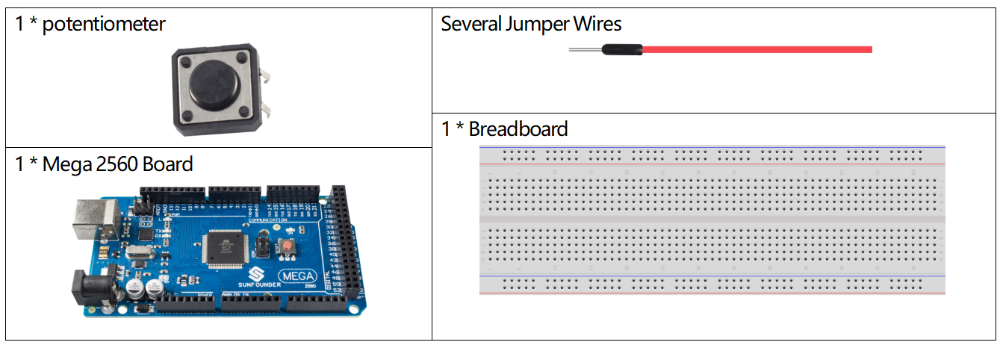
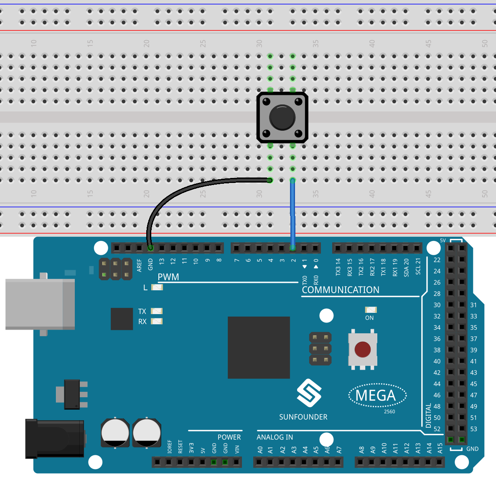
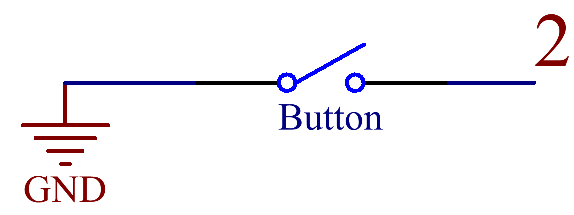
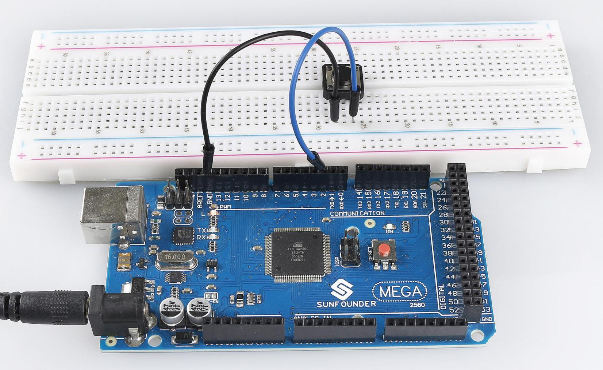

.. _ar_digital_pullup:

1.9 Digitaler Eingangs-Pull-Up
======================================

Überblick
------------

Bei der Verwendung einiger Schaltereingabegeräte werden oft einige Pull-up- oder Pull-down-Widerstände verwendet, um den Pegel der entsprechenden Pins auf einem bestimmten Wert zu halten, wenn das Gerät nicht funktioniert. Wie in 1.4 Digital Read wird ein 10k-Widerstand verwendet, um den Pin mit GND zu verbinden, wenn die Taste nicht gedrückt wird. Wenn wir viele Schaltereingangskomponenten verwendet haben und die Schaltung vereinfachen möchten, können wir den Pin-Modus im Code auf 「INPUT_PULLUP」 setzen, sodass der Pin im suspendierten Zustand den hohen Pegel liest.

Erforderliche Komponenten
----------------------------------

* :ref:`cpn_mega2560`
* :ref:`cpn_breadboard`
* :ref:`cpn_wires`
* :ref:`cpn_button`

Fritzing-Schaltung
-------------------------

In diesem Beispiel verwenden wir Pin 2, um das Signal der Taste zu lesen. Der interne Pull-up in Pin 2 ist gültig, wenn also die Taste nicht gedrückt wird, wird HIGH in Pin 2 gelesen; wenn die Taste gedrückt wird, wird LOW gelesen.

Schematische Darstellung
---------------------------------

Code
-------

.. note::

    * Sie können die Datei ``1.9_digitalInputPullup.ino`` unter dem Pfad ``sunfounder_vincent_kit_for_arduino\code\1.9_digitalInputPullup`` direkt öffnen.
    * Oder kopieren Sie diesen Code in Arduino IDE. 

.. raw:: html

    <iframe src=https://create.arduino.cc/editor/sunfounder01/223d1c70-2644-4b9c-9f69-74e18394631f/preview?embed style="height:510px;width:100%;margin:10px 0" frameborder=0></iframe>

Nachdem die Codes auf die Mega2560-Karte hochgeladen wurden, können Sie den Monitor für die serielle Schnittstelle öffnen, um die gelesenen Werte des Pins anzuzeigen. Wenn die Taste gedrückt wird, zeigt der Monitor des seriellen Anschlusses „0“ an und „1“ wird angezeigt, wenn die Taste losgelassen wird.

Code-Analyse
-----------------

Führen Sie die serielle Kommunikation in setup() aus und stellen Sie die Datenrate auf 9600 ein.

.. code-block:: arduino

    Serial.begin(9600);

Konfigurieren Sie Pin 2 als Eingang und aktivieren Sie den internen Pull-up-Widerstand.

.. code-block:: arduino

    pinMode(2, INPUT_PULLUP);

Lesen Sie den Pegelstatus vom digitalen Pin 2 mit der Anweisung ``digitalRead()`` in ``loop()`` und deklarieren Sie eine Variable, um ihn zu speichern.

.. code-block:: arduino

    int buttonState = digitalRead(2);

Drucken Sie die von Variablen gespeicherten Werte auf dem Monitor der seriellen Schnittstelle.

.. code-block:: arduino

    Serial.println(buttonState);

Phänomen Bild
------------------

