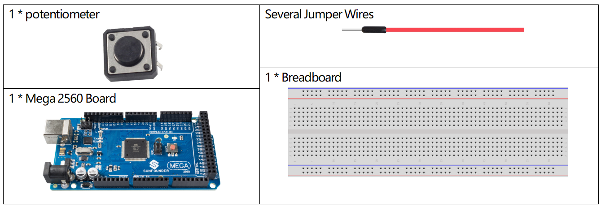
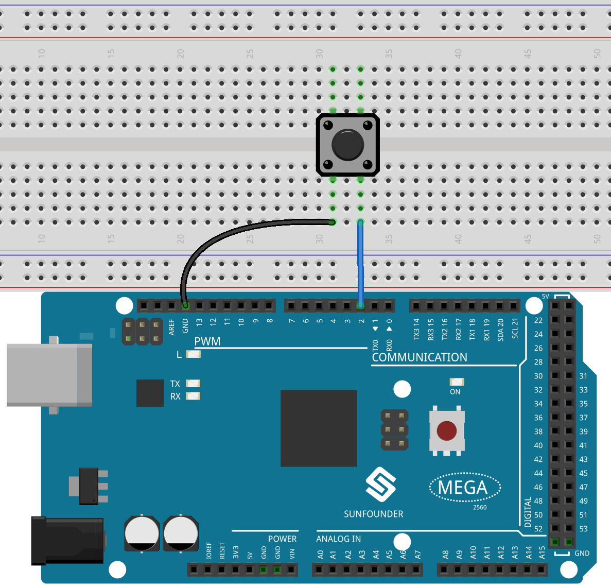
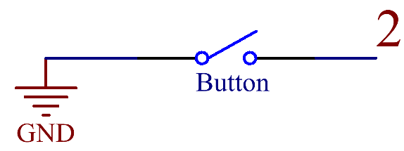
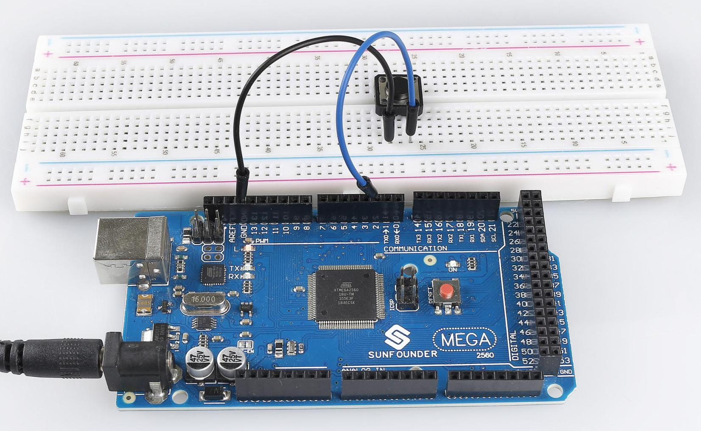

.. note:: 

    ¡Hola, bienvenido a la Comunidad de Entusiastas de Raspberry Pi, Arduino y ESP32 en Facebook! Profundiza en Raspberry Pi, Arduino y ESP32 junto a otros entusiastas.

    **¿Por qué unirse?**

    - **Soporte experto**: Resuelve problemas postventa y desafíos técnicos con la ayuda de nuestra comunidad y equipo.
    - **Aprender y compartir**: Intercambia consejos y tutoriales para mejorar tus habilidades.
    - **Vistas previas exclusivas**: Obtén acceso anticipado a nuevos anuncios de productos y avances.
    - **Descuentos especiales**: Disfruta de descuentos exclusivos en nuestros productos más nuevos.
    - **Promociones festivas y sorteos**: Participa en sorteos y promociones especiales de temporada.

    👉 ¿Listo para explorar y crear con nosotros? Haz clic en [|link_sf_facebook|] y únete hoy mismo.

.. _ar_digital_pullup:

1.9 Entrada Digital con Resistencia Pull-Up
=============================================

Resumen
----------

Al utilizar algunos dispositivos de entrada con interruptor, a menudo se 
emplean resistencias pull-up o pull-down para mantener el nivel de los pines 
correspondientes en un valor determinado cuando el dispositivo no está activado. 
Como en el caso de la lectura digital en 1.4, se utiliza una resistencia de 10k 
para conectar el pin a GND cuando el botón no está presionado. Si hemos utilizado 
muchos componentes de entrada con interruptor y deseamos simplificar el circuito, 
podemos configurar el modo del pin como「INPUT_PULLUP」en el código para que el 
pin lea el nivel alto en estado suspendido.

Componentes necesarios
-------------------------

* :ref:`cpn_mega2560`
* :ref:`cpn_breadboard`
* :ref:`cpn_wires`
* :ref:`cpn_button`

Circuito Fritzing
--------------------

En este ejemplo, utilizamos el pin 2 para leer la señal del botón. 
La resistencia pull-up interna en el pin 2 está habilitada, por lo que 
si el botón no se presiona, se lee un valor ALTO en el pin 2; cuando el 
botón se presiona, se lee un valor BAJO.

Diagrama esquemático
-------------------------

Código
---------

.. note::

    * Puedes abrir el archivo ``1.9_digitalInputPullup.ino`` en la ruta ``sunfounder_vincent_kit_for_arduino\code\1.9_digitalInputPullup`` directamente.
    * O copiar este código en el IDE de Arduino.

.. raw:: html

    <iframe src=https://create.arduino.cc/editor/sunfounder01/223d1c70-2644-4b9c-9f69-74e18394631f/preview?embed style="height:510px;width:100%;margin:10px 0" frameborder=0></iframe>

Después de cargar el código en la placa Mega2560, puedes abrir el monitor serie para ver los valores leídos del pin. Cuando se presiona el botón, el monitor serie mostrará "0", y cuando se suelta el botón, mostrará "1".

Análisis del código
----------------------

Inicia la comunicación serial en setup() y establece la tasa de datos a 9600.

.. code-block:: arduino

    Serial.begin(9600);

Configura el pin 2 como entrada y habilita la resistencia pull-up interna.

.. code-block:: arduino

    pinMode(2, INPUT_PULLUP);

Lee el estado del nivel del pin digital 2 usando la instrucción digitalRead() en loop() y declara una variable para almacenarlo.

.. code-block:: arduino

    int buttonState = digitalRead(2);

Imprime los valores almacenados por la variable en el monitor serie.

.. code-block:: arduino

    Serial.println(buttonState);

Imagen del fenómeno
----------------------

