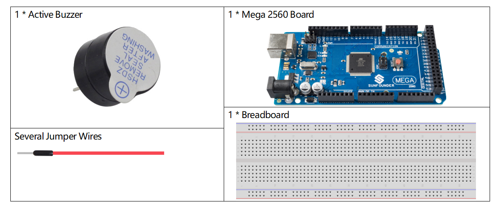
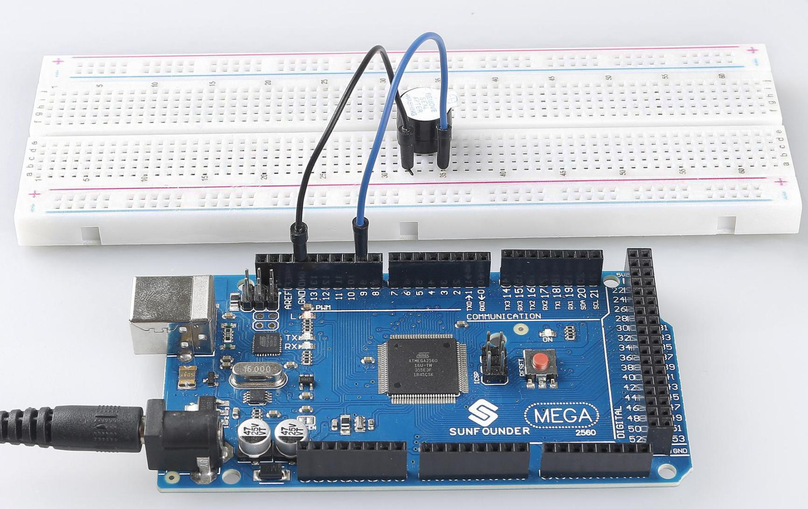

.. _ar_active_buzzer:

2.10 Active Buzzer
==================

Overview
--------

In this lesson, you will get to know about active buzzer. As a type of
electronic buzzer with an integrated structure, active buzzer is
supplied by DC power, widely used in computer, alarm, electronic toy,
telephone, timer and other electronic products or voice devices.

Components Required
-------------------

* :ref:`cpn_mega2560`
* :ref:`cpn_breadboard`
* :ref:`cpn_wires`
* :ref:`cpn_buzzer`

Fritzing Circuit
----------------

.. image:: img/image448.png

In this example, we use the digital pin 9 to drive the buzzer and extend
the cathode of the Buzzer to GND and its anode to the digital pin 9.

Schematic Diagram
-----------------

.. image:: img/image450.png

Code
----

.. note::

    * You can open the file ``2.10_activeBuzzer.ino`` under the path of ``sunfounder_vincent_kit_for_arduino\code\2.10_activeBuzzer`` directly.
    * Or copy this code into Arduino IDE 1/2.
    * Or click **Open Code** to open it in `Web Editor <https://docs.arduino.cc/cloud/web-editor/tutorials/getting-started/getting-started-web-editor>`_.
    * Then :ref:`ar_upload_code` to the board.

.. raw:: html

    <iframe src=https://create.arduino.cc/editor/sunfounder01/6452dcca-4e26-4e50-a32f-a00c8d0ace38/preview?embed style="height:510px;width:100%;margin:10px 0" frameborder=0></iframe>

When you finish uploading the codes to the Mega2560 board, you can hear the beep—beep emitted from the buzzer. If you want to know more about the detail code explanation, please refer to **Part 1-1.2 Digital Write**.

:ref:`digital_write`

Phenomenon Picture
------------------

