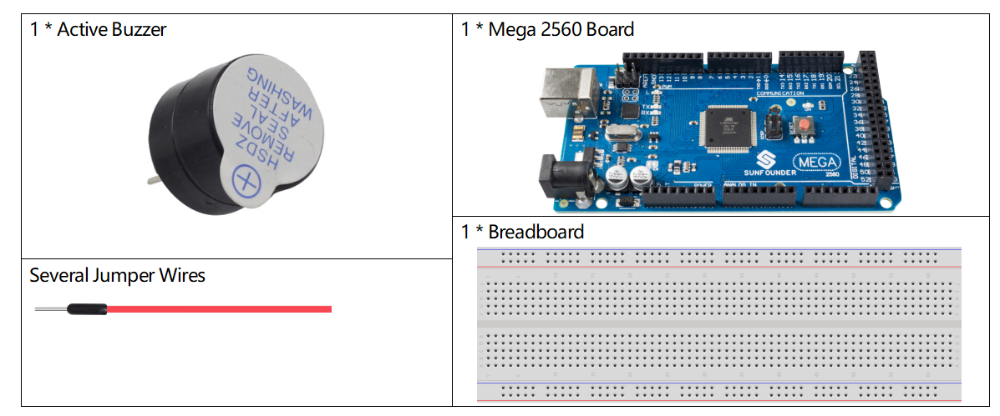
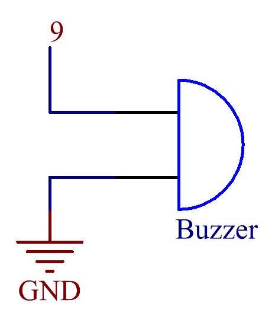
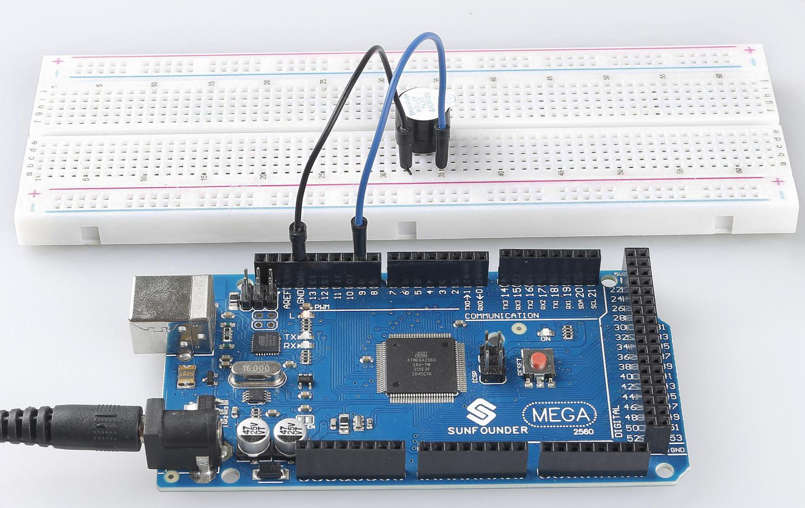

.. note:: 

    ¡Hola, bienvenido a la Comunidad de Entusiastas de Raspberry Pi, Arduino y ESP32 en Facebook! Profundiza en Raspberry Pi, Arduino y ESP32 junto a otros entusiastas.

    **¿Por qué unirse?**

    - **Soporte experto**: Resuelve problemas postventa y desafíos técnicos con la ayuda de nuestra comunidad y equipo.
    - **Aprender y compartir**: Intercambia consejos y tutoriales para mejorar tus habilidades.
    - **Vistas previas exclusivas**: Obtén acceso anticipado a nuevos anuncios de productos y avances.
    - **Descuentos especiales**: Disfruta de descuentos exclusivos en nuestros productos más recientes.
    - **Promociones festivas y sorteos**: Participa en sorteos y promociones especiales de temporada.

    👉 ¿Listo para explorar y crear con nosotros? Haz clic en [|link_sf_facebook|] y únete hoy mismo.

.. _ar_active_buzzer:

2.10 Zumbador Activo
======================

Resumen
---------

En esta lección, conocerás el zumbador activo. Este es un tipo de zumbador 
electrónico con estructura integrada que funciona con alimentación de corriente 
continua (DC). Se utiliza ampliamente en computadoras, alarmas, juguetes 
electrónicos, teléfonos, temporizadores y otros dispositivos electrónicos o de 
sonido.

Componentes necesarios
-------------------------

* :ref:`cpn_mega2560`
* :ref:`cpn_breadboard`
* :ref:`cpn_wires`
* :ref:`cpn_buzzer`

Circuito Fritzing
---------------------

.. image:: img/image448.png

En este ejemplo, utilizamos el pin digital 9 para activar el zumbador. 
Conecta el cátodo del zumbador a GND y su ánodo al pin digital 9.

Diagrama esquemático
----------------------

Código
---------

.. note::

    * Puedes abrir el archivo ``2.10_activeBuzzer.ino`` en la ruta ``sunfounder_vincent_kit_for_arduino\code\2.10_activeBuzzer`` directamente.
    * O copiar este código en el IDE de Arduino.

.. raw:: html

    <iframe src=https://create.arduino.cc/editor/sunfounder01/6452dcca-4e26-4e50-a32f-a00c8d0ace38/preview?embed style="height:510px;width:100%;margin:10px 0" frameborder=0></iframe>

Después de cargar el código en la placa Mega2560, escucharás el pitido—pitido emitido por el zumbador. Si deseas saber más detalles sobre la explicación del código, consulta **Parte 1-1.2 Digital Write**.

:ref:`ar_digital_write`

Imagen del fenómeno
----------------------

