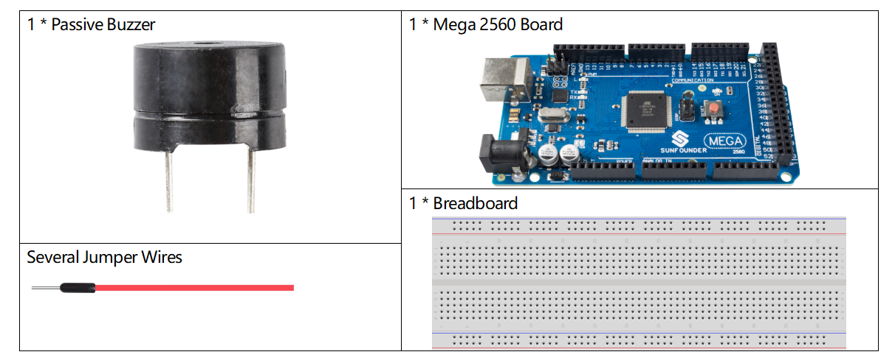
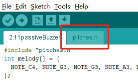
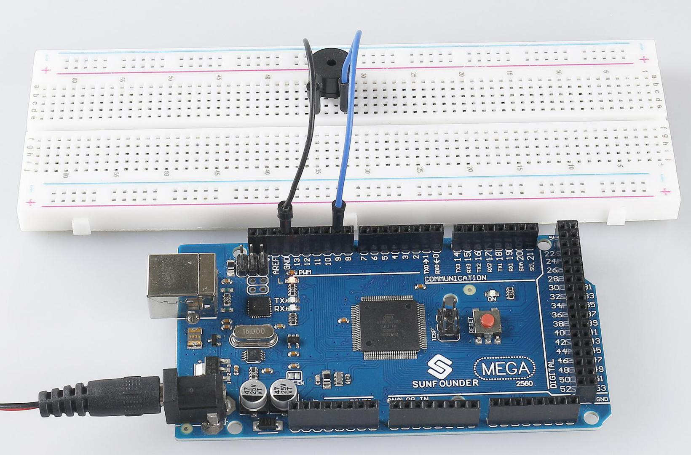

.. _ar_passive_buzzer:

2.11 Passiver Summer
=======================

Überblick
------------

In dieser Lektion lernen Sie den passiven Summer kennen. Als eine Art elektronischer Summer mit integrierter Struktur wird der passive Summer mit Gleichstrom versorgt, der in Computern, Alarmen, elektronischen Spielzeugen, Telefonen, Timern und anderen elektronischen Produkten oder Sprachgeräten weit verbreitet ist.

Erforderliche Komponenten
------------------------------

* :ref:`cpn_mega2560`
* :ref:`cpn_breadboard`
* :ref:`cpn_wires`
* :ref:`cpn_buzzer`

Fritzing-Schaltung
--------------------------

.. image:: img/image448.png

In diesem Beispiel verwenden wir den Pin 9, um den Summer anzusteuern. Wir bringen die Kathode des Summers auf GND und die Anode auf den digitalen Pin 9.

Schematische Darstellung
------------------------------

.. image:: img/image450.png

Code
-------

.. note::

    * Sie können die Datei ``2.11_passiveBuzzer.ino`` unter dem Pfad ``sunfounder_vincent_kit_for_arduino\code\2.11_passiveBuzzer`` direkt öffnen.
    * Oder klicken Sie auf Code öffnen, um ihn im `Web Editor <https://docs.arduino.cc/cloud/web-editor/tutorials/getting-started/getting-started-web-editor>`_ zu öffnen.
    * Laden Sie dann :ref:`ar_upload_code` auf das Board hoch.

.. raw:: html

    <iframe src=https://create.arduino.cc/editor/sunfounder01/d6c0bde7-aa46-4900-9c11-0ca56832a962/preview?embed style="height:510px;width:100%;margin:10px 0" frameborder=0></iframe>

Wenn Sie die Codes auf das Mega2560-Board hochgeladen haben, können Sie eine Melodie mit sieben Tönen hören.

Code-Analyse
-------------

Es gibt zwei Punkte, die Ihre Aufmerksamkeit erfordern:

1. ``tone()`` & ``noTone()``: Diese Funktion wird verwendet, um den Ton des passiven Summers direkt zu steuern, und ihr Prototyp ist wie folgt:

.. code-block:: arduino

    void tone(int pin, unsigned int frequency)
    void tone(int pin, unsigned int frequency, unsigned long duration)

Erzeugt eine Rechteckwelle mit der angegebenen Frequenz (und 50 % Arbeitszyklus) auf einem Stift (um den passiven Summer zum Vibrieren zu bringen, um einen Ton zu erzeugen). Eine Dauer kann angegeben werden, andernfalls wird die Welle fortgesetzt, bis ein Aufruf von ``noTone()`` erfolgt. Der Stift kann mit einem Piezo-Summer oder einem anderen Lautsprecher verbunden werden, um Töne zu spielen.

Es kann immer nur ein Ton erzeugt werden. Wenn auf einem anderen Pin bereits ein Ton abgespielt wird, hat der Aufruf to ``tone()`` keine Wirkung. Wenn der Ton auf demselben Pin abgespielt wird, wird der Anruf seine Frequenz festlegen.

Die Verwendung der Funktion ``tone()`` stört den PWM-Ausgang an den Pins 3 und 11 (auf anderen Platinen als dem Mega).

Es ist nicht möglich, Töne unter 31 Hz zu erzeugen.

* ``pin``: Der Arduino-Pin, auf dem der Ton erzeugt werden soll.
* ``frequency``: Die Frequenz des Tons in Hertz.
* ``duration``: Die Dauer des Tons in Millisekunden (optional)

.. code-block:: arduino

    void noTone(int pin)

Stoppt die Generierung einer durch ``Tone()`` ausgelösten Rechteckwelle. Hat keine Auswirkung, wenn kein Ton erzeugt wird.

* ``pin``: Der Arduino-Pin, auf dem der Ton erzeugt werden soll.

Nachdem Sie die beiden Funktionen kennen, können Sie die Codes verstehen – das Anlegen des Arrays melody[] und des Arrays noteDurations[] ist die Vorbereitung des anschließenden mehrmaligen Aufrufs der Funktion ``tone()`` und der Änderung von Ton und Dauer in die Schleife für eine bessere Wirkung des Musikspiels.

2. ``pitches.h``: Der Code verwendet eine zusätzliche Datei, ``pitches.h``. Diese Datei enthält alle Tonhöhenwerte für typische Noten. Zum Beispiel ist ``NOTE_C4`` das mittlere C. ``NOTE_FS4`` ist Fis und so weiter. Diese Notentabelle wurde ursprünglich von Brett Hagman geschrieben, auf dessen Arbeit der Befehl ``tone()`` basierte. Sie können es nützlich finden, wenn Sie Musiknoten machen möchten.

.. code-block:: arduino

    #include "pitches.h"

.. note::
    In diesem Beispielprogramm ist bereits eine Datei ``pitches.h`` vorhanden. Wenn wir es zusammen mit dem Hauptcode in einen Ordner packen, können die aufeinanderfolgenden Schritte der Installation von ``pitches.h`` entfallen.

Wenn Sie nach dem Öffnen des Codes ``2.11_passiveBuzzer.ino`` den Code ``pitches.h`` nicht öffnen können, können Sie einfach einen manuell installieren. Die Schritte sind wie folgt:

Um die Datei ``pitches.h`` zu erstellen, klicken Sie entweder auf die Schaltfläche direkt unter dem Symbol für den seriellen Monitor und wählen Sie „Neuer Tab“ oder verwenden Sie Strg+Umschalt+N.

Fügen Sie dann den folgenden Code ein und speichern Sie ihn als ``pitches.h``:

.. code-block:: arduino

    /*****************
    Public Constants
    *****************/
    #define NOTE_B0  31
    #define NOTE_C1  33
    #define NOTE_CS1 35
    #define NOTE_D1  37
    #define NOTE_DS1 39
    #define NOTE_E1  41
    #define NOTE_F1  44
    #define NOTE_FS1 46
    #define NOTE_G1  49
    #define NOTE_GS1 52
    #define NOTE_A1  55
    #define NOTE_AS1 58
    #define NOTE_B1  62
    #define NOTE_C2  65
    #define NOTE_CS2 69
    #define NOTE_D2  73
    #define NOTE_DS2 78
    #define NOTE_E2  82
    #define NOTE_F2  87
    #define NOTE_FS2 93
    #define NOTE_G2  98
    #define NOTE_GS2 104
    #define NOTE_A2  110
    #define NOTE_AS2 117
    #define NOTE_B2  123
    #define NOTE_C3  131
    #define NOTE_CS3 139
    #define NOTE_D3  147
    #define NOTE_DS3 156
    #define NOTE_E3  165
    #define NOTE_F3  175
    #define NOTE_FS3 185
    #define NOTE_G3  196
    #define NOTE_GS3 208
    #define NOTE_A3  220
    #define NOTE_AS3 233
    #define NOTE_B3  247
    #define NOTE_C4  262
    #define NOTE_CS4 277
    #define NOTE_D4  294
    #define NOTE_DS4 311
    #define NOTE_E4  330
    #define NOTE_F4  349
    #define NOTE_FS4 370
    #define NOTE_G4  392
    #define NOTE_GS4 415
    #define NOTE_A4  440
    #define NOTE_AS4 466
    #define NOTE_B4  494
    #define NOTE_C5  523
    #define NOTE_CS5 554
    #define NOTE_D5  587
    #define NOTE_DS5 622
    #define NOTE_E5  659
    #define NOTE_F5  698
    #define NOTE_FS5 740
    #define NOTE_G5  784
    #define NOTE_GS5 831
    #define NOTE_A5  880
    #define NOTE_AS5 932
    #define NOTE_B5  988
    #define NOTE_C6  1047
    #define NOTE_CS6 1109
    #define NOTE_D6  1175
    #define NOTE_DS6 1245
    #define NOTE_E6  1319
    #define NOTE_F6  1397
    #define NOTE_FS6 1480
    #define NOTE_G6  1568
    #define NOTE_GS6 1661
    #define NOTE_A6  1760
    #define NOTE_AS6 1865
    #define NOTE_B6  1976
    #define NOTE_C7  2093
    #define NOTE_CS7 2217
    #define NOTE_D7  2349
    #define NOTE_DS7 2489
    #define NOTE_E7  2637
    #define NOTE_F7  2794
    #define NOTE_FS7 2960
    #define NOTE_G7  3136
    #define NOTE_GS7 3322
    #define NOTE_A7  3520
    #define NOTE_AS7 3729
    #define NOTE_B7  3951
    #define NOTE_C8  4186
    #define NOTE_CS8 4435
    #define NOTE_D8  4699
    #define NOTE_DS8 49

Phänomen Bild
------------------

