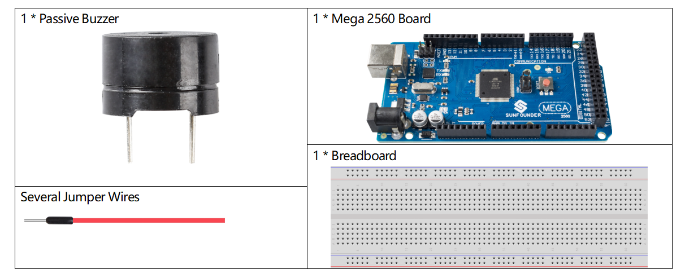
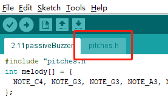
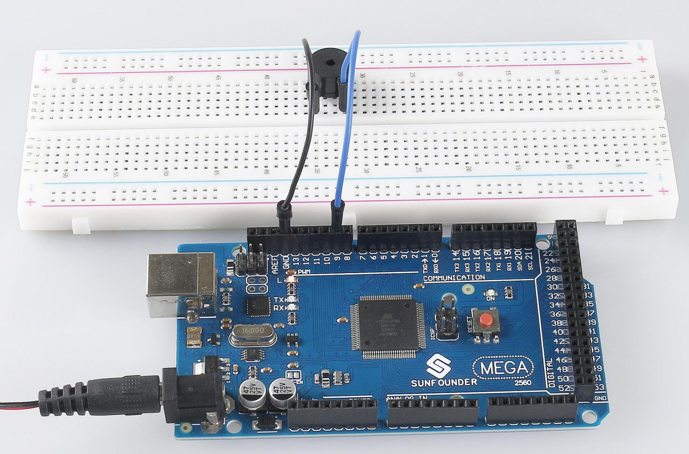

.. note:: 

    Bonjour et bienvenue dans la communauté des passionnés de Raspberry Pi, Arduino et ESP32 de SunFounder sur Facebook ! Plongez dans l’univers du Raspberry Pi, d'Arduino et de l'ESP32 avec d'autres passionnés.

    **Pourquoi nous rejoindre ?**

    - **Assistance d'experts** : Résolvez vos problèmes post-achat et défis techniques grâce à l'aide de notre communauté et de notre équipe.
    - **Apprendre et partager** : Échangez des astuces et tutoriels pour améliorer vos compétences.
    - **Aperçus exclusifs** : Accédez en avant-première aux annonces de nouveaux produits et aux aperçus.
    - **Réductions spéciales** : Profitez de réductions exclusives sur nos derniers produits.
    - **Promotions et concours festifs** : Participez à des concours et promotions durant les fêtes.

    👉 Prêt à explorer et créer avec nous ? Cliquez sur [|link_sf_facebook|] et rejoignez-nous dès aujourd'hui !

.. _ar_passive_buzzer:

2.11 Buzzer Passif
=====================

Aperçu
--------

Dans cette leçon, vous allez découvrir le buzzer passif. Ce type de buzzer 
électronique avec une structure intégrée est alimenté par une source de courant 
continu (DC). Le buzzer passif est largement utilisé dans les ordinateurs, 
alarmes, jouets électroniques, téléphones, minuteries, et autres produits 
électroniques ou dispositifs sonores.

Composants Requis
-------------------

* :ref:`cpn_mega2560`
* :ref:`cpn_breadboard`
* :ref:`cpn_wires`
* :ref:`cpn_buzzer`

Circuit Fritzing
-------------------

.. image:: img/image448.png

Dans cet exemple, nous utilisons la broche numérique 9 pour piloter le buzzer. Connectez la cathode du buzzer à la masse (GND) et l'anode à la broche numérique 9.

Schéma de Connexion
----------------------

.. image:: img/image450.png

Code
-------

.. note::

    * Vous pouvez ouvrir directement le fichier ``2.11_passiveBuzzer.ino`` situé dans le chemin ``sunfounder_vincent_kit_for_arduino\code\2.11_passiveBuzzer``.
    * Ou copiez ce code dans l’IDE Arduino.

.. raw:: html

    <iframe src=https://create.arduino.cc/editor/sunfounder01/d6c0bde7-aa46-4900-9c11-0ca56832a962/preview?embed style="height:510px;width:100%;margin:10px 0" frameborder=0></iframe>

Après avoir téléversé le code sur la carte Mega2560, vous entendrez une mélodie comportant sept notes.

Analyse du Code
-------------------

Deux points nécessitent votre attention :

1. ``tone()`` & ``noTone()`` : Cette fonction permet de contrôler directement le son du buzzer passif, dont le prototype est le suivant :

.. code-block:: arduino

    void tone(int pin, unsigned int frequency)
    void tone(int pin, unsigned int frequency, unsigned long duration)

Génère une onde carrée de la fréquence spécifiée (et avec un cycle de travail de 50%) sur une broche (faisant ainsi vibrer le buzzer passif pour produire un son). Une durée peut être spécifiée, sinon l’onde continue jusqu’à un appel de noTone(). La broche peut être connectée à un buzzer piézo ou un autre haut-parleur pour jouer des tonalités.

Une seule tonalité peut être générée à la fois. Si une tonalité est déjà jouée sur une autre broche, l’appel à tone() n’aura aucun effet. Si la tonalité est déjà en cours sur la même broche, l’appel ajustera sa fréquence.

L’utilisation de la fonction ``tone()`` interférera avec la sortie PWM sur les broches 3 et 11 (sauf pour les cartes Mega).

Il est impossible de générer des tonalités inférieures à 31 Hz.

**pin** : La broche de l’Arduino sur laquelle générer la tonalité.

**frequency** : La fréquence de la tonalité en hertz.

**duration** : La durée de la tonalité en millisecondes (facultatif).

.. code-block:: arduino

    void noTone(int pin)

Arrête la génération d'une onde carrée déclenchée par ``tone()``. Sans effet si aucune tonalité n’est générée.

**pin** : La broche de l’Arduino sur laquelle arrêter la tonalité.

Après avoir compris ces deux fonctions, le code devient clair : les tableaux melody[] et noteDurations[] préparent la suite d'appels successifs de la fonction ``tone()`` pour modifier la tonalité et la durée de chaque note jouée dans la boucle afin d'obtenir un effet musical.

2. ``pitches.h`` : Le code utilise un fichier supplémentaire, ``pitches.h``. Ce fichier contient toutes les valeurs de fréquence pour les notes musicales standards. Par exemple, NOTE_C4 est le do médian, NOTE_FS4 est un fa dièse, etc. Cette table de notes a été écrite par Brett Hagman, sur laquelle la commande ``tone()`` est basée. Elle est utile chaque fois que vous souhaitez jouer des notes musicales.

.. code-block:: arduino

    #include "pitches.h"

.. note::
    Un fichier ``pitches.h`` est déjà inclus dans cet exemple. Si vous le placez dans le même dossier que le code principal, les étapes d'installation de ``pitches.h`` peuvent être ignorées.

Si vous ne pouvez pas ouvrir le fichier ``pitches.h`` en ouvrant le code 
2.11_passiveBuzzer, vous pouvez en créer un manuellement. Voici les étapes :

Pour créer le fichier ``pitches.h``, cliquez sur le bouton sous l’icône du 
moniteur série et choisissez "Nouvel Onglet", ou utilisez Ctrl+Shift+N.

Ensuite, collez le code suivant et enregistrez-le sous le nom ``pitches.h`` :

.. code-block:: arduino

    /*****************
    Public Constants
    *****************/
    #define NOTE_B0  31
    #define NOTE_C1  33
    #define NOTE_CS1 35
    #define NOTE_D1  37
    #define NOTE_DS1 39
    #define NOTE_E1  41
    #define NOTE_F1  44
    #define NOTE_FS1 46
    #define NOTE_G1  49
    #define NOTE_GS1 52
    #define NOTE_A1  55
    #define NOTE_AS1 58
    #define NOTE_B1  62
    #define NOTE_C2  65
    #define NOTE_CS2 69
    #define NOTE_D2  73
    #define NOTE_DS2 78
    #define NOTE_E2  82
    #define NOTE_F2  87
    #define NOTE_FS2 93
    #define NOTE_G2  98
    #define NOTE_GS2 104
    #define NOTE_A2  110
    #define NOTE_AS2 117
    #define NOTE_B2  123
    #define NOTE_C3  131
    #define NOTE_CS3 139
    #define NOTE_D3  147
    #define NOTE_DS3 156
    #define NOTE_E3  165
    #define NOTE_F3  175
    #define NOTE_FS3 185
    #define NOTE_G3  196
    #define NOTE_GS3 208
    #define NOTE_A3  220
    #define NOTE_AS3 233
    #define NOTE_B3  247
    #define NOTE_C4  262
    #define NOTE_CS4 277
    #define NOTE_D4  294
    #define NOTE_DS4 311
    #define NOTE_E4  330
    #define NOTE_F4  349
    #define NOTE_FS4 370
    #define NOTE_G4  392
    #define NOTE_GS4 415
    #define NOTE_A4  440
    #define NOTE_AS4 466
    #define NOTE_B4  494
    #define NOTE_C5  523
    #define NOTE_CS5 554
    #define NOTE_D5  587
    #define NOTE_DS5 622
    #define NOTE_E5  659
    #define NOTE_F5  698
    #define NOTE_FS5 740
    #define NOTE_G5  784
    #define NOTE_GS5 831
    #define NOTE_A5  880
    #define NOTE_AS5 932
    #define NOTE_B5  988
    #define NOTE_C6  1047
    #define NOTE_CS6 1109
    #define NOTE_D6  1175
    #define NOTE_DS6 1245
    #define NOTE_E6  1319
    #define NOTE_F6  1397
    #define NOTE_FS6 1480
    #define NOTE_G6  1568
    #define NOTE_GS6 1661
    #define NOTE_A6  1760
    #define NOTE_AS6 1865
    #define NOTE_B6  1976
    #define NOTE_C7  2093
    #define NOTE_CS7 2217
    #define NOTE_D7  2349
    #define NOTE_DS7 2489
    #define NOTE_E7  2637
    #define NOTE_F7  2794
    #define NOTE_FS7 2960
    #define NOTE_G7  3136
    #define NOTE_GS7 3322
    #define NOTE_A7  3520
    #define NOTE_AS7 3729
    #define NOTE_B7  3951
    #define NOTE_C8  4186
    #define NOTE_CS8 4435
    #define NOTE_D8  4699
    #define NOTE_DS8 49

Illustration du Phénomène
-----------------------------

