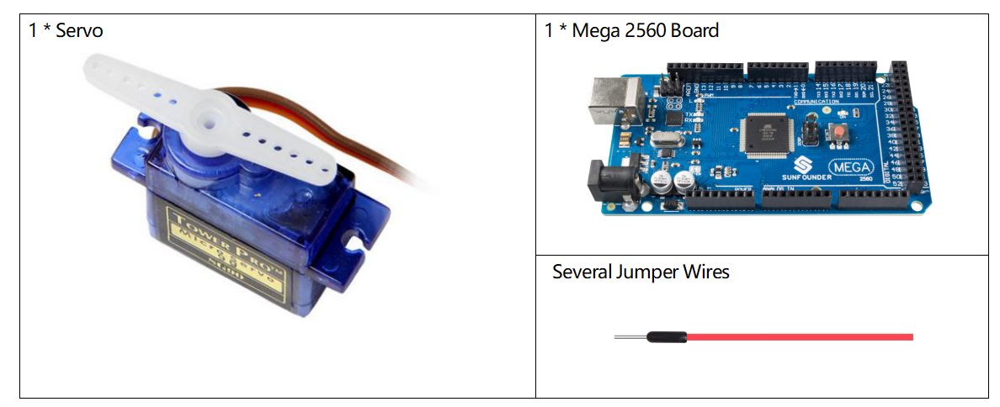
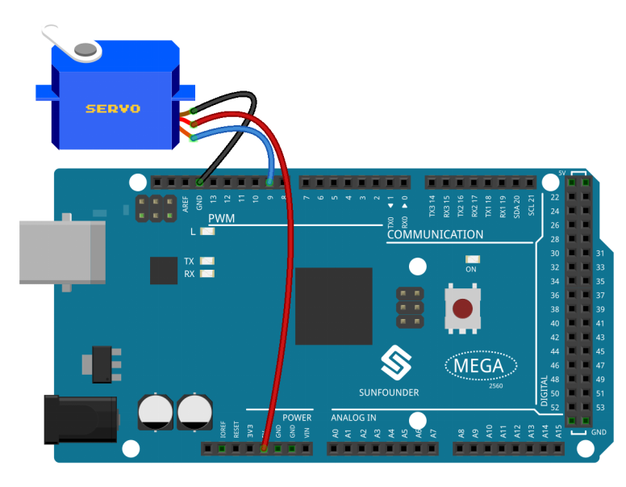
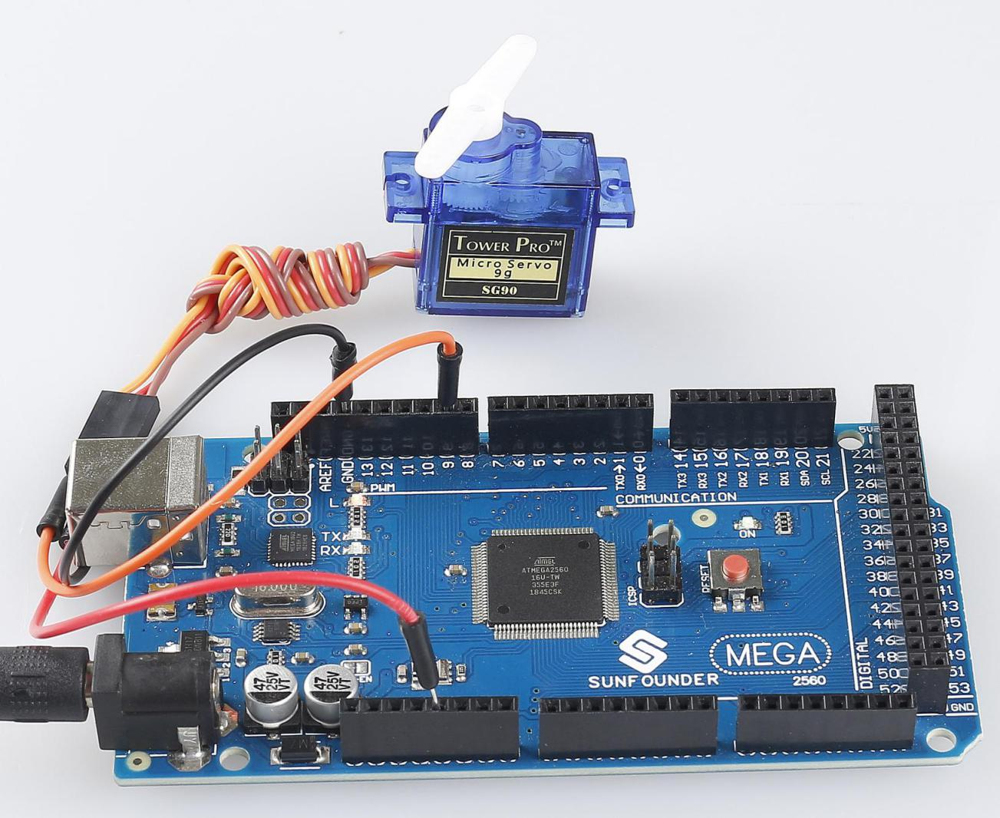

.. _ar_servo:

2.12 Servo
==========

Overview
--------

In this lesson, you will learn something about Servo. Servo is a kind of
driver whose position (angular) can be adjustable and kept or a rotary
actuator that allows for precise control of angular position. Currently,
it is widely used in upscale remote control toys, such as airplane,
submarine, telerobot and so on.

Components Required
-------------------

* :ref:`cpn_mega2560`
* :ref:`cpn_wires`
* :ref:`cpn_servo`

Fritzing Circuit
----------------

In this example, we use PWM pin 9 to drive the Servo, and get the orange
wire of the servo connected to the PWM pin 9, the red one to 5V, and the
brown one to GND.

Schematic Diagram
-----------------

.. image:: img/image455.png

Code
----

.. note::

    * You can open the file ``2.12_servo.ino`` under the path of ``sunfounder_vincent_kit_for_arduino\code\2.12_servo`` directly.
    * Or copy this code into Arduino IDE.

.. raw:: html

    <iframe src=https://create.arduino.cc/editor/sunfounder01/a32d1aea-1fe2-44f1-9ec7-46713d50ef3d/preview?embed style="height:510px;width:100%;margin:10px 0" frameborder=0></iframe>

Once you finish uploading the codes to the Mega2560 board, you can see the servo arm rotating in the range 0°~180°.

Code Analysis
-------------

By calling the library Servo.h, you can drive the servo easily. 

.. code-block:: arduino

    #include <Servo.h> 

**Library Functions：**

.. code-block:: arduino

    Servo

Create **Servo** object to control a servo.

.. code-block:: arduino

    uint8_t attach(int pin); 

Turn a pin into a servo driver. Calls pinMode. Returns 0 on failure.

.. code-block:: arduino

    void detach();

Release a pin from servo driving.

.. code-block:: arduino

    void write(int value); 

Set the angle of the servo in degrees, 0 to 180.

.. code-block:: arduino

    int read();

Return that value set with the last write().

.. code-block:: arduino

    bool attached(); 

Return 1 if the servo is currently attached.

Phenomenon Picture
------------------

