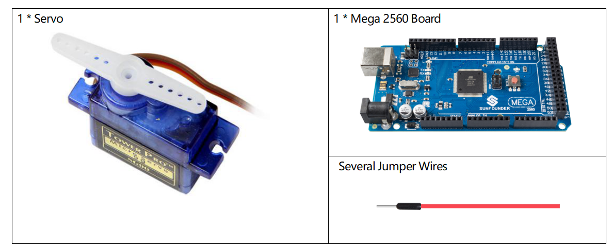
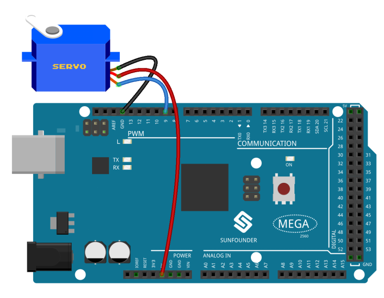
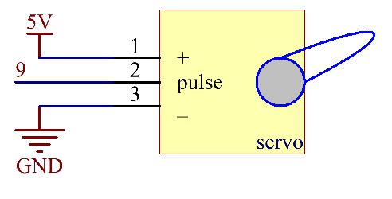
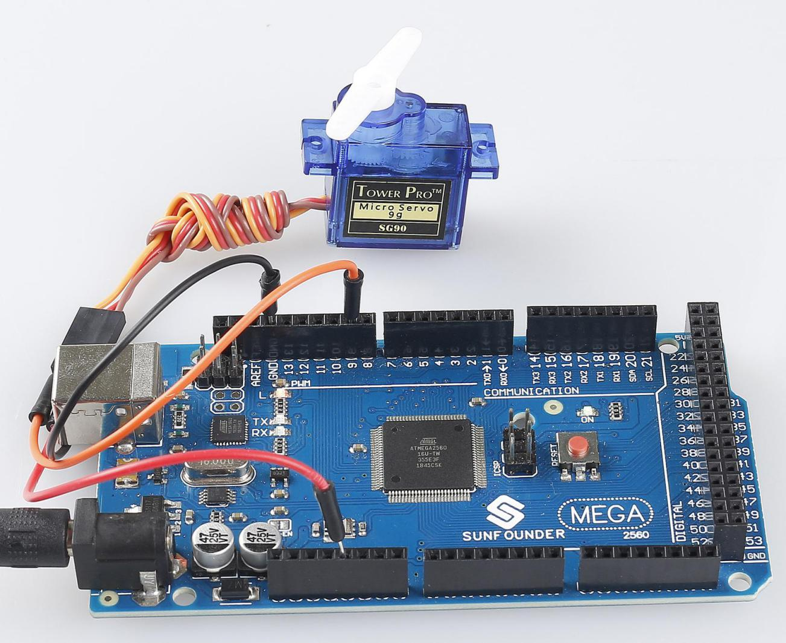

.. note:: 

    Bonjour et bienvenue dans la communauté des passionnés de Raspberry Pi, Arduino et ESP32 de SunFounder sur Facebook ! Plongez dans l’univers du Raspberry Pi, d'Arduino et de l'ESP32 avec d'autres passionnés.

    **Pourquoi nous rejoindre ?**

    - **Assistance d'experts** : Résolvez vos problèmes post-achat et défis techniques grâce à l'aide de notre communauté et de notre équipe.
    - **Apprendre et partager** : Échangez des astuces et tutoriels pour améliorer vos compétences.
    - **Aperçus exclusifs** : Accédez en avant-première aux annonces de nouveaux produits et aux aperçus.
    - **Réductions spéciales** : Profitez de réductions exclusives sur nos derniers produits.
    - **Promotions et concours festifs** : Participez à des concours et promotions durant les fêtes.

    👉 Prêt à explorer et créer avec nous ? Cliquez sur [|link_sf_facebook|] et rejoignez-nous dès aujourd'hui !

.. _ar_servo:

2.12 Servo
============

Aperçu
-----------

Dans cette leçon, vous allez découvrir le servo-moteur. Un servo est un 
dispositif permettant de contrôler de manière précise une position angulaire 
qui peut être ajustée et maintenue. Il est couramment utilisé dans les 
jouets télécommandés haut de gamme, tels que les avions, sous-marins, robots, etc.

Composants Requis
-------------------

* :ref:`cpn_mega2560`
* :ref:`cpn_wires`
* :ref:`cpn_servo`

Circuit Fritzing
-------------------

Dans cet exemple, nous utilisons la broche PWM 9 pour piloter le servo, en 
connectant le fil orange du servo à la broche PWM 9, le fil rouge à 5V, et 
le fil marron à GND.

Schéma de Connexion
---------------------

Code
----

.. note::

    * Vous pouvez ouvrir directement le fichier ``2.12_servo.ino`` situé dans le chemin ``sunfounder_vincent_kit_for_arduino\code\2.12_servo``.
    * Ou copiez ce code dans l’IDE Arduino.

.. raw:: html

    <iframe src=https://create.arduino.cc/editor/sunfounder01/a32d1aea-1fe2-44f1-9ec7-46713d50ef3d/preview?embed style="height:510px;width:100%;margin:10px 0" frameborder=0></iframe>

Une fois le code téléversé sur la carte Mega2560, vous verrez le bras du servo se déplacer dans une plage de 0° à 180°.

Analyse du Code
------------------

En utilisant la bibliothèque Servo.h, vous pouvez piloter facilement le servo.

.. code-block:: arduino

    #include <Servo.h> 

**Fonctions de la Bibliothèque：**

.. code-block:: arduino

    Servo

Créer un objet **Servo** pour contrôler un servo.

.. code-block:: arduino

    uint8_t attach(int pin); 

Configurer une broche en tant que pilote de servo. Appelle pinMode. Renvoie 0 en cas d'échec.

.. code-block:: arduino

    void detach();

Libère une broche de la commande du servo.

.. code-block:: arduino

    void write(int value); 

Définit l'angle du servo en degrés, de 0 à 180.

.. code-block:: arduino

    int read();

Renvoie la dernière valeur définie avec write().

.. code-block:: arduino

    bool attached(); 

Renvoie 1 si le servo est actuellement attaché.

Illustration du Phénomène
-----------------------------

