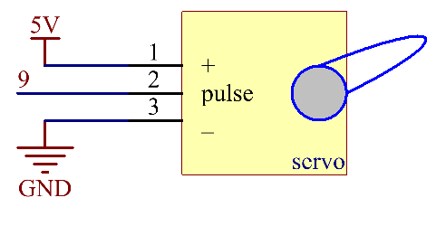

.. _ar_servo:

2.12 Servo
==========

Überblick
-------------------

In dieser Lektion werden Sie etwas über Servo lernen. Servo ist eine Art von
Treiber, dessen Position (Winkel) einstellbar ist und beibehalten werden kann, oder ein Drehantrieb
Aktuator, der eine präzise Steuerung der Winkelposition ermöglicht. Derzeit,
wird er häufig in gehobenen ferngesteuerten Spielzeugen wie Flugzeugen, U-Booten
U-Boot, Teleroboter und so weiter.

Erforderliche Komponenten
---------------------------------

* :ref:`cpn_mega2560`
* :ref:`cpn_wires`
* :ref:`cpn_servo`

Fritzing-Schaltung
---------------------------

In diesem Beispiel verwenden wir PWM-Pin 9, um den Servo anzutreiben, und verbinden den orangefarbenen Draht des Servos mit dem PWM-Pin 9, den roten mit 5 V und den braunen mit GND.

.. image:: img/image454.png

Schematische Darstellung
-----------------------------------

Code
----

.. note::

    * Sie können die Datei ``2.12_servo.ino`` unter dem Pfad ``sunfounder_vincent_kit_for_arduino\code\2.12_servo`` direkt öffnen.
    * Oder kopieren Sie diesen Code in Arduino IDE. 

.. raw:: html

    <iframe src=https://create.arduino.cc/editor/sunfounder01/a32d1aea-1fe2-44f1-9ec7-46713d50ef3d/preview?embed style="height:510px;width:100%;margin:10px 0" frameborder=0></iframe>

Sobald Sie die Codes auf das Mega2560-Board hochgeladen haben, können Sie sehen, wie sich der Servoarm im Bereich von 0 ° ~ 180 ° dreht.

Code-Analyse
-------------

Durch den Aufruf der Bibliothek ``Servo.h`` können Sie das Servo einfach ansteuern.

.. code-block:: arduino

    #include <Servo.h> 

**Bibliotheksfunktionen:**

.. code-block:: arduino

    Servo

Erstellen Sie ein ``Servo`` -Objekt, um einen Servo zu steuern.

.. code-block:: arduino

    uint8_t attach(int pin); 

Verwandeln Sie einen Stift in einen Servotreiber. Ruft pinMode auf. Gibt bei einem Fehler 0 zurück.

.. code-block:: arduino

    void detach();

Lösen Sie einen Stift vom Servoantrieb.

.. code-block:: arduino

    void write(int value); 

Stellen Sie den Winkel des Servos in Grad ein, 0 bis 180.

.. code-block:: arduino

    int read();

Gibt diesen Wert zurück, der mit dem letzten ``write()`` gesetzt wurde.

.. code-block:: arduino

    bool attached(); 

Geben Sie 1 zurück, wenn das Servo derzeit angeschlossen ist.

Phänomen Bild
------------------

