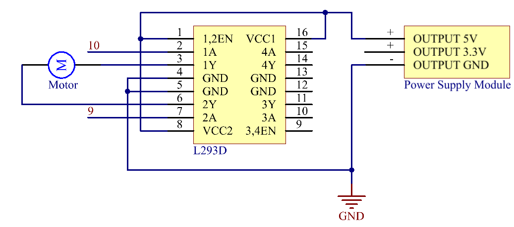
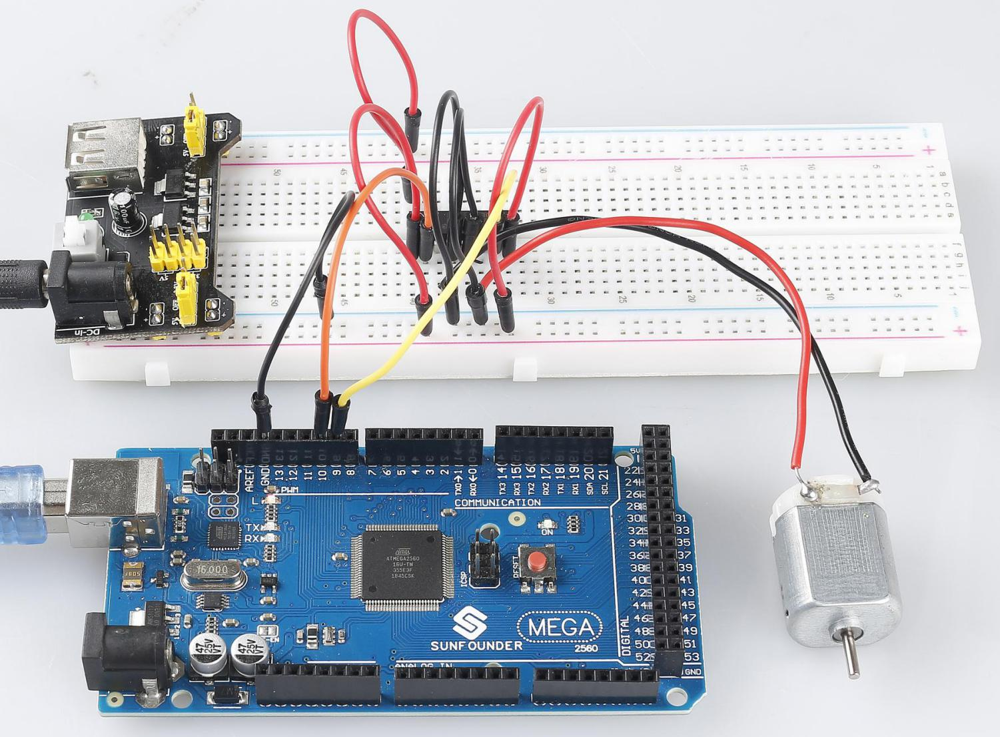

.. _ar_motor:

2.13 Motor
==========

Overview
--------

In this lesson, you will learn how to use Motor, the working principle
of which is that the energized coil is forced to rotate in the magnetic
field then the rotor of the motor rotates accordingly on which the
pinion gear drives the engine flywheel to rotate.

Components Required
-------------------

.. image:: img/list_2.13.png

* :ref:`cpn_mega2560`
* :ref:`cpn_breadboard`
* :ref:`cpn_wires`
* :ref:`cpn_l293d`
* :ref:`cpn_motor`
* :ref:`cpn_power_module`

Fritzing Circuit
----------------

In this example, we use Power Supply Module to power the anode and
cathode of breadboard. GND of Mega 2560 Board is connected to the
cathode.

.. image:: img/image141.png

Schematic Diagram
-----------------

Code
----

.. note::

    * You can open the file ``2.13_motor.ino`` under the path of ``sunfounder_vincent_kit_for_arduino\code\2.13_motor`` directly.
    * Or copy this code into Arduino IDE.

.. raw:: html

    <iframe src=https://create.arduino.cc/editor/sunfounder01/97ab73d2-6658-43e3-b741-c95f5040c15f/preview?embed style="height:510px;width:100%;margin:10px 0" frameborder=0></iframe>

After uploading the codes to the Mega2560 board, you can select the rotating direction of motor by typing 「A」 or 「B」 in the serial monitor.

Code Analysis
-------------

The motor can be driven by providing a voltage difference between the copper sheets at both sides of the motor. 
Therefore, you only need to write 0 for the voltage of one side of the copper sheet and 5V for the other side. Modify the written analog signal value to adjust the direction and speed.

.. code-block:: arduino

    void clockwise(int Speed)
    {
    analogWrite(motor1A,0);
    analogWrite(motor2A,Speed);
    }

    void anticlockwise(int Speed)
    {
    analogWrite(motor1A,Speed);
    analogWrite(motor2A,0);
    }

In this example, Serial.Read() is used to control the direction of motor. 

When you type \'A\' in serial monitor, there calls the clockwise (255) function to make the motor rotate with the speed of 255.
Input \'B\', and the motor will rotate in reverse direction.

.. code-block:: arduino

    void loop() {
    if (Serial.available() > 0) {
        int incomingByte = Serial.read();
        switch(incomingByte){
        case 'A':
            clockwise(255);
            Serial.println("The motor rotate clockwise.");  
            break;
        case 'B':
            anticlockwise(255);
            Serial.println("The motor rotate anticlockwise."); 
            break;
        }
    }
    delay(3000);
    stopMotor();
    }

Phenomenon Picture
------------------

