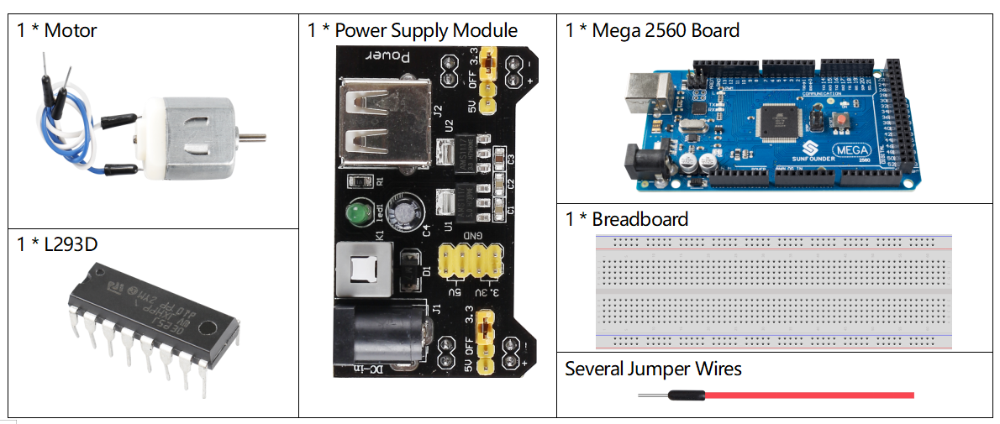
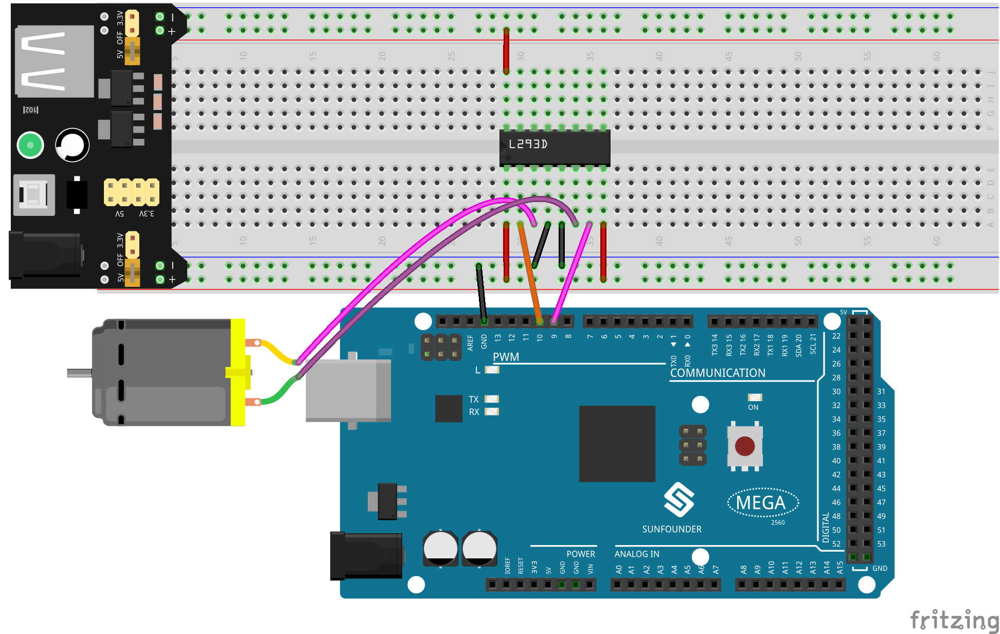
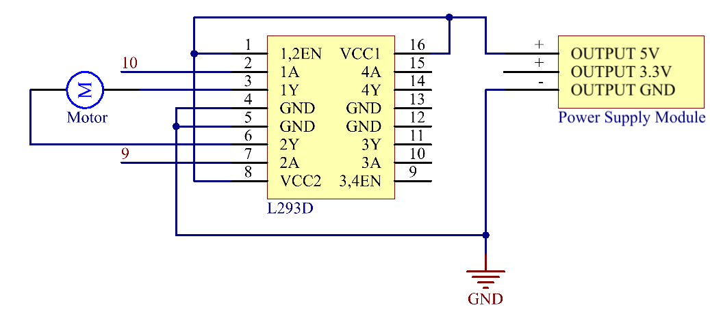
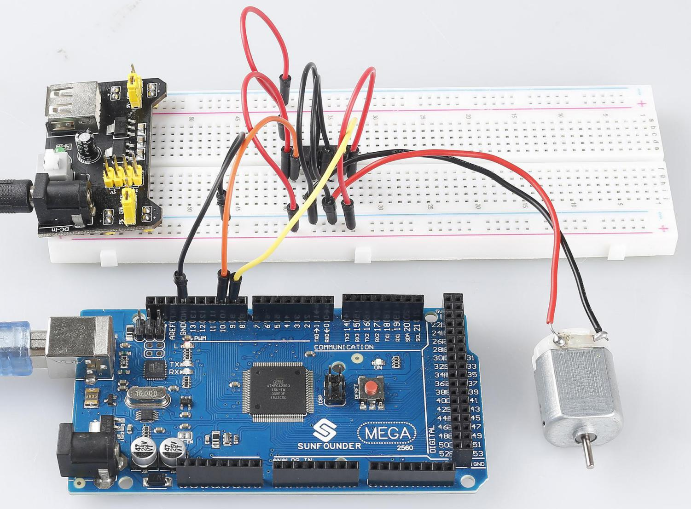

.. note::

    Ciao, benvenuto nella community di appassionati di SunFounder Raspberry Pi & Arduino & ESP32 su Facebook! Esplora più a fondo Raspberry Pi, Arduino ed ESP32 con altri appassionati.

    **Perché unirsi a noi?**

    - **Supporto esperto**: Risolvi problemi post-vendita e sfide tecniche grazie al supporto della nostra community e del nostro team.
    - **Impara e condividi**: Scambia suggerimenti e tutorial per migliorare le tue competenze.
    - **Anteprime esclusive**: Ottieni l'accesso anticipato a nuovi annunci di prodotto e anteprime.
    - **Sconti speciali**: Approfitta di sconti esclusivi sui nostri prodotti più recenti.
    - **Promozioni festive e omaggi**: Partecipa a giveaway e promozioni durante le festività.

    👉 Pronto a esplorare e creare con noi? Clicca [|link_sf_facebook|] e unisciti oggi stesso!

.. _ar_motor:

2.13 Motore
=============

Panoramica
-------------

In questa lezione imparerai a utilizzare un motore, il cui principio di 
funzionamento si basa su una bobina energizzata che è costretta a ruotare 
in un campo magnetico. Questo movimento fa sì che il rotore del motore ruoti 
e il pignone trasmetta il movimento al volano del motore.

Componenti necessari
----------------------

* :ref:`cpn_mega2560`
* :ref:`cpn_breadboard`
* :ref:`cpn_wires`
* :ref:`cpn_l293d`
* :ref:`cpn_motor`
* :ref:`cpn_power_module`

Circuito Fritzing
--------------------

In questo esempio utilizziamo un modulo di alimentazione per fornire 
energia al catodo e all'anodo della breadboard. Il GND della scheda 
Mega 2560 è collegato al catodo.

Schema elettrico
-------------------

Codice
---------

.. note::

    * Puoi aprire direttamente il file ``2.13_motor.ino`` nella cartella ``sunfounder_vincent_kit_for_arduino\code\2.13_motor``.
    * Oppure copia questo codice nell'IDE di Arduino.

.. raw:: html

    <iframe src=https://create.arduino.cc/editor/sunfounder01/97ab73d2-6658-43e3-b741-c95f5040c15f/preview?embed style="height:510px;width:100%;margin:10px 0" frameborder=0></iframe>

Dopo aver caricato il codice sulla scheda Mega2560, puoi selezionare la direzione di rotazione del motore digitando 「A」 o 「B」 nel monitor seriale.

Analisi del codice
-------------------

Il motore può essere azionato fornendo una differenza di tensione tra le lamine di rame su entrambi i lati del motore. 
Pertanto, è sufficiente impostare 0V su un lato della lamina di rame e 5V sull'altro lato. Modificando il valore del segnale analogico scritto, è possibile regolare la direzione e la velocità.

.. code-block:: arduino

    void clockwise(int Speed)
    {
    analogWrite(motor1A,0);
    analogWrite(motor2A,Speed);
    }

    void anticlockwise(int Speed)
    {
    analogWrite(motor1A,Speed);
    analogWrite(motor2A,0);
    }

In questo esempio, la funzione Serial.Read() viene utilizzata per controllare la direzione del motore. 

Quando digiti 'A' nel monitor seriale, viene chiamata la funzione clockwise(255) per far ruotare il motore alla velocità di 255.
Digitando 'B', il motore ruoterà in direzione opposta.

.. code-block:: arduino

    void loop() {
    if (Serial.available() > 0) {
        int incomingByte = Serial.read();
        switch(incomingByte){
        case 'A':
            clockwise(255);
            Serial.println("The motor rotate clockwise.");  
            break;
        case 'B':
            anticlockwise(255);
            Serial.println("The motor rotate anticlockwise."); 
            break;
        }
    }
    delay(3000);
    stopMotor();
    }

Immagine del risultato
---------------------------

