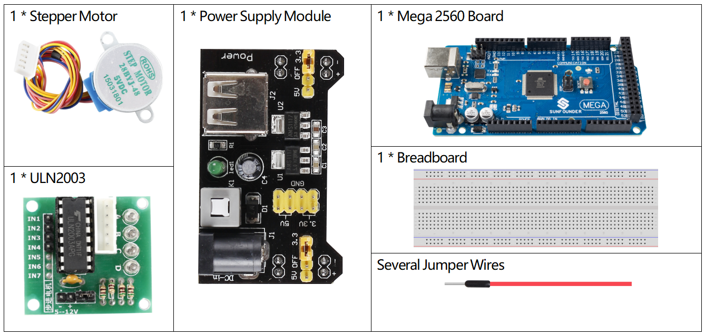
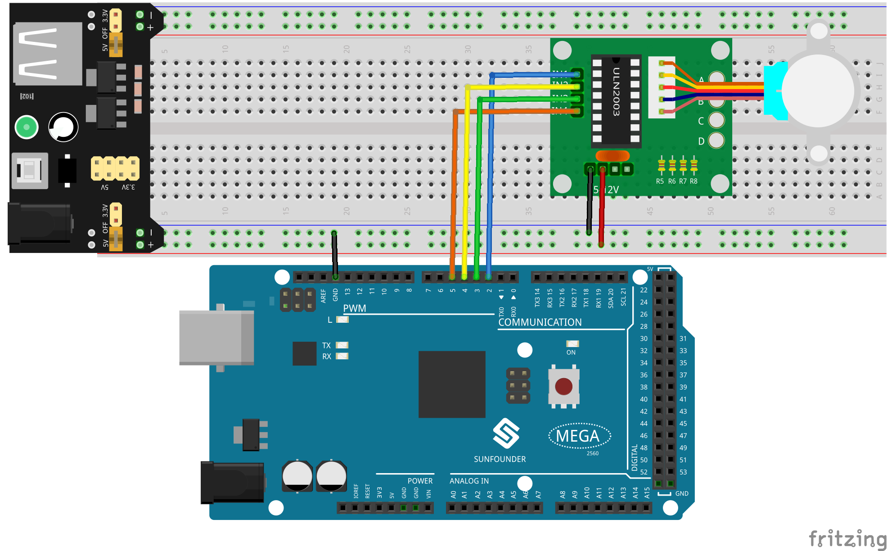
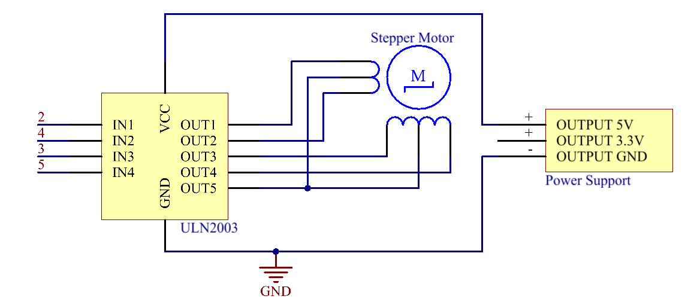
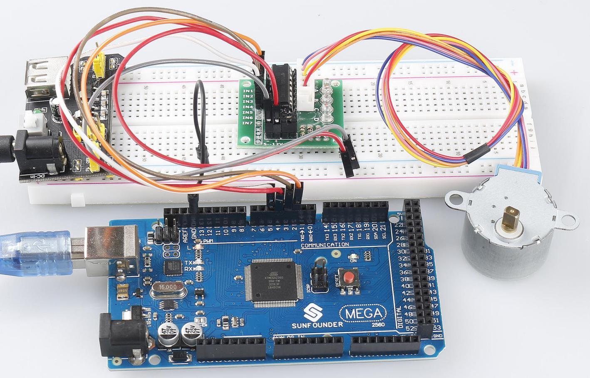

.. _ar_stepper_motor:

2.14 Schrittmotor
==================

Überblick
-----------------

In dieser Lektion lernen Sie Schrittmotoren kennen.

Erforderliche Komponenten
------------------------------------------

* :ref:`cpn_mega2560`
* :ref:`cpn_breadboard`
* :ref:`cpn_wires`
* :ref:`cpn_stepper_motor`
* :ref:`cpn_power_module`

Fritzing-Schaltung
-----------------------------

Das Stromversorgungsmodul wird verwendet, um den Schrittmotor mit Strom zu versorgen. Verbinden Sie den GND des Mega 2560-Boards und den GND des ULN2003 mit der Kathode des Steckbretts und verbinden Sie den VCC des ULN2003 mit dem 5-V-AUSGANG des Netzteils.

Die Verkabelung von ULN2003 und Mega2560 ist wie folgt dargestellt:

Schematische Darstellung
-----------------------------------

Code
--------

.. note::

    * Sie können die Datei ``2.14_stepperMotor.ino`` unter dem Pfad ``sunfounder_vincent_kit_for_arduino\code\2.14_stepperMotor`` direkt öffnen.
    * Oder kopieren Sie diesen Code in Arduino IDE. 

.. raw:: html

    <iframe src=https://create.arduino.cc/editor/sunfounder01/1ea1cc56-83ef-45c3-8140-2c7378ad8efa/preview?embed style="height:510px;width:100%;margin:10px 0" frameborder=0></iframe>

Nachdem Sie die Codes auf das Mega2560-Board hochgeladen haben, können Sie sehen, dass der Schrittmotor einen Kreis mit einem Intervall von einer Sekunde dreht und jeder Kreis 3,75 Sekunden dauert.

Code-Analyse
---------------------

Durch den Aufruf der Bibliothek Stepper.h können Sie den Schrittmotor einfach ansteuern.

.. code-block:: arduino

    #include <Stepper.h> 

**Bibliotheksfunktionen:**

.. code-block:: arduino

    Stepper(steps, pin1, pin2, pin3, pin4)

Erstellt eine neue Instanz der Stepper-Klasse, die einen bestimmten Schrittmotor darstellt, der an Ihr Arduino-Board angeschlossen ist.

* ``steps``: die Anzahl der Schritte in einer Umdrehung Ihres Motors. Wenn Ihr Motor die Gradzahl pro Schritt angibt, teilen Sie diese Zahl durch 360, um die Anzahl der Schritte zu erhalten (z. B. 360 / 3,6 ergibt 100 Schritte). (int)

.. note::
    Jeder Kreis des Schrittmotors dauert 2048 Schritte.

.. code-block:: arduino

    setSpeed(rpm)

Legt die Motordrehzahl in Umdrehungen pro Minute fest. Diese Funktion lässt den Motor nicht drehen, sondern legt nur die Geschwindigkeit fest, mit der er sich dreht, wenn Sie ``step()`` aufrufen.

* ``rpm``: die Drehzahl, mit der sich der Motor in Umdrehungen pro Minute drehen soll - eine positive Zahl. (lang)

.. note::
    Der hier verwendete Schrittmotor dreht maximal 17 Kreise pro Minute.

.. code-block:: arduino

    step(steps)

Dreht den Motor um eine bestimmte Anzahl von Schritten mit einer Geschwindigkeit, die durch den letzten Aufruf von ``setSpeed()`` bestimmt wird.

Diese Funktion blockiert; Das heißt, es wird warten, bis der Motor die Bewegung beendet hat, um die Steuerung an die nächste Zeile in Ihrer Skizze zu übergeben. Wenn Sie beispielsweise die Geschwindigkeit auf beispielsweise 1 U/min einstellen und bei einem Motor mit 2048 Schritten step(2048) aufrufen, würde diese Funktion eine volle Minute dauern, um ausgeführt zu werden. Halten Sie zur besseren Kontrolle die Geschwindigkeit hoch und gehen Sie bei jedem Aufruf von ``step()`` nur wenige Schritte.

* ``steps``: Die Anzahl der Schritte, um den Motor zu drehen - positiv, um in eine Richtung zu drehen, negativ, um in die andere Richtung zu drehen. (int)

Phänomen Bild
------------------

