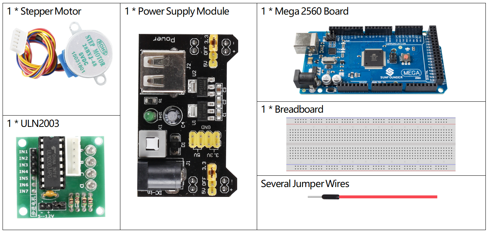
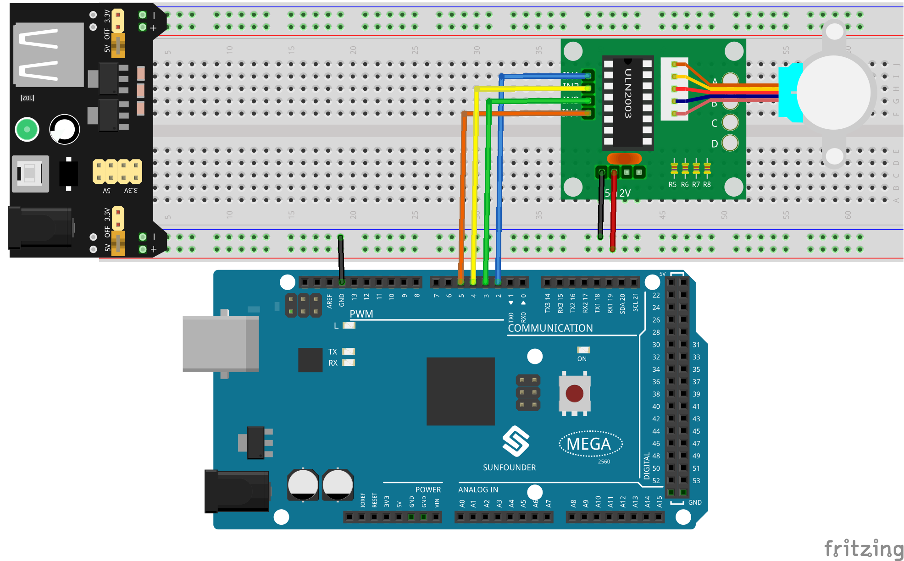
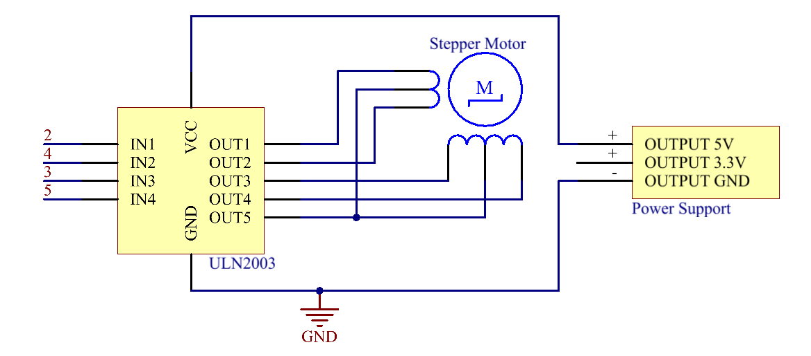
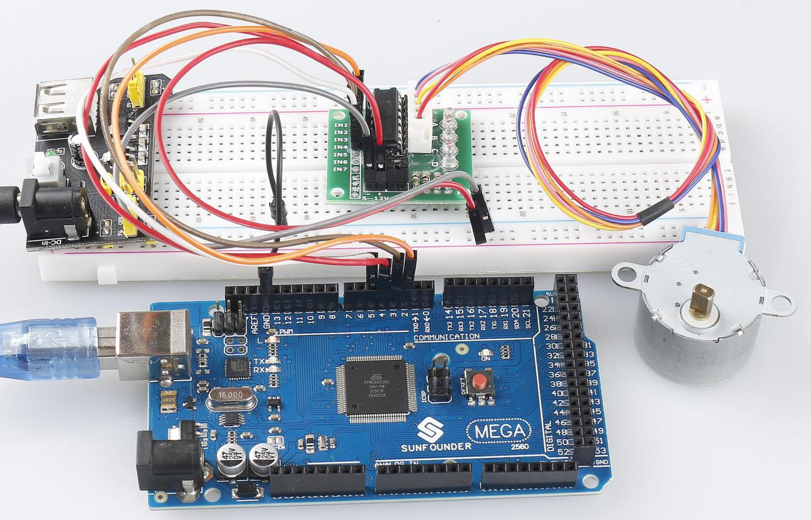

.. note:: 

    Hola, ¡bienvenido a la Comunidad de Entusiastas de SunFounder Raspberry Pi, Arduino y ESP32 en Facebook! Profundiza tus conocimientos sobre Raspberry Pi, Arduino y ESP32 junto a otros entusiastas.

    **¿Por qué unirte?**

    - **Soporte experto**: Resuelve problemas postventa y desafíos técnicos con ayuda de nuestra comunidad y equipo.
    - **Aprende y comparte**: Intercambia consejos y tutoriales para mejorar tus habilidades.
    - **Avances exclusivos**: Obtén acceso anticipado a nuevos anuncios de productos y adelantos.
    - **Descuentos especiales**: Disfruta de descuentos exclusivos en nuestros productos más recientes.
    - **Promociones festivas y sorteos**: Participa en sorteos y promociones especiales de temporada.

    👉 ¿Listo para explorar y crear con nosotros? Haz clic en [|link_sf_facebook|] y únete hoy mismo.

.. _ar_stepper_motor:

2.14 Motor a Pasos
=====================

Resumen
----------

En esta lección, aprenderás sobre el motor a pasos.

Componentes necesarios
-------------------------

* :ref:`cpn_mega2560`
* :ref:`cpn_breadboard`
* :ref:`cpn_wires`
* :ref:`cpn_stepper_motor`
* :ref:`cpn_power_module`

Circuito Fritzing
--------------------

Usamos el Módulo de Alimentación para energizar el motor a pasos. 
Conecta el GND de la placa Mega 2560 y el GND del ULN2003 al cátodo 
de la breadboard, y conecta el VCC del ULN2003 al pin de salida de 
5V del Módulo de Alimentación.

El cableado entre el ULN2003 y el Mega2560 se muestra a continuación:

Diagrama esquemático
-----------------------

Código
---------

.. note::

    * Puedes abrir el archivo ``2.14_stepperMotor.ino`` en la ruta ``sunfounder_vincent_kit_for_arduino\code\2.14_stepperMotor`` directamente.
    * O copiar este código en el IDE de Arduino.

.. raw:: html

    <iframe src=https://create.arduino.cc/editor/sunfounder01/1ea1cc56-83ef-45c3-8140-2c7378ad8efa/preview?embed style="height:510px;width:100%;margin:10px 0" frameborder=0></iframe>

Después de cargar el código en la placa Mega2560, podrás ver que el motor a pasos gira un círculo con un intervalo de un segundo, y cada círculo tarda 3,75 segundos.

Análisis del código
-----------------------

Al llamar a la librería Stepper.h, puedes controlar el motor a pasos fácilmente.

.. code-block:: arduino

    #include <Stepper.h> 

**Funciones de la librería:**

.. code-block:: arduino

    Stepper(steps, pin1, pin2, pin3, pin4)

Crea una nueva instancia de la clase Stepper que representa un motor a pasos específico conectado a tu placa Arduino.

* ``steps``: el número de pasos en una vuelta completa de tu motor. Si tu motor proporciona el número de grados por paso, divide ese número entre 360 para obtener el número de pasos (por ejemplo, 360 / 3.6 da 100 pasos). (int)

.. note::
    Cada vuelta del motor a pasos requiere 2048 pasos.

.. code-block:: arduino

    setSpeed(rpm)

Establece la velocidad del motor en rotaciones por minuto. Esta función no hace girar el motor, solo establece la velocidad a la que girará cuando llames a step().

* ``rpm``: la velocidad a la que debería girar el motor en rotaciones por minuto, un número positivo. (long)

.. note::
    El motor a pasos que usamos aquí gira un máximo de 17 vueltas por minuto.

.. code-block:: arduino

    step(steps)

Gira el motor un número específico de pasos, a la velocidad determinada por la llamada más reciente a setSpeed().

Esta función es bloqueante; es decir, esperará hasta que el motor termine de moverse para pasar el control a la siguiente línea en tu código. Por ejemplo, si configuras la velocidad a 1 RPM y llamas a step(2048) en un motor de 2048 pasos, esta función tomará un minuto completo en ejecutarse. Para un mejor control, mantén la velocidad alta y usa solo unos pocos pasos en cada llamada a step().

* ``steps``: el número de pasos para girar el motor - positivo para girar en una dirección, negativo para la otra. (int)

Imagen del fenómeno
-----------------------

