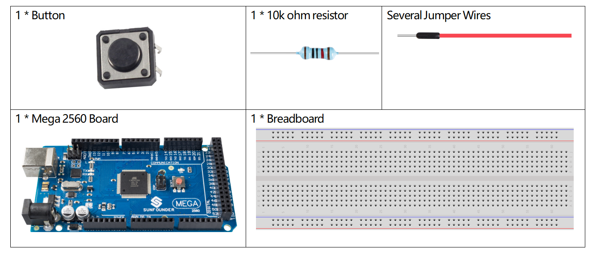
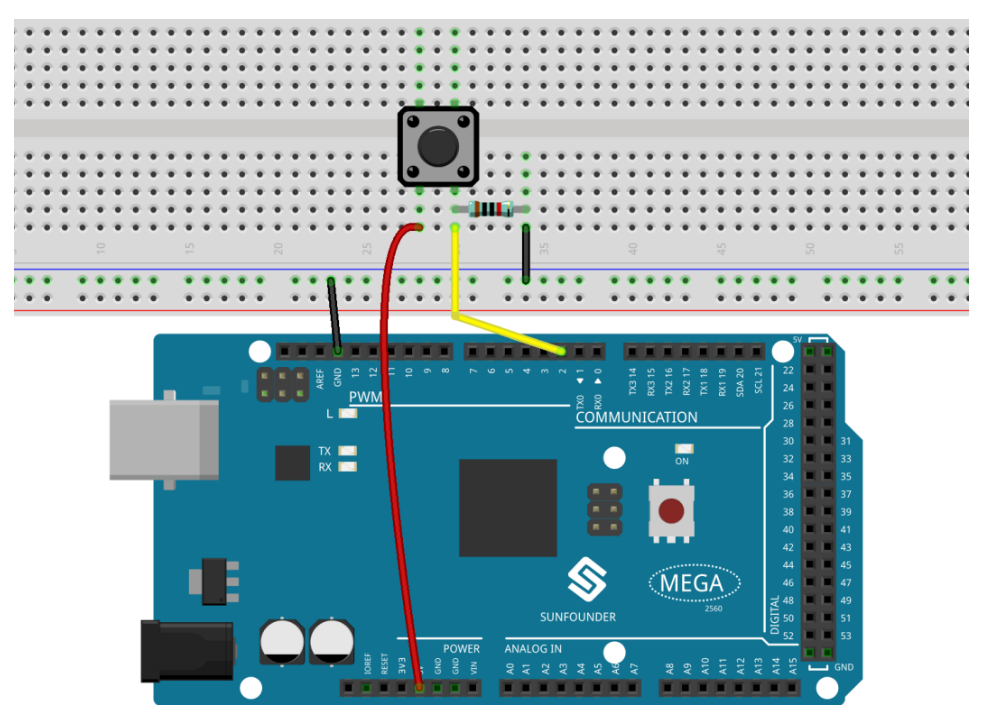
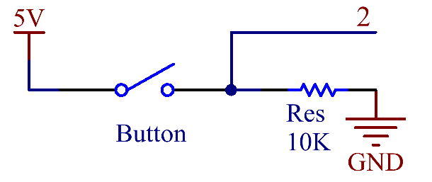

.. _ar_button:

2.15 Schaltfläche
============================

Überblick
-------------------------

In dieser Lektion lernen Sie Button kennen. Button ist eine gängige Komponente zur Steuerung elektronischer Geräte. Es wird normalerweise als Schalter zum Verbinden oder Unterbrechen von Stromkreisen verwendet.

Erforderliche Komponenten
----------------------------------

* :ref:`cpn_mega2560`
* :ref:`cpn_breadboard`
* :ref:`cpn_wires`
* :ref:`cpn_resistor`
* :ref:`cpn_button`

Fritzing-Schaltung
---------------------------

In diesem Beispiel lesen wir das Signal der Taste mit dem digitalen pin. Wenn die Taste nicht gedrückt wird, wird der digitale Pin 2 (über den Vorwiderstand) mit Masse verbunden, um den niedrigen Pegel (0) zu lesen; Wenn der Taster gedrückt wird, werden die beiden Pins verbunden und wenn der Pin mit der 5-V-Stromversorgung verbunden ist, wird der hohe Pegel (1) gelesen.

.. note::
    Wenn Sie den digitalen I/O-Pin von irgendetwas trennen, kann die LED unregelmäßig blinken. Der Eingang ist „schwebend“ oder hat keine feste Verbindung zu Spannung oder Masse, sodass er zufällig entweder HIGH oder LOW zurückgibt. Deshalb braucht es einen Pulldown-Widerstand in der Schaltung.

Schematische Darstellung
-------------------------------

Code
----

**Beispiel 1:**

.. note::

    * Sie können die Datei ``2.15_button.ino`` unter dem Pfad ``sunfounder_vincent_kit_for_arduino\code\2.15_button`` direkt öffnen.
    * Oder kopieren Sie diesen Code in Arduino IDE 1/2.
    * Oder klicken Sie auf Code öffnen, um ihn im `Web Editor <https://docs.arduino.cc/cloud/web-editor/tutorials/getting-started/getting-started-web-editor>`_ zu öffnen .
    * Laden Sie dann :ref:`ar_upload_code` auf das Board hoch.

.. raw:: html

    <iframe src=https://create.arduino.cc/editor/sunfounder01/435a252c-3d2e-45be-a3e2-294a5dcdb9fd/preview?embed style="height:510px;width:100%;margin:10px 0" frameborder=0></iframe>

Wenn Sie die Codes auf die Mega2560-Platine hochgeladen haben, können Sie die Messwerte der Pins auf dem seriellen Monitor sehen. Wenn Sie die Taste drücken, wird auf dem seriellen Monitor 「1」 angezeigt, und sobald Sie sie loslassen, wird 「0」 angezeigt. Bezüglich der detaillierten Code-Erklärung siehe :ref:`ar_digital_read`.

**Beispiel 2:**

.. note::

    * Sie können die Datei ``2.15_button_2.ino`` unter dem Pfad ``sunfounder_vincent_kit_for_arduino\code\2.15_button_2`` direkt öffnen.
    * Oder kopieren Sie diesen Code in Arduino IDE 1/2.
    * Oder klicken Sie auf Code öffnen, um ihn im `Web Editor <https://docs.arduino.cc/cloud/web-editor/tutorials/getting-started/getting-started-web-editor>`_ zu öffnen .
    * Laden Sie dann :ref:`ar_upload_code` auf das Board hoch.

.. raw:: html

    <iframe src=https://create.arduino.cc/editor/sunfounder01/020e4812-4345-4bf2-849b-df0c2b857213/preview?embed style="height:510px;width:100%;margin:10px 0" frameborder=0></iframe>

Wenn Sie die Codes auf die Mega2560-Platine hochgeladen haben, wechselt der Ausgangswert bei jedem Drücken der Taste zwischen 0 und 1. Wenn Sie mehr über die Codeerklärung erfahren möchten, können Sie zu :ref:`ar_state_change`.

Phänomen Bild
------------------

.. image:: img/image43.jpeg