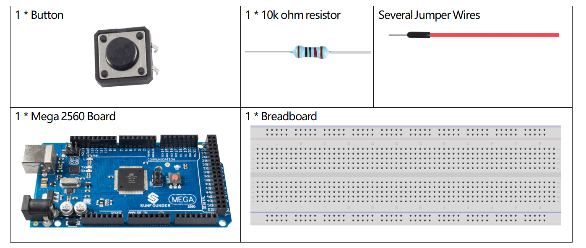
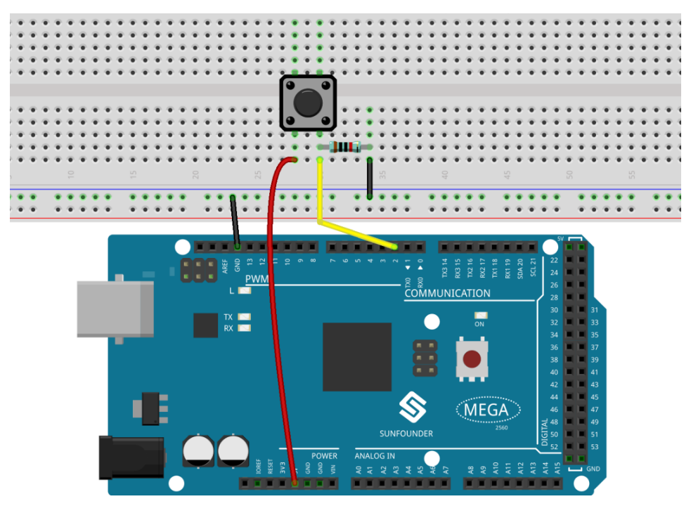
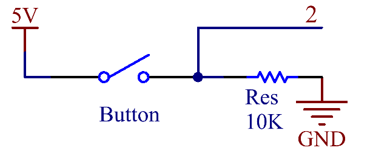

.. note::

    Ciao, benvenuto nella community di appassionati di SunFounder Raspberry Pi & Arduino & ESP32 su Facebook! Esplora più a fondo Raspberry Pi, Arduino ed ESP32 con altri appassionati.

    **Perché unirsi a noi?**

    - **Supporto esperto**: Risolvi problemi post-vendita e sfide tecniche grazie al supporto della nostra community e del nostro team.
    - **Impara e condividi**: Scambia suggerimenti e tutorial per migliorare le tue competenze.
    - **Anteprime esclusive**: Ottieni l'accesso anticipato a nuovi annunci di prodotto e anteprime.
    - **Sconti speciali**: Approfitta di sconti esclusivi sui nostri prodotti più recenti.
    - **Promozioni festive e omaggi**: Partecipa a giveaway e promozioni durante le festività.

    👉 Pronto a esplorare e creare con noi? Clicca [|link_sf_facebook|] e unisciti oggi stesso!

.. _ar_button:

2.15 Pulsante
================

Panoramica
-------------

In questa lezione imparerai a conoscere il pulsante. Il pulsante è un 
componente comune utilizzato per controllare dispositivi elettronici. 
È solitamente usato come interruttore per collegare o interrompere i circuiti.

Componenti necessari
-----------------------

* :ref:`cpn_mega2560`
* :ref:`cpn_breadboard`
* :ref:`cpn_wires`
* :ref:`cpn_resistor`
* :ref:`cpn_button`

Circuito Fritzing
---------------------

In questo esempio leggiamo il segnale del pulsante utilizzando il pin digitale. 
Quando il pulsante non è premuto, il pin digitale 2 (attraverso il resistore 
pull-down) è collegato a terra e legge un livello basso (0); quando il pulsante 
viene premuto, i due pin sono collegati e il pin è connesso all'alimentazione a 
5V, leggendo un livello alto (1).

.. note::
    Se il pin di I/O digitale non è connesso a nulla, il LED potrebbe lampeggiare 
    in modo casuale. L'ingresso è "fluttuante", ovvero non ha una connessione solida 
    a tensione o terra, quindi restituirà casualmente HIGH o LOW. Per questo motivo, 
    è necessario un resistore pull-down nel circuito.

Schema elettrico
--------------------

Codice
---------

**Esempio 1：**

.. note::

    * Puoi aprire direttamente il file ``2.15_button.ino`` nella cartella ``sunfounder_vincent_kit_for_arduino\code\2.15_button``.
    * Oppure copia questo codice nell'IDE di Arduino.

.. raw:: html

    <iframe src=https://create.arduino.cc/editor/sunfounder01/435a252c-3d2e-45be-a3e2-294a5dcdb9fd/preview?embed style="height:510px;width:100%;margin:10px 0" frameborder=0></iframe>

Caricato il codice sulla scheda Mega2560, potrai vedere le letture dei pin sul 
monitor seriale. Quando premi il pulsante, verrà visualizzato 「1」sul monitor 
seriale; quando lo rilasci, apparirà 「0」. Per ulteriori dettagli sul codice, 
consulta :ref:`ar_digital_read`.

**Esempio 2：**

.. note::

    * Puoi aprire direttamente il file ``2.15_button_2.ino`` nella cartella ``sunfounder_vincent_kit_for_arduino\code\2.15_button_2``.
    * Oppure copia questo codice nell'IDE di Arduino.

.. raw:: html

    <iframe src=https://create.arduino.cc/editor/sunfounder01/020e4812-4345-4bf2-849b-df0c2b857213/preview?embed style="height:510px;width:100%;margin:10px 0" frameborder=0></iframe>

Caricato il codice sulla scheda Mega2560, ogni volta che premi il pulsante, 
il valore di output passerà da 0 a 1 e viceversa. Per ulteriori dettagli sul 
codice, consulta :ref:`ar_state_change`.

Immagine del risultato
--------------------------

.. image:: img/image43.jpeg