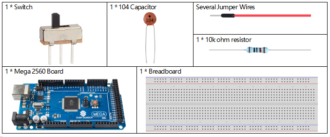
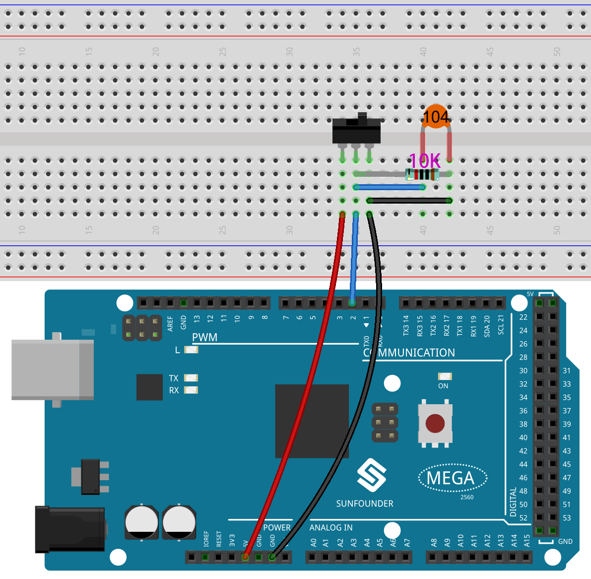
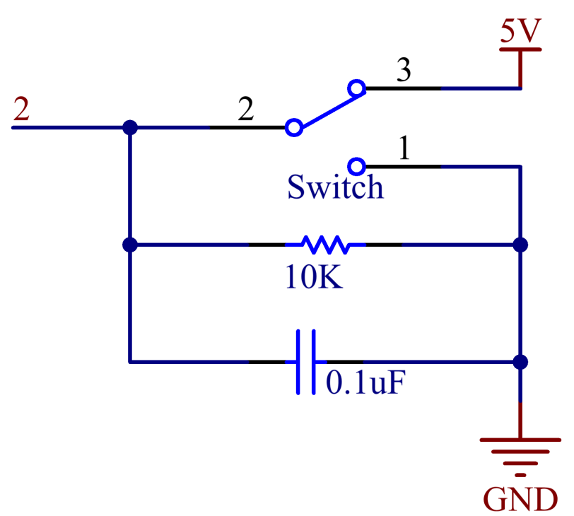
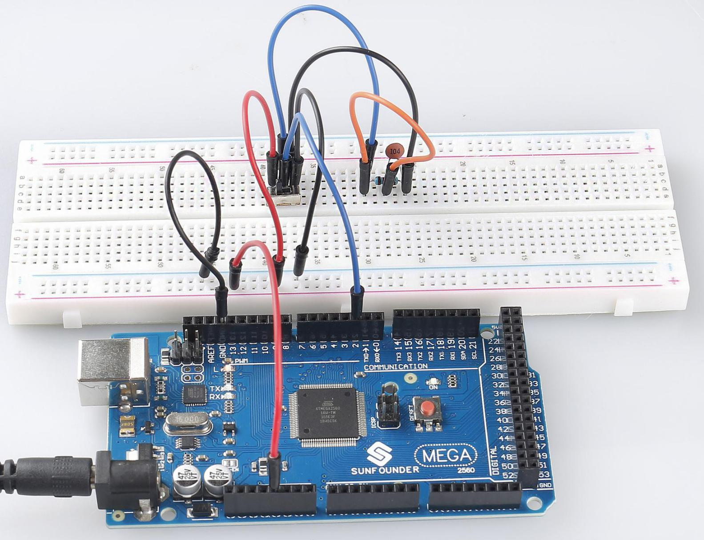

.. _ar_slide:

2.16 Schiebeschalter
===========================

Überblick
------------

In dieser Lektion lernen Sie etwas über Switch kennen. Ein Schiebeschalter dient, wie der Name schon sagt, dazu, die Schalterleiste zu verschieben, um den Stromkreis zu verbinden oder zu unterbrechen, und weitere Stromkreise umzuschalten. Der Schiebeschalter wird üblicherweise in Niederspannungskreisen verwendet. Es hat die Eigenschaften Flexibilität und Stabilität und findet breite Anwendung in elektrischen Instrumenten und elektrischem Spielzeug.

Erforderliche Komponenten
--------------------------------

* :ref:`cpn_mega2560`
* :ref:`cpn_breadboard`
* :ref:`cpn_wires`
* :ref:`cpn_resistor`
* :ref:`cpn_slide`
* :ref:`cpn_capacitor`

Fritzing-Schaltung
---------------------

In diesem Beispiel wird der digitale Pin 2 verwendet, um das Signal von Switch zu lesen. Zusätzlich müssen Sie einen 10-kΩ-Widerstand und einen 104-Kondensator parallel schalten, um eine RC-Schaltung (Widerstands-Kapazitätsschaltung) zu bilden, die zwischen Pin 2 und GND gesetzt wird, um eine Entprellung zu realisieren, die durch Ihren Schalter entstehen kann.

Schematische Darstellung
---------------------------------

Code
---------

.. note::

    * Sie können die Datei ``2.16_switch.ino`` unter dem Pfad ``sunfounder_vincent_kit_for_arduino\code\2.16_switch`` direkt öffnen.
    * Oder kopieren Sie diesen Code in Arduino IDE 1/2.
    * Oder klicken Sie auf Code öffnen, um ihn im `Web Editor <https://docs.arduino.cc/cloud/web-editor/tutorials/getting-started/getting-started-web-editor>`_ zu öffnen .
    * Laden Sie dann :ref:`ar_upload_code` auf das Board hoch.

.. raw:: html

   <iframe src=https://create.arduino.cc/editor/sunfounder01/952c55eb-b08b-4c4a-8107-07a946183457/preview?embed style="height:510px;width:100%;margin:10px 0" frameborder=0></iframe>

Nachdem die Codes auf die Mega2560-Platine hochgeladen wurden, können Sie den seriellen Monitor öffnen, um die Messwerte des Pins zu überprüfen. Wenn der Schalter nach links umschaltet, zeigt der serielle Monitor 「1」 an; Wenn nach rechts umgeschaltet wird, zeigt der serielle Monitor「0」 an. Siehe :ref:`ar_digital_read`, um die Code-Erklärung zu überprüfen.

Phänomen Bild
------------------------

