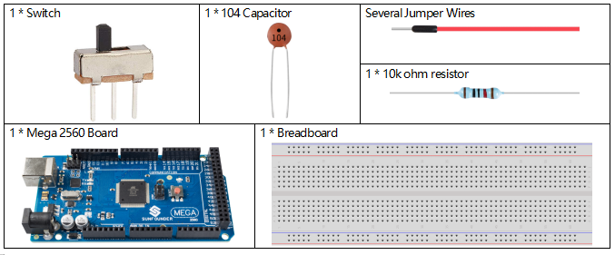
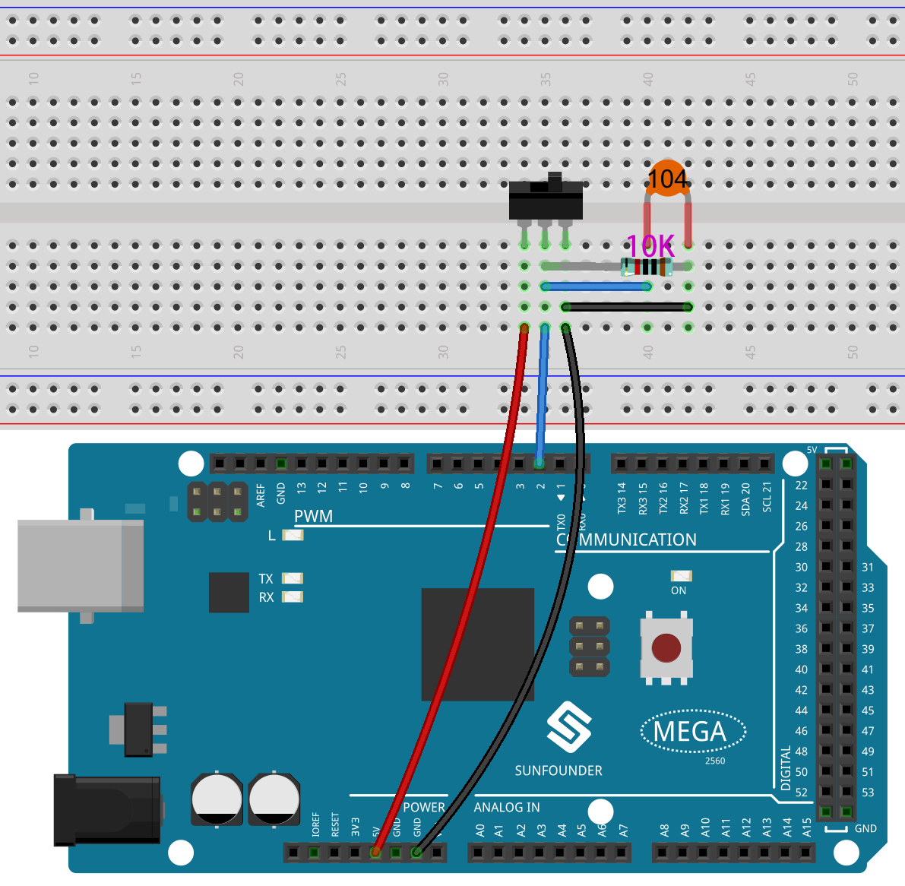
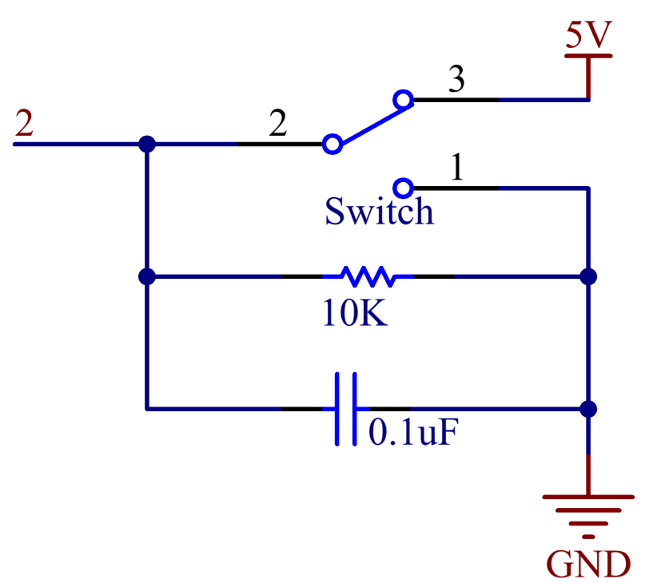
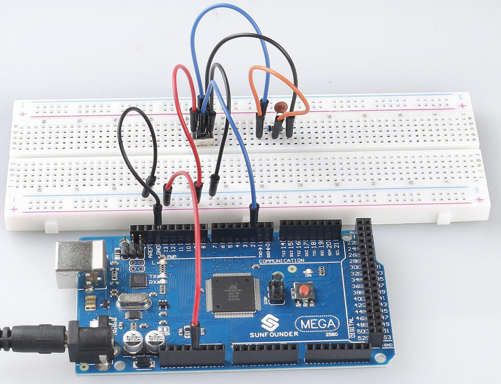

.. note:: 

    Hola, ¡bienvenido a la Comunidad de Entusiastas de SunFounder Raspberry Pi, Arduino y ESP32 en Facebook! Profundiza tus conocimientos sobre Raspberry Pi, Arduino y ESP32 junto a otros entusiastas.

    **¿Por qué unirte?**

    - **Soporte experto**: Resuelve problemas postventa y desafíos técnicos con ayuda de nuestra comunidad y equipo.
    - **Aprende y comparte**: Intercambia consejos y tutoriales para mejorar tus habilidades.
    - **Avances exclusivos**: Obtén acceso anticipado a nuevos anuncios de productos y adelantos.
    - **Descuentos especiales**: Disfruta de descuentos exclusivos en nuestros productos más recientes.
    - **Promociones festivas y sorteos**: Participa en sorteos y promociones especiales de temporada.

    👉 ¿Listo para explorar y crear con nosotros? Haz clic en [|link_sf_facebook|] y únete hoy mismo.

.. _ar_slide:

2.16 Interruptor Deslizante
=============================

Resumen
---------

En esta lección, aprenderás sobre el interruptor deslizante. Este tipo de 
interruptor permite conectar o desconectar el circuito al deslizar su barra, 
lo que posibilita alternar circuitos. Es comúnmente usado en circuitos de bajo 
voltaje y se caracteriza por su flexibilidad y estabilidad, siendo ampliamente 
aplicado en instrumentos eléctricos y juguetes electrónicos.

Componentes necesarios
--------------------------

* :ref:`cpn_mega2560`
* :ref:`cpn_breadboard`
* :ref:`cpn_wires`
* :ref:`cpn_resistor`
* :ref:`cpn_slide`
* :ref:`cpn_capacitor`

Circuito Fritzing
---------------------

En este ejemplo, el pin digital 2 se utiliza para leer la señal del interruptor. 
Además, necesitas conectar una resistencia de 10 kΩ y un condensador de 104 en 
paralelo para formar un circuito RC (Resistencia - Capacitancia), que se coloca 
entre el pin 2 y GND para eliminar posibles rebotes que pueden surgir al alternar 
el interruptor.

Diagrama esquemático
------------------------

Código
---------

.. note::

    * Puedes abrir el archivo ``2.16_switch.ino`` en la ruta ``sunfounder_vincent_kit_for_arduino\code\2.16_switch`` directamente.
    * O copiar este código en el IDE de Arduino.

.. raw:: html

   <iframe src=https://create.arduino.cc/editor/sunfounder01/952c55eb-b08b-4c4a-8107-07a946183457/preview?embed style="height:510px;width:100%;margin:10px 0" frameborder=0></iframe>

Una vez subidos los códigos a la placa Mega2560, puedes abrir el monitor 
serial para comprobar las lecturas del pin. Cuando el interruptor se desliza 
hacia la izquierda, el monitor serial muestra 「1」; cuando se desliza hacia 
la derecha, muestra 「0」. Consulta :ref:`ar_digital_read` para ver la explicación 
del código.

Imagen del fenómeno
----------------------

