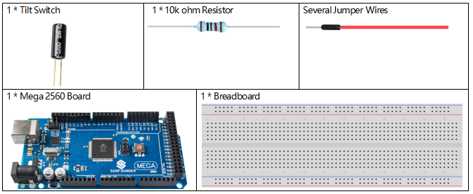
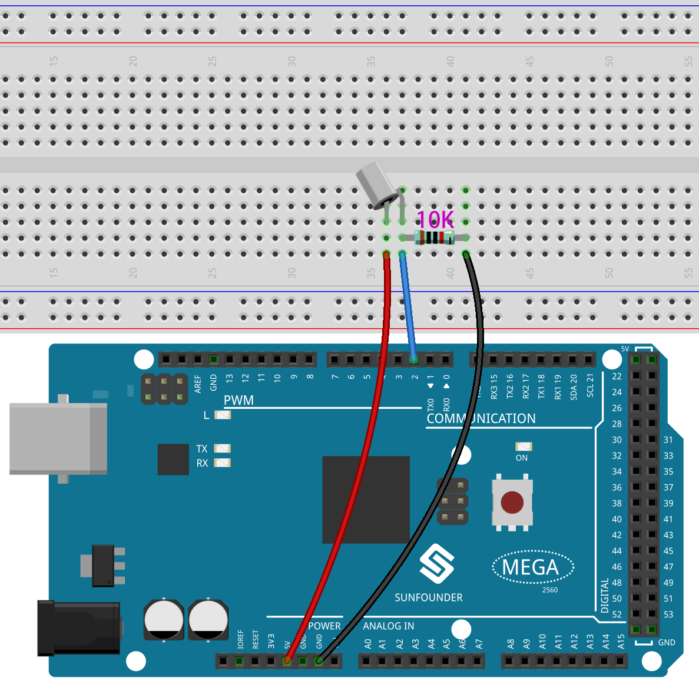
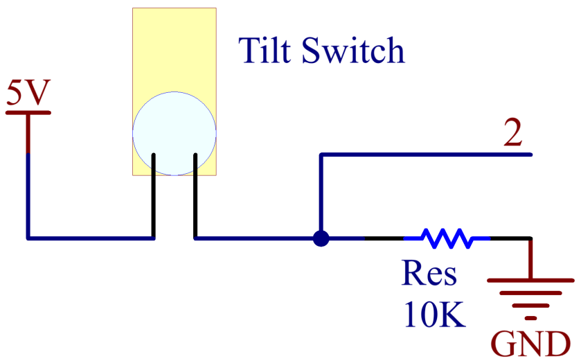
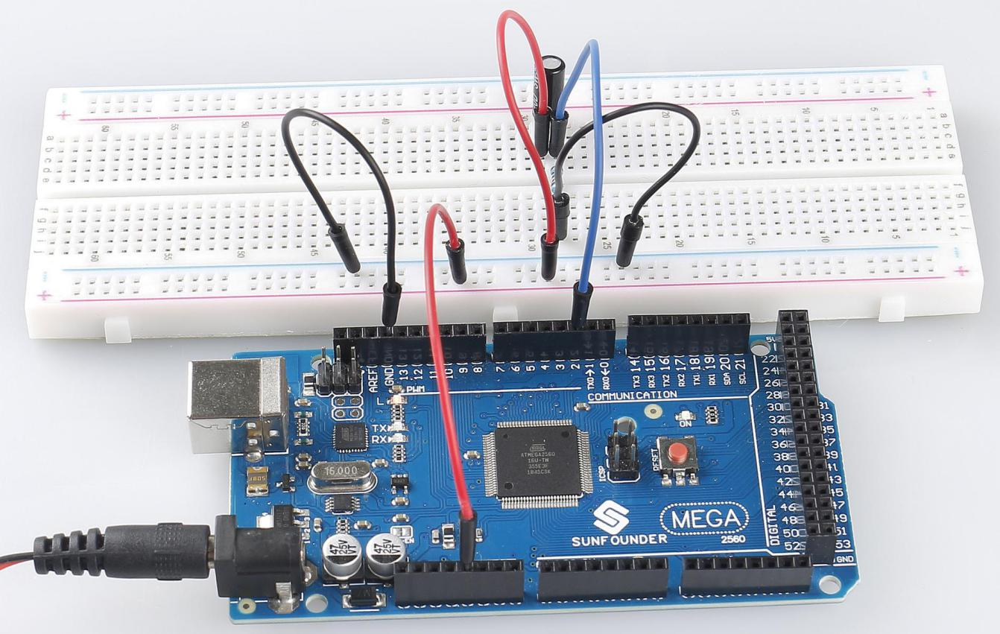

.. _ar_tilt:

2.17 Tilt Switch
==================

Overview
---------------

In this lesson, you will learn about tilt switch. Tilt switch can be
used to detect whether objects tilt, which is of great value in
practical applications. It can be used to judge the tilt of bridges,
buildings, transmission line tower and so on, so it has an important
guiding function in carrying out maintenance work.

Components Required
-------------------------

* :ref:`cpn_mega2560`
* :ref:`cpn_breadboard`
* :ref:`cpn_wires`
* :ref:`cpn_resistor`
* :ref:`cpn_tilt`

Fritzing Circuit
---------------------

In this example, digital pin 2 is used to read the signal of Tilt
Switch.

   :align: center

Schematic Diagram
-----------------------

Code
----------

.. note::

    * You can open the file ``2.17_tiltSwitch.ino`` under the path of ``sunfounder_vincent_kit_for_arduino\code\2.17_tiltSwitch`` directly.
    * Or copy this code into Arduino IDE 1/2.
    * Or click **Open Code** to open it in `Web Editor <https://docs.arduino.cc/cloud/web-editor/tutorials/getting-started/getting-started-web-editor>`_.
    * Then :ref:`ar_upload_code` to the board.

.. raw:: html

    <iframe src=https://create.arduino.cc/editor/sunfounder01/b0649977-fa45-423a-9612-9180d600f3ec/preview?embed style="height:510px;width:100%;margin:10px 0" frameborder=0></iframe>

After the codes are uploaded to the Mega2560 board, you can open the
serial monitor to see the readings of pins, which displays 「1」 or
「0」 when Tilt Switch is vertical (bringing the internal metal ball
into contacting with the Wire Pins) or tilted. For detailed explanation
of codes, you can turn to :ref:`digital_read`.

Phenomenon Picture
-----------------------

