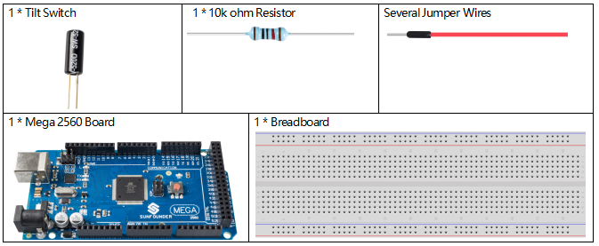
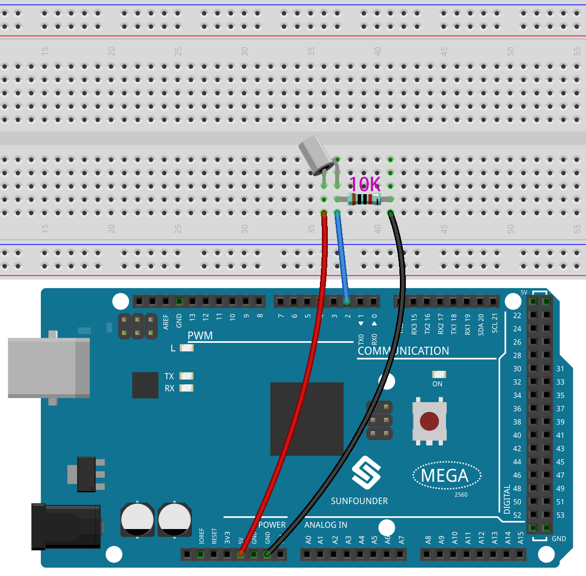
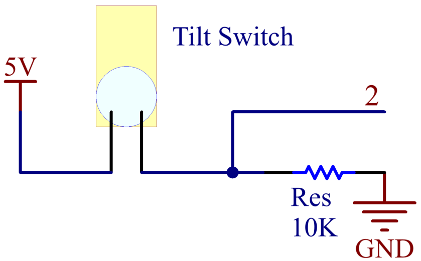
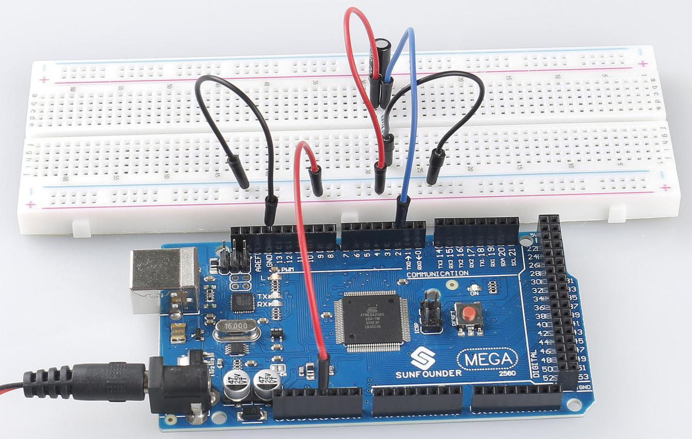

.. note::

    Hola, ¡bienvenido a la Comunidad de Entusiastas de SunFounder Raspberry Pi, Arduino y ESP32 en Facebook! Profundiza en el mundo de Raspberry Pi, Arduino y ESP32 junto a otros entusiastas.

    **¿Por qué unirte?**

    - **Soporte experto**: Resuelve problemas postventa y desafíos técnicos con la ayuda de nuestra comunidad y equipo.
    - **Aprende y comparte**: Intercambia consejos y tutoriales para mejorar tus habilidades.
    - **Avances exclusivos**: Obtén acceso anticipado a nuevos anuncios de productos y adelantos.
    - **Descuentos especiales**: Disfruta de descuentos exclusivos en nuestros productos más recientes.
    - **Promociones festivas y sorteos**: Participa en sorteos y promociones especiales de temporada.

    👉 ¿Listo para explorar y crear con nosotros? Haz clic en [|link_sf_facebook|] y únete hoy mismo.

.. _ar_tilt:

2.17 Interruptor de Inclinación
=================================

Resumen
----------

En esta lección, aprenderás sobre el interruptor de inclinación. Este tipo 
de interruptor puede usarse para detectar si un objeto está inclinado, lo 
cual tiene gran valor en aplicaciones prácticas. Se utiliza, por ejemplo, 
para medir la inclinación de puentes, edificios, torres de transmisión, 
entre otros, y juega un rol importante en tareas de mantenimiento preventivo.

Componentes necesarios
-------------------------

* :ref:`cpn_mega2560`
* :ref:`cpn_breadboard`
* :ref:`cpn_wires`
* :ref:`cpn_resistor`
* :ref:`cpn_tilt`

Circuito Fritzing
---------------------

En este ejemplo, se utiliza el pin digital 2 para leer la señal del 
interruptor de inclinación.

Diagrama esquemático
------------------------

Código
---------

.. note::

    * Puedes abrir el archivo ``2.17_tiltSwitch.ino`` en la ruta ``sunfounder_vincent_kit_for_arduino\code\2.17_tiltSwitch`` directamente.
    * O copiar este código en el IDE de Arduino.

.. raw:: html

    <iframe src=https://create.arduino.cc/editor/sunfounder01/b0649977-fa45-423a-9612-9180d600f3ec/preview?embed style="height:510px;width:100%;margin:10px 0" frameborder=0></iframe>

Después de subir el código a la placa Mega2560, puedes abrir el monitor 
serial para ver las lecturas de los pines, que muestran 「1」 o 「0」 
cuando el interruptor de inclinación está en posición vertical (haciendo 
que la bola metálica interna entre en contacto con los pines) o inclinado. 
Para una explicación detallada del código, consulta :ref:`ar_digital_read`.

Imagen del fenómeno
-----------------------

